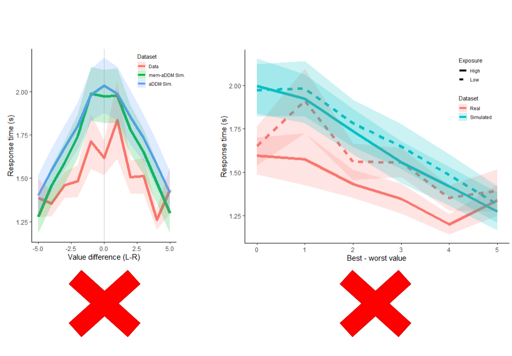
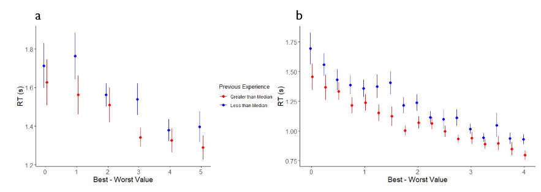
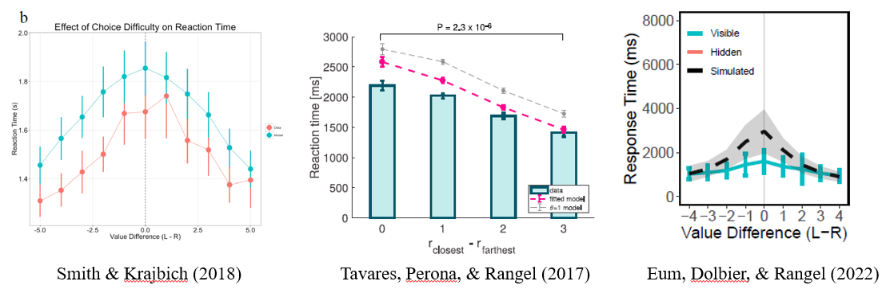

# mem-aDDM {#mem-aDDM}

(TL;DR) I tried to incorporate the effects of working memory (mem-) into the Attentional Drift-Diffusion-Model (aDDM) by allowing the drift rate parameter to scale with the number of previous exposures to the chosen stimulus in the session. This was an attempt to (1) improve the accuracy of response time predictions from the aDDM and (2) model shorter response times with repeated exposures. It didn't work, but at least now I know what not to try next ¯\\_(ツ)_/¯.

<center>
{width=60%}
</center>

## Introduction

In value-based decisions, there are different ways that familiarity with a stimulus might affect decisions over time. Adopting intuition from Signal Detection Theory, repeated exposure to a stimulus might reduce the variance of the value signal. When it comes to sequential sampling models, we can model this in two ways. The obvious approach would be to reduce the noise parameter as a function of stimulus exposure time. However, previous studies have shown that response times decrease with repeated exposure to a stimulus in an experiment (a wonderful report written by Trinity Pruitt when she was rotating through the Rangel Lab in 2021, or [@agranov2017]). A reduced noise parameter can only serve to increase response times, therefore this adjustment to the model would likely fail to account for behavior. Similarly, I believe the extension of the DDM used in [@agranov2017] fails to account for the effects of repeated exposure on parameters of the DDM.

<center>
{width=30%}
Source: Trinity Pruitt. Faster RTs for stimuli seen more than the median number of times a stimulus is seen in [@smith2018] and in [@eum2022].\
</center>

Instead, I hypothesize that familiarity with a stimulus will affect the drift rate parameter. For one, a drift rate parameter that scales with previous encounters is capable of explaining faster response times with repeated exposure. [@kelly2013] find that faster response times correlate with faster buildup rate of centroparietal positive potential independent of stimulus coherence, suggesting that faster response times might be explained by a larger drift rate parameter. But the main inspiration behind an encounter-scaling drift rate parameter comes from the memory and decision-making literature. [@shadlen2016] argue that value signals are modulated by memory (episodic, working, etc.), specifically that value signals in sequential sampling models integrated in the LIP are modulated by activity in the hippocampus. Studies using EEG also find a neural signal that reflects sampling from memory [@vanede2022]. If we buy the argument that sampling from memory is more difficult than sampling from a visual representation ([@weilbacher2021] and [@eum2022]), then we might suspect that recent exposure to a stimulus will reduce the difficulty of sampling information from working memory. Again, this could potentially result in a smaller noise parameter, but seeing that this fails to explain behavior, I believe it is instead explained by drift rate parameter that scales with previous encounters.

I also think this will make different RT predictions depending on the value difference. Since value differences integrate over time, the lack of evidence in a difficult decision compounds over time. This means that a larger drift rate parameter will reduce response times by more in difficult choices than in easy choices. This may remedy problems that the aDDM has with fitting RT distributions across value differences (see below).

<center>
{width=30%}
</center>


The goals of this report:

1. Incorporate the idea that internal samples are modulated by (and sometimes even sampled from) memory into a sequential sampling model.
2. Build a variation of the aDDM that explains shorter response times with more familiar stimuli.
3. Improve the performance of the aDDM, which has previously overestimated response times when choices are difficult.

## Warning

Not a great display of coding. But with one weekend for a side-project, this is what I wound up with. If the project turns into something bigger, then I'll consider re-writing the code into something more elegant.

## Methods

### Prep work

#### Load libraries

```{r message=FALSE, messages=FALSE}
rm(list = ls())
seed = 1337
library(dplyr)
library(ggplot2)
library(hrbrthemes)
library(runjags)
library(brms)
#library(cmdstanr)
library(data.table)
library(plotrix)
library(grid)
library(gridExtra)
#set_cmdstan_path("D:/Program Files/R-4.0.2/library/cmdstan-2.24.1") #gotta do this everytime :\
```

#### Read-in data and calculations

I will use data from the "two food" choice task in [@smith2018]. The data can be downloaded here: https://osf.io/x2jhp/?view_only=2669d8f3983d4442952a52c5de5814f7. I calculate a variable called "PreviousEncountersChosen", which counts the number of previous trials in which the subject has seen the chosen item for this trial.

I was thinking about extending the model so that we calculate "PreviousExposure" up until the current fixation, but this would require that we use a different (and MUCH slower) toolbox to estimate the aDDM. If we fit the data by fixations, then we need should use the Tavares toolbox [@tavares2017]. But, that will take a long time and will not result in posterior distributions for parameter estimates. So instead, I will use the Lombardi and Hare toolbox [@lombardi2021] and let drift rate vary trial-by-trial systematically as a function of previous encounters. This differs from the trial-by-trial variability in drift rate that draws drift from a distribution, as in [@lombardi2021] or [@eum2022].

```{r}
load("data/mem-aDDM-smithkrajbich2018.RData")

twofoodeyedata <- twofoodeyedata %>%
  group_by(SubjectNumber, Trial) %>%
  mutate( # fixation number
    fixNum=row_number()
  ) 

# Running counts of the number of times the subjects have seen the left and right options across previous trials
twofoodchoicedata$PreviousEncounterLeft <- NA
twofoodchoicedata$PreviousEncounterRight <- NA
data <- twofoodchoicedata[order(twofoodchoicedata$SubjectNumber, twofoodchoicedata$Trial),]
for (n in 1:length(data$SubjectNumber)) {
  tempdata <- data[data$SubjectNumber==data$SubjectNumber[n] & data$Trial<=data$Trial[n],]
  prevList <- rbind(tempdata$FoodLeft,tempdata$FoodRight)
  data$PreviousEncounterLeft[n] <- sum(prevList==data$FoodLeft[n])-1
  data$PreviousEncounterRight[n] <- sum(prevList==data$FoodRight[n])-1
}
twofoodchoicedata <- data
twofoodchoicedata$PreviousEncounterBoth <- twofoodchoicedata$PreviousEncounterLeft+twofoodchoicedata$PreviousEncounterRight
twofoodchoicedata$PreviousEncounterChosen <- 
  ifelse(twofoodchoicedata$LeftRight==1, twofoodchoicedata$PreviousEncounterLeft, twofoodchoicedata$PreviousEncounterRight)

food <- merge(twofoodchoicedata, twofoodeyedata, by=c("SubjectNumber", "Trial"))
food <- food[order(food$SubjectNumber, food$Trial, food$fixNum),]
food$valDiff <- food$ValueLeft-food$ValueRight
food$difficulty <- abs(food$ValueLeft-food$ValueRight)
food$fixID <- ifelse(food$ROI==1, food$FoodLeft, food$FoodRight) # ID for currently fixated food
food$choiceID <- ifelse(food$LeftRight==1, food$FoodLeft, food$FoodRight) # ID for chosen food

food <- food %>%
  group_by(SubjectNumber, fixID) %>%
  mutate( # Get total dwell time up until this fixation
    Exposure = cumsum(DwellLength)-DwellLength 
  ) %>%
  ungroup() %>%
  group_by(SubjectNumber, Trial, fixID) %>%
  mutate( # Get total dwell time up until this trial for each unique stimulus
    TrialPreviousExposure = min(Exposure) 
  ) %>%
  ungroup() %>%
  group_by(SubjectNumber, Trial) %>%
  mutate( # Get total dwell time for both stimuli up until this trial
    PreviousExposureBoth = sum(unique(TrialPreviousExposure),na.rm=TRUE)
  ) %>%
  ungroup() %>%
  mutate(
    fixToChoice = (fixID==choiceID),
    placeholder = 0
  )

food$placeholder <- ifelse(food$fixToChoice==1, food$TrialPreviousExposure, 0)
food <- food %>%
  group_by(SubjectNumber, Trial) %>%
  mutate( 
    PreviousExposureChosen = max(placeholder), # Get total dwell time for chosen stimulus up until this trial
    maxFixNum = max(fixNum) # use this to get middle fixation indicators later
  )

# middle fixations
food$middleFix <- (food$fixNum>1 & food$fixNum!=food$maxFixNum)
```

## How should drift change?

Let's regress response time on value difference (L-R) and various metrics of previous exposure. If previous exposure leads to larger drift rate parameters, then we necessarily need a negative correlation between response time and previous exposure.

Really quickly, let's define the data set we will use for regressions. This should be trial-by-trial data. Also, let's change RT to ms for better parameterization. Also, let's set the settings for the hierarchical regressions.

```{r}
data <- food[food$fixNum==1,]
data$RT <- data$RT*1000 # convert to ms

chainscores = 3
iterations = 6000
burnin = floor(iterations/2)
```

### Previous exposure to both options

Here, I take previous exposure as the sum of total fixation time to either option in previous trials.

```{r cache=TRUE}
#reg.exp.both <- brm(
#  RT ~ difficulty+PreviousExposureBoth + (1+difficulty+PreviousExposureBoth|SubjectNumber),
#  data=data,
#  family=gaussian,
#  chains=chainscores,
#  cores=chainscores,
#  iter=iterations,
#  warmup=burnin,
#  seed=seed,
#  refresh=0
#)
reg.exp.both = lm(RT ~ difficulty+PreviousExposureBoth + (1+difficulty+PreviousExposureBoth|SubjectNumber), data=data)
reg.exp.both
```

The results don't look very promising. It doesn't seem like previous exposure to both options is affecting the response times.

### Previous exposure to chosen option

Here, I take previous exposure as the total fixation time to the chosen option in previous trials.

```{r cache=TRUE}
#reg.exp.chosen <- brm(
#  RT ~ difficulty+PreviousExposureChosen + (1+difficulty+PreviousExposureChosen|SubjectNumber),
#  data=data,
#  family=gaussian,
#  chains=chainscores,
#  cores=chainscores,
#  iter=iterations,
#  warmup=burnin,
#  seed=seed,
#  refresh=0
#)
reg.exp.chosen = lm(RT ~ difficulty+PreviousExposureChosen + (1+difficulty+PreviousExposureChosen|SubjectNumber), data=data)
reg.exp.chosen
```

The results don't look very promising. It doesn't seem like previous exposure to the chosen option is affecting the response times.

### Previous encounters with both options 

Here, I take previous encounters as the number of times the subject has encountered both options before.

```{r cache=TRUE}
#reg.enc.both <- brm(
#  RT ~ difficulty+PreviousEncounterBoth + (1+difficulty+PreviousEncounterBoth|SubjectNumber),
#  data=data,
#  family=gaussian,
#  chains=chainscores,
#  cores=chainscores,
#  iter=iterations,
#  warmup=burnin,
#  seed=seed,
#  save_pars = save_pars(all = TRUE), #for LOO CV later
#  refresh=0
#)
reg.enc.both = lm(RT ~ difficulty+PreviousEncounterBoth + (1+difficulty+PreviousEncounterBoth|SubjectNumber), data=data)
reg.enc.both
```

Interestingly, previous encounters with both options is negatively correlated with response times.

### Previous encounters with chosen option

Here, I take previous encounters as the number of times the subject has encountered the chosen option before.

```{r cache=TRUE}
#reg.enc.chosen <- brm(
#  RT ~ difficulty+PreviousEncounterChosen + (1+difficulty+PreviousEncounterChosen|SubjectNumber),
#  data=data,
#  family=gaussian,
#  chains=chainscores,
#  cores=chainscores,
#  iter=iterations,
#  warmup=burnin,
#  seed=seed,
#  save_pars = save_pars(all = TRUE), #for LOO CV later
#  refresh=0
#)
reg.enc.chosen = lm(RT ~ difficulty+PreviousEncounterChosen + (1+difficulty+PreviousEncounterChosen|SubjectNumber), data=data)
reg.enc.chosen
```

It seems that previous encounters with the chosen option is also negatively correlated with response times. 

### Model comparison

So now we have two potential ways in which working memory might affect response times. (1) Previous encounters with both options, and (2) Previous encounters with the chosen item. Let's run a quick model comparison using Leave-One-Out Cross Validation to see which explains the data better. 

We are comparing the expected log pointwise predictive density (ELPD) of the "chosen" model compared to the "both" model. For this, we should look at the elpd_loo. The better model has the higher elpd_loo.

```{r model-comparison, cache=TRUE, warnings=FALSE}
#loo1 <- loo(reg.enc.both)
#loo2 <- loo(reg.enc.chosen)

#comparison <- loo_compare(loo1,loo2)
#print(comparison, simplify=FALSE, digits=3)
```

[I ran these at some point in the past, but I didn't want to have to rerun the MCMC algorithms when I reknit the book again. I've commented out all the analyses using Bayesian heirarchical modeling and used OLS instead. This means there's no need to use ELPD, but I've left the written analyses in from a long time ago so you can see what the results were.]

It looks like previous encounters with the chosen option slightly outperforms previous encounters with both options. 

The results here suggest that previous encounters with the chosen option are correlated with faster responses. My hunch is that working memory is somehow affecting behavior. My hypothesis is that repeated exposure to the chosen item is increasing the ease with which subjects can sample value signals from working memory [@weilbacher2021].

These results make sense with the previous literature. [@weilbacher2021] showed that the amount of attention to an item did not affect whether or not subjects remembered that item. However, [@agranov2017] found that repeated encounters with the same item sped up response times. Perhaps value become easier to sample from memory with more encounters, but is not modulated by the amount of exposure per encounter.

In the next section, I will design a variation of the aDDM where the drift rate scales with previous encounters with the chosen item.

## mem-aDDM

### Fitting Methods

The general piecewise constant DDM (pcDDM) does not have fully time-dependent drift rates. Instead, it has drift rates that are constant over discrete intervals. The continuous pcDDM is written as follows:

$dx(t) = \mu(t) dt + \sigma dW(t)$

where:

- $x(t)$ is evidence at time $t$
- $\mu(t)$ is the drift rate at time $t$
- $\sigma$ is the standard deviation of the Brownian motion
- $W(t)$ is standard Brownian motion

Bias is $x(0)=x_0$. Drift is $\mu(t)=\mu_i$ for $t_i \leq t < t_{i+1}$. Response time is $\tau = \inf\{t>0|x(t)\not\in(-B,B)\}$.

Following [@lombardi2021], we can rewrite drift rate when two conditions hold: (1) when it is constant in discrete time intervals, and (2) when stopping time is explicitly known. We rewrite it:

\begin{equation}
\begin{aligned}

\mu(t) &= \sum_{i=0}^{n-1} \mu_i 1_{[t_i,t_{i+1})} \\

\int_0^\tau \mu(t) dt &= \int_0^\tau \sum_{i=0}^{n-1} \mu_i 1_{[t_i,t_{i+1})} dt \\

\int_0^\tau \sum_{i=0}^{n-1} |\mu_i 1_{[t_i,t_{i+1})}| dt &< \infty, \; \therefore \text{by Fubini's theorem,} \\

\int_0^\tau \mu(t) dt &= \sum_{i=0}^{n-1} \int_0^\tau \mu_i 1_{[t_i,t_{i+1})} dt \\

&= \sum_{i=0}^{n-1} \int_{t_i}^{t_{i+1}} \mu_i dt \\

&= \tau \left( \sum_{i=0}^{n-1} \int_{t_i}^{t_{i+1}} \mu_i dt \right) \frac{1}{\tau} \\

\text{By Fundamental theorem of} &\text{ calculus and some continuity conditions...} \\

&= \int_0^\tau \frac{d}{d\tau} \left[ \tau \left( \sum_{i=0}^{n-1} \int_{t_i}^{t_{i+1}} \mu_i dt \right) \frac{1}{\tau} \right] dt \\

&= \int_0^\tau \left( \frac{1}{\tau} \sum_{i=0}^{n-1} \int_{t_i}^{t_{i+1}} \mu_i dt \right) dt - \int_0^\tau \left( \frac{1}{\tau} \sum_{i=0}^{n-1} \int_{t_i}^{t_{i+1}} \mu_i dt \right) dt \\

&= ??? \\

&= \int_0^\tau \left( \frac{1}{\tau} \sum_{i=0}^{n-1} \int_{t_i}^{t_{i+1}} \mu_i dt \right) dt \\

\text{Let } t_0=0 \text{ and } t_n=\tau. &\text{ If } n \text{ is the number of intervals, then} \\

\mu(t) &= \frac{1}{\tau} \sum_{i=0}^{n-1} \int_{t_i}^{t_{i+1}} \mu_i dt \\

&= \frac{1}{\tau} \sum_{i=0}^{n-1} \mu_i (t_{i+1}-t_i)

\end{aligned}
\end{equation}


Here, $\mu_i$ is constant across each time interval $(t_{i+1}-t_i)$. The drift rate in the aDDM can be written as:

$\bar{\mu} = \frac{\tau_A}{\tau} d (V_A-\theta V_B) + \frac{\tau_B}{\tau} d (\theta V_A- V_B)$

I modify drift rate to account for previous encounters with the chosen option. Note that this remains constant across an entire trial, thus we can transform the drift rate parameter and still use the toolbox by [@lombardi2021]:

$\bar{\mu} =  (d+\gamma \text{PreviousEncounters}) \left[ \frac{\tau_A}{\tau} (V_A-\theta V_B) + \frac{\tau_B}{\tau} (\theta V_A- V_B) \right]$

where $\text{PreviousEncounters}$ is the number of times the chosen item was seen in previous trials.

### Lombardi & Hare Toolbox

This is the part of the toolbox that prepares the data. I've modified it to include PreviousEncounters.

```{r}
# # # Input a dataframe with: # # # # # # # # # # # # # # # # # # # # # # # # # # # # # # # # # # # # # #
#
# choice   -> =1 if left food item chosen, =0 if right food item chosen
# leftval  -> value option on the left
# rightval -> value option on the right
# rt       -> reaction time in ms
# fixnum   -> fixation number
# fixdur   -> fixation duration in ms
# pe       -> total number of times the chosen option was seen in previous trials
# roi      -> region of interest of the fixation (1 if fixation to the left option, 2 to the right option)
# trial    -> trial number
# subject  -> subject number
#
# # # # # # # # # # # # # # # # # # # # # # # # # # # # # # # # # # # # # # # # # # # # # # # # # # # # # 

LHToolbox <- function(data) {
  
  # subject numbers
  subjs<- unique(data$subject)
  
  # calculate total fixation duration
  # total fixation time to the left option 
  # and total fixation time to the right option
  for( s in subjs){
    for (t in unique(data$trial[data$subject==s])){
      #index for all fixations in one trial
      ind=which(data$subject==s & data$trial==t)
      #index for left fixations in the trial
      indl=which(data$subject==s & data$trial==t & data$roi==1)
      #index for right fixations in the trial
      indr=which(data$subject==s & data$trial==t & data$roi==0)
      #total fixation duration
      data$totfix[data$subject==s & data$trial==t] = sum(data$fixdur[ind])
      #fixation time to the left option
      data$fixleft[data$subject==s & data$trial==t] = sum(data$fixdur[indl])
      #fixation time to the right option
      data$fixright[data$subject==s & data$trial==t] = sum(data$fixdur[indr])
    }
  }
  
  # discard all the fixations, keep the first one
  data<-data[data$fixnum==1,]
  
  #non decision time = rt - total fixation time
  data$ndt <- (data$rt - data$totfix) # in seconds
  data$ndt[data$ndt<0] <- 0.0001 # you can decide whether to fit the ndt or give it as input to the model
  
  # NB BEFORE FITTING THE MODEL MAKE SURE YOU HAVE NO NAN or NA IN YOUR DATA
  
  #--------------------------------#--------------------------------
  
  # RT is positive if left food item choosen, negative if right food item chosen
  data$rtPN[data$choice==1]<- data$rt[data$choice==1] # in seconds
  data$rtPN[data$choice==0]<- -data$rt[data$choice==0] # in seconds
  
  # Index of subjects
  idxP = as.numeric(ordered(data$subject)) #makes a sequentially numbered subj index
  
  # rescale the value of the options
  v_left = data$leftval/10 # Smith & Krajbich 2018 scale was from 1-10
  v_right = data$rightval/10
  
  # value diff
  vDiff = round(v_left-v_right,1)
  
  # proportion of fixations to the left option (nb. fixright = 1-gazeL)
  gazeL = data$fixleft/data$totfix

  # rt to fit
  y = data$rtPN
  
  # number of trials
  N = length(y)
  
  # number of subjects
  ns = length(unique(idxP))
  
  # non-decision time
  ndt = data$ndt
  
  # previous encounters, scaled from 0 to 1 by the maximum number of previous encounters.
  pe = data$pe/max(data$pe)
  
  #--------------------------------------------
  # fit the model
  
  # data
  dat <- list(
    subject=data$subject,
    trial=data$trial,
    choice=data$choice,
    rt=data$rt,
    N=N, 
    y=y, 
    idxP=idxP, 
    v_L=v_left,
    v_R=v_right, 
    vDiff=vDiff,
    gazeL=gazeL, 
    ns=ns, 
    ndt=ndt, 
    pe=pe
  )
  
  return(dat)
}
```

### JAGS code

$RDV_t = RDV_{t-1} + (d+\gamma*\text{PreviousEncounters})\mu+\epsilon$

where $\mu=(V_L-\theta V_R)$ if looking left, and $\mu=(\theta V_L-V_R)$ if looking right. $\epsilon \sim N(0,\sigma)$ is white, Gaussian noise. $\gamma$ is sensitivity to previous time spent looking at either stimuli.

Don't forget that JAGS rnorm works with precision... so confusing keeping track of what Stan or JAGS use...

```{r}
cat( "model {

    # drift rate
        d_mu ~ dunif(0.00001,50)
        d_pr ~ dgamma(1, 0.1)
        
    # previous exposure sensitivity
        g_mu ~ dunif(0.00001,50)
        g_pr ~ dgamma(1, 0.1)

    # noise
        sig_mu ~ dunif(0.000001, 2)
        sig_pr ~ dgamma(1, 0.1)


    # Bias of the DDM
        bias_alpha <- bias_mu * bias_kappa
        bias_beta <- (1 - bias_mu) * bias_kappa
        bias_mu ~ dbeta(2, 2)T(0.01,0.99)
        bias_kappa ~ dgamma(1, 0.5)

    # attentional bias
        theta_mu ~ dnorm(.5,.3)T(0,1)
        theta_pr ~ dgamma(1, 0.1)


    for (p in 1:ns) { # subject level

        d[p] ~ dnorm(d_mu, d_pr)T(0.000001,50)
        
        g[p] ~ dnorm(g_mu, g_pr)T(0.000001,50)
        
        sig[p] ~ dnorm(sig_mu, sig_pr)T(0.00001,2)
        
        bias[p] ~ dbeta(bias_alpha, bias_beta)T(0.01,0.99)

        theta[p] ~ dnorm(theta_mu, theta_pr)T(0,1)
    }

    for (i in 1:N) { # trial level

    ## WIENER model, fixing the threshold to 2 and estimating the noise
        y[i] ~ dwieners(2, tau[i], bet[i], w[i], sig[idxP[i]] ) # actual DDM distribution

        # generate trial-by-trial nDT
        tau[i] <- ndt[i]

        # generate trial-by-trial Bias
        bet[i] <- bias[idxP[i]]

        # Drift rate
        w[i] <- (d[idxP[i]]+g[idxP[i]]*pe[i]) * ( (gazeL[i]*v_L[i] - (1-gazeL[i])*v_R[i]) + theta[idxP[i]]*((1-gazeL[i])*v_L[i] - gazeL[i]*v_R[i]))

    }
}", file="temp/mem-aDDM_memaDDM.txt")
```

### Fit mem-aDDM

Use odd trials as training data. At the end, check whether all distributions have converged with Gelman-Rubin statistics. 

**One key thing I've learned about the Lombardi-Hare Toolbox from this project: If non-decision time takes up more than 99% of the response time, the JAGS wiener module will completely break ("Node inconsistent with parent"). To use the toolbox, you need to drop the trials where (NDT/RT) > 0.99!**

```{r fit_mem-aDDM, cache=TRUE}
# rename and transform
toolboxdata <- data.frame(
  choice = ifelse(food$LeftRight==1,1,0),
  leftval = food$ValueLeft,
  rightval = food$ValueRight,
  rt = food$RT,
  fixnum = food$fixNum,
  fixdur = food$DwellLength,
  pe = food$PreviousEncounterChosen,
  roi = ifelse(food$ROI==1,1,0),
  trial = food$Trial,
  subject = food$SubjectNumber,
  totfix = NA, #placeholder
  fixleft = NA, #placeholder
  fixright = NA #placeholder
)
train <- toolboxdata[toolboxdata$trial%%2!=0,] # Training data
test <- toolboxdata[toolboxdata$trial%%2==0,] # Testing data

# Lombardi Hare toolbox transformation
train <- data.frame(LHToolbox(train))
test <- data.frame(LHToolbox(test))

# Drop any trials where NDT is more than 99% of the trial. Why?
# (1) This breaks JAGS wiener module.
# (2) Who the heck is spending more than 99% of a trial not fixating on anything?
train$who <- train$ndt/train$rt
train <- train[train$who<.99,]
test$who <- test$ndt/test$rt
test <- test[test$who<.99,]

# Any recent adjustments to the data require that I remake the data dump that goes into JAGS
dat <- dump.format(list(
  N=length(train$y), 
  y=train$y, 
  idxP=as.numeric(ordered(train$subject)), 
  v_L=train$v_L,
  v_R=train$v_R, 
  gazeL=train$gazeL, 
  ns=length(unique(train$subject)), 
  ndt=train$ndt, 
  pe=train$pe
))

# initial guesses
inits1 <- dump.format(list( 
  d_mu=0.2, d_pr=0.05,
  g_mu=0.2, g_pr=0.05,
  sig_mu=1,sig_pr=1,
  bias_mu=0.5, bias_kappa=1,
  theta_mu=0.6,theta_pr=0.5,
  .RNG.name="base::Super-Duper", .RNG.seed=1
))

inits2 <- dump.format(list( 
  d_mu=0.1, d_pr=0.05,
  g_mu=0.1, g_pr=0.05,
  sig_mu=1,sig_pr=1,
  bias_mu=0.6, bias_kappa=1,
  theta_mu=0.5,theta_pr=0.5,
  .RNG.name="base::Wichmann-Hill", .RNG.seed=2
))

inits3 <- dump.format(list( 
  d_mu=0.05, d_pr=0.05,
  g_mu=0.05, g_pr=0.05,
  sig_mu=1,sig_pr=1,
  bias_mu=0.4, bias_kappa=1,
  theta_mu=0.2,theta_pr=0.5,
  .RNG.name="base::Mersenne-Twister", .RNG.seed=3
))

# parameters to monitor
monitor = c(
  "d_mu", "d_pr", "d", # drift rate
  "g_mu", "g_pr", "g", # exposure modulates drift rate
  "sig_mu", "sig_pr", "sig", # noise 
  "bias_mu", "bias_kappa", "bias", # bias
  "theta_mu", "theta_pr", "theta" # attentional discounting
) 

# # run the fitting
# set.seed(seed)
# results <- run.jags(
#   model="temp/mem-aDDM_memaDDM.txt", 
#   monitor=monitor, 
#   data=dat, 
#   n.chains=3, 
#   inits=list(inits1,inits2,inits3),
#   plots = TRUE, 
#   method="parallel", 
#   module="wiener", 
#   burnin=15000, sample=5000 #burnin=25000 sample=10000
# ) 
# 
# memFit <- add.summary(results)
# 
# save(memFit, file="temp/mem-aDDM_memaDDMfit.RData")
# 
# # Convergence reached?
# memFit$psrf$mpsrf
```

Looks like we're in the clear.

### MAP estimates

Let's get the mode and 95% HDI for each subject's parameter estimates.

```{r cache=TRUE}
# estimate and return the mode of a distribution (in this case, the posterior)
estimate_mode <- function(x) {
  d <- density(x)
  return( d$x[which.max(d$y)] )
}

# estimate 95 HDI
estimate_hdi <- function(x, conf=.95) {
  lb <- 0 + (1-conf)/2
  ub <- 1 - (1-conf)/2
  d <- quantile(x, probs = c(lb,ub), na.rm = F,
           names = TRUE)
  return(d)
}

load(file="temp/mem-aDDM_memaDDMfit.RData")

# Get the traces
memtraces <- data.frame(combine.mcmc(mcmc.objects=memFit$mcmc))

# placeholders
memMAP <- data.frame(
  d = unique(food$SubjectNumber),
  d_lb = unique(food$SubjectNumber),
  d_ub = unique(food$SubjectNumber),
  g = unique(food$SubjectNumber),
  g_lb = unique(food$SubjectNumber),
  g_ub = unique(food$SubjectNumber),
  sig = unique(food$SubjectNumber),
  sig_lb = unique(food$SubjectNumber),
  sig_ub = unique(food$SubjectNumber),
  bias = unique(food$SubjectNumber),
  bias_lb = unique(food$SubjectNumber),
  bias_ub = unique(food$SubjectNumber),
  theta = unique(food$SubjectNumber),
  theta_lb = unique(food$SubjectNumber),
  theta_ub = unique(food$SubjectNumber)
)

for (j in unique(food$SubjectNumber)) {
  
  # column names
  d.ind <- paste0('d.',toString(j),'.')
  g.ind <- paste0('g.',toString(j),'.')
  sig.ind <- paste0('sig.',toString(j),'.')
  bias.ind <- paste0('bias.',toString(j),'.')
  theta.ind <- paste0('theta.',toString(j),'.')
  
  # Get modes
  memMAP$d[j]     <- estimate_mode(memtraces[,d.ind])
  memMAP$g[j]     <- estimate_mode(memtraces[,g.ind])
  memMAP$sig[j]   <- estimate_mode(memtraces[,sig.ind])
  memMAP$bias[j]  <- estimate_mode(memtraces[,bias.ind])
  memMAP$theta[j] <- estimate_mode(memtraces[,theta.ind])
  
  # Get HDIs
  d_hdi     <- estimate_hdi(memtraces[,d.ind])
  g_hdi     <- estimate_hdi(memtraces[,g.ind])
  sig_hdi   <- estimate_hdi(memtraces[,sig.ind])
  bias_hdi  <- estimate_hdi(memtraces[,bias.ind])
  theta_hdi <- estimate_hdi(memtraces[,theta.ind])
  memMAP$d_lb[j]     <- d_hdi[1]
  memMAP$g_lb[j]     <- g_hdi[1]
  memMAP$sig_lb[j]   <- sig_hdi[1]
  memMAP$bias_lb[j]  <- bias_hdi[1]
  memMAP$theta_lb[j] <- theta_hdi[1]
  memMAP$d_ub[j]     <- d_hdi[2]
  memMAP$g_ub[j]     <- g_hdi[2]
  memMAP$sig_ub[j]   <- sig_hdi[2]
  memMAP$bias_ub[j]  <- bias_hdi[2]
  memMAP$theta_ub[j] <- theta_hdi[2]
  
}
```

## aDDM

We need something to compare the mem-aDDM to. The obvious benchmark is the aDDM since the mem-aDDM is an attempt to improve the RT fits of the aDDM.

### JAGS code

$RDV_t = RDV_{t-1} + d\mu+\epsilon$

where $\mu=(V_L-\theta V_R)$ if looking left, and $\mu=(\theta V_L-V_R)$ if looking right. $\epsilon \sim N(0,\sigma)$ is white, Gaussian noise. $\gamma$ is sensitivity to previous time spent looking at either stimuli.

Don't forget that JAGS rnorm works with precision... so confusing keeping track of what Stan or JAGS use...

```{r}
cat( "model {

    # drift rate
        d_mu ~ dunif(0.00001,50)
        d_pr ~ dgamma(1, 0.1)

    # noise
        sig_mu ~ dunif(0.000001, 2)
        sig_pr ~ dgamma(1, 0.1)

    # Bias of the DDM
        bias_alpha <- bias_mu * bias_kappa
        bias_beta <- (1 - bias_mu) * bias_kappa
        bias_mu ~ dbeta(2, 2)T(0.01,0.99)
        bias_kappa ~ dgamma(1, 0.5)

    # attentional bias
        theta_mu ~ dnorm(.5,.3)T(0,1)
        theta_pr ~ dgamma(1, 0.1)


    for (p in 1:ns) { # subject level

        d[p] ~ dnorm(d_mu, d_pr)T(0.000001,50)
        
        sig[p] ~ dnorm(sig_mu, sig_pr)T(0.00001,2)
        
        bias[p] ~ dbeta(bias_alpha, bias_beta)T(0.01,0.99)

        theta[p] ~ dnorm(theta_mu, theta_pr)T(0,1)
    }

    for (i in 1:N) { # trial level

    ## WIENER model, fixing the threshold to 2 and estimating the noise
        y[i] ~ dwieners(2, tau[i], bet[i], w[i], sig[idxP[i]] ) # actual DDM distribution

        # generate trial-by-trial nDT
        tau[i] <- ndt[i]

        # generate trial-by-trial Bias
        bet[i] <- bias[idxP[i]]

        # Drift rate
        w[i] <- d[idxP[i]] * ( (gazeL[i]*v_L[i] - (1-gazeL[i])*v_R[i]) + theta[idxP[i]]*((1-gazeL[i])*v_L[i] - gazeL[i]*v_R[i]))

    }
}", file="temp/mem-aDDM_aDDM.txt")
```

### Fit aDDM

Use odd trials as training data. At the end, check whether all distributions have converged with Gelman-Rubin statistics. 

```{r fit_aDDM, eval=FALSE}
# initial guesses
inits1 <- dump.format(list( 
  d_mu=0.2, d_pr=0.05,
  sig_mu=1,sig_pr=1,
  bias_mu=0.5, bias_kappa=1,
  theta_mu=0.6,theta_pr=0.5,
  .RNG.name="base::Super-Duper", .RNG.seed=1
))

inits2 <- dump.format(list( 
  d_mu=0.1, d_pr=0.05,
  sig_mu=1,sig_pr=1,
  bias_mu=0.6, bias_kappa=1,
  theta_mu=0.5,theta_pr=0.5,
  .RNG.name="base::Wichmann-Hill", .RNG.seed=2
))

inits3 <- dump.format(list( 
  d_mu=0.05, d_pr=0.05,
  sig_mu=1,sig_pr=1,
  bias_mu=0.4, bias_kappa=1,
  theta_mu=0.2,theta_pr=0.5,
  .RNG.name="base::Mersenne-Twister", .RNG.seed=3
))

# parameters to monitor
monitor = c(
  "d_mu", "d_pr", "d", # drift rate
  "sig_mu", "sig_pr", "sig", # noise 
  "bias_mu", "bias_kappa", "bias", # bias
  "theta_mu", "theta_pr", "theta" # attentional discounting
)

# run the fitting
set.seed(seed)
results <- run.jags(
  model="temp/mem-aDDM_aDDM.txt",
  monitor=monitor,
  data=dat,
  n.chains=3,
  inits=list(inits1,inits2,inits3),
  plots = TRUE,
  method="parallel",
  module="wiener",
  burnin=15000, sample=5000
)

aFit <- add.summary(results)

save(aFit, file="temp/mem-aDDM_aDDMfit.RData")

# Convergence reached?
aFit$psrf$mpsrf
```

Looks like we're in the clear.

### MAP estimates

Let's get the mode and 95% HDI for each subject's parameter estimates.

```{r cache=TRUE}
load(file="temp/mem-aDDM_aDDMfit.RData")

# Get the traces
atraces <- data.frame(combine.mcmc(mcmc.objects=aFit$mcmc))

# placeholders
aMAP <- data.frame(
  d = unique(food$SubjectNumber),
  d_lb = unique(food$SubjectNumber),
  d_ub = unique(food$SubjectNumber),
  sig = unique(food$SubjectNumber),
  sig_lb = unique(food$SubjectNumber),
  sig_ub = unique(food$SubjectNumber),
  bias = unique(food$SubjectNumber),
  bias_lb = unique(food$SubjectNumber),
  bias_ub = unique(food$SubjectNumber),
  theta = unique(food$SubjectNumber),
  theta_lb = unique(food$SubjectNumber),
  theta_ub = unique(food$SubjectNumber)
)

for (j in unique(food$SubjectNumber)) {
  
  # column names
  d.ind <- paste0('d.',toString(j),'.')
  sig.ind <- paste0('sig.',toString(j),'.')
  bias.ind <- paste0('bias.',toString(j),'.')
  theta.ind <- paste0('theta.',toString(j),'.')
  
  # Get modes
  aMAP$d[j]     <- estimate_mode(atraces[,d.ind])
  aMAP$sig[j]   <- estimate_mode(atraces[,sig.ind])
  aMAP$bias[j]  <- estimate_mode(atraces[,bias.ind])
  aMAP$theta[j] <- estimate_mode(atraces[,theta.ind])
  
  # Get HDIs
  d_hdi     <- estimate_hdi(atraces[,d.ind])
  sig_hdi   <- estimate_hdi(atraces[,sig.ind])
  bias_hdi  <- estimate_hdi(atraces[,bias.ind])
  theta_hdi <- estimate_hdi(atraces[,theta.ind])
  aMAP$d_lb[j]     <- d_hdi[1]
  aMAP$sig_lb[j]   <- sig_hdi[1]
  aMAP$bias_lb[j]  <- bias_hdi[1]
  aMAP$theta_lb[j] <- theta_hdi[1]
  aMAP$d_ub[j]     <- d_hdi[2]
  aMAP$sig_ub[j]   <- sig_hdi[2]
  aMAP$bias_ub[j]  <- bias_hdi[2]
  aMAP$theta_ub[j] <- theta_hdi[2]
  
}
```


## Compare predictions

### mem-aDDM trial simulation

Write a function that simulates behavior (choice, rt) for a single trial using the mem-aDDM. It will take as inputs parameters to the mem-aDDM and fixation properties (e.g. probability of first fixating left which is a scalar, or middle fixations which is the distribution of all middle fixations for that subject from the testing set).

This is code taken from [@eum2022], which is code based on [@lombardi2021].

Note that the mem-aDDM nests the original aDDM. If you want to run an aDDM trial, all you need to do is feed in g=c(0). This eliminates any effect of previous encounter in the algorithm!

```{r}
mem.sim.trial <- function(b, d, g, t, s, vL, vR, pe, prFirstLeft, firstFix, middleFix, latency, transition) {
  
  ###################################################################
  # create a variable to track when to stop (for efficiency purposes)
  stopper <- 0
  
  ##############################
  # initialize rdv at bias point
  RDV <- b
  rt  <- 0
  
  ##############################
  # latency to first fixation
  latencyDur <- sample(latency,1)
  latency_err <- rnorm(n=latencyDur, mean=0, sd=s)
  
  if (abs(RDV+sum(latency_err))>=1) {
    for (t in 1:latencyDur) {
      RDV <- RDV + latency_err[t]
      rt <- rt + 1
      lastLoc <- 4
      if (abs(RDV)>=1) {stopper<-1; break}
    }
  } else {
    RDV <- RDV + sum(latency_err)
    rt <- rt + latencyDur
  }
  
  ##############################
  # first fixation
  if (stopper==0) {
    firstDur <- sample(firstFix,1)
    loc <- rbinom(1,1,prFirstLeft)
    if (loc==1) {drift_mean <- (d+g*pe)*(vL-t*vR)}
    if (loc==0) {drift_mean <- (d+g*pe)*(t*vL-vR)}
    drift <- drift_mean + rnorm(n=firstDur, mean=0, sd=s)
  
    if (abs(RDV+sum(drift))>=1) {
      for (t in 1:firstDur) {
        RDV <- RDV + drift[t]
        rt <- rt + 1
        lastLoc <- loc
        if (abs(RDV)>=1) {stopper<-1; break}
      }
    } else {
      RDV <- RDV + sum(drift)
      rt <- rt + firstDur
      prevLoc <- loc
    }
  }
  
  #######################################################
  # transitions and middle fixations until choice is made
  while (abs(RDV)<1) {
    transDur <- sample(transition,1)
    trans_err <- rnorm(n=transDur, mean=0, sd=s)
    
    if (abs(RDV+sum(trans_err))>=1) {
      for (t in 1:transDur) {
        RDV <- RDV + trans_err[t]
        rt <- rt + 1
        lastLoc <- prevLoc
        if (abs(RDV)>=1) {stopper<-1; break}
      }
    } else {
      RDV <- RDV + sum(trans_err)
      rt <- rt + transDur
    }
    
    if (stopper==0) {
      middleDur <- sample(middleFix,1)
      if (prevLoc==1) {loc<-0}
      if (prevLoc==0) {loc<-1}
      if (loc==1) {drift_mean <- (d+g*pe)*(vL-t*vR)}
      if (loc==0) {drift_mean <- (d+g*pe)*(t*vL-vR)}
      drift <- drift_mean + rnorm(n=middleDur, mean=0, sd=s)
    
      if (abs(RDV+sum(drift))>=1) {
        for (t in 1:middleDur) {
          RDV <- RDV + drift[t]
          rt <- rt + 1
          lastLoc <- loc
          if (abs(RDV)>=1) {break}
        }
      } else {
        RDV <- RDV + sum(drift)
        rt <- rt + middleDur
        prevLoc <- loc
      }
    }
  }

  ##############################
  # return your results
  if (RDV>0) {choice <- 1}
  if (RDV<0) {choice <- 0}
  vDiff <- vL*10-vR*10
  results <- data.frame(choice=choice, rt=rt/1000, vL=vL*10, vR=vR*10, vDiff=vDiff, lastFix=lastLoc)
  return(results)
  
}
```

### Out-of-sample predictions

Simulate

```{r, eval=FALSE}
simCount = 20
set.seed(seed)

# fixation data from out-of-sample
fixeven <- food[food$Trial%%2==0,]

# Placeholders
vL <- list()
vR <- list()
pe <- list()
d <- list()
g <- list()
sig <- list()
theta <- list()
bias <- list()
prFirstLeft <- list()
latency <- list()
firstFix <- list()
transition <- list()
middleFix <- list()

mem.sim <- data.frame(
  subj = NA,
  trial = NA,
  choice = NA,
  choice.a = NA,
  rt = NA,
  rt.a=NA,
  vL = NA,
  vR = NA,
  vDiff = NA,
  simulation = NA,
  lastFix = NA,
  lastFix.a = NA,
  pe=NA
)

# Loop through subjects to get everyone's choices and RT
for (sub in sort(unique(test$subject))) {
  
  # Progress tracker
  print(sub)
  
  # gather relevant data
  subjdata <- test[test$subject==sub,]
  vL[[sub]] <- subjdata$v_L
  vR[[sub]] <- subjdata$v_R
  pe[[sub]] <- subjdata$pe
  
  d.ind <- paste0('d.',toString(sub),'.')
  g.ind <- paste0('g.',toString(sub),'.')
  sig.ind <- paste0('sig.',toString(sub),'.')
  bias.ind <- paste0('bias.',toString(sub),'.')
  theta.ind <- paste0('theta.',toString(sub),'.')
  
  # convert all parameters to 1 ms timestep (originally in 1 s timestep)
  d[[sub]]     <- sample(memtraces[,d.ind], simCount)/1000
  g[[sub]]     <- sample(memtraces[,g.ind], simCount)/1000
  sig[[sub]]   <- sample(memtraces[,sig.ind], simCount)/sqrt(1000)
  bias[[sub]]  <- (sample(memtraces[,bias.ind], simCount)-0.5)*2
  theta[[sub]] <- sample(memtraces[,theta.ind], simCount) 
  
  subjfix <- fixeven[fixeven$SubjectNumber==sub,]
  prFirstLeft[[sub]] <- mean( (subjfix$ROI[subjfix$fixNum==1]==1) ,na.rm=T)
  latency[[sub]] <- test$ndt #capturing both latency and transitions
  firstFix[[sub]] <- round(subjfix$DwellLength[subjfix$fixNum==1]*1000,0)
  transition[[sub]] <- c(0)
  middleFix[[sub]] <- round(subjfix$DwellLength[subjfix$middleFix==1]*1000,0)
  
  # Simulate dataset
  for (j in 1:simCount) {
    for (i in 1:length(vL[[sub]])) {
      
      simTrial <- mem.sim.trial(
          b = bias[[sub]][j],
          d = d[[sub]][j],
          g = g[[sub]][j],
          t = theta[[sub]][j],
          s = sig[[sub]][j],
          vL = vL[[sub]][i],
          vR = vR[[sub]][i],
          pe = pe[[sub]][[i]],
          prFirstLeft = prFirstLeft[[sub]],
          latency = latency[[sub]],
          transition = transition[[sub]],
          firstFix = firstFix[[sub]],
          middleFix = middleFix[[sub]]
      )
      
      asimTrial <- mem.sim.trial(
          b = bias[[sub]][j],
          d = d[[sub]][j],
          g = c(0), # again, aDDM is nested in mem-aDDM (i.e. g=0).
          t = theta[[sub]][j],
          s = sig[[sub]][j],
          vL = vL[[sub]][i],
          vR = vR[[sub]][i],
          pe = c(0),
          prFirstLeft = prFirstLeft[[sub]],
          latency = latency[[sub]],
          transition = transition[[sub]],
          firstFix = firstFix[[sub]],
          middleFix = middleFix[[sub]]
      )
      simTrial$choice.a <- asimTrial$choice
      simTrial$rt.a <- asimTrial$rt
      simTrial$lastFix.a <- asimTrial$lastFix
      
      simTrial$subj <- sub
      simTrial$trial <- i
      simTrial$simulation <- j
      simTrial$pe <- pe[[sub]][[i]]
      mem.sim <- rbind(mem.sim, simTrial)
    }
  }
}
mem.sim <- na.omit(mem.sim)

save(mem.sim, file="temp/mem-aDDM_sim.RData")

```

I want two plots, each with 3 lines. One plot for choices. One plot for RTs. One line will show true out-of-sample data. One line will show mem-aDDM predictions for those exact same trials. One line will show aDDM predictions for those exact same trials. Run 20 simulations.

```{r}

load(file="temp/mem-aDDM_sim.RData")

pdata.real <- test %>%
  group_by(subject, vDiff) %>%
  summarize(
    choices = mean(choice, na.rm=T),
    rts = mean(rt, na.rm=T)
  ) %>%
  ungroup() %>%
  group_by(vDiff) %>%
  summarize(
    choice.mean = mean(choices, na.rm=T),
    choice.se = std.error(choices, na.rm=T),
    rt.mean = mean(rts, na.rm=T),
    rt.se = std.error(rts, na.rm=T),
    Dataset = 0
  )
pdata.real$vDiff <- pdata.real$vDiff*10
pdata.mem <- mem.sim %>%
  group_by(subj, vDiff) %>%
  summarize(
    choices = mean(choice, na.rm=T),
    rts = mean(rt, na.rm=T)
  ) %>%
  ungroup() %>%
  group_by(vDiff) %>%
  summarize(
    choice.mean = mean(choices, na.rm=T),
    choice.se = std.error(choices, na.rm=T),
    rt.mean = mean(rts, na.rm=T),
    rt.se = std.error(rts, na.rm=T),
    Dataset = 1
  )
pdata.a <- mem.sim %>%
  group_by(subj, vDiff) %>%
  summarize(
    choices = mean(choice.a, na.rm=T),
    rts = mean(rt.a, na.rm=T)
  ) %>%
  ungroup() %>%
  group_by(vDiff) %>%
  summarize(
    choice.mean = mean(choices, na.rm=T),
    choice.se = std.error(choices, na.rm=T),
    rt.mean = mean(rts, na.rm=T),
    rt.se = std.error(rts, na.rm=T),
    Dataset = 2
  )

pdata <- rbind(pdata.real, pdata.mem)
pdata <- rbind(pdata, pdata.a)
pdata$Dataset <- factor(pdata$Dataset, levels=c(0,1,2), labels=c("Data","mem-aDDM Sim.","aDDM Sim."))

mem.choice.plot <- ggplot(data=pdata, aes(x=vDiff)) +
  geom_hline(yintercept=0.5, color='grey', alpha=0.75) +
  geom_vline(xintercept=0, color='grey', alpha=0.75) +
  geom_line(aes(y=choice.mean, group=Dataset, color=Dataset), size=2) +
  geom_ribbon(aes(ymin=choice.mean-choice.se, ymax=choice.mean+choice.se, group=Dataset, fill=Dataset), alpha=.2) +
  ylab("P(choose left)") +
  xlab("Value difference (L-R)") +
  ylim(c(0,1)) +
  theme_classic() +
  theme(
    legend.position=c(0.25,.8)
  )

mem.rt.plot <- ggplot(data=pdata, aes(x=vDiff)) +
  geom_vline(xintercept=0, color='grey', alpha=0.75) +
  geom_line(aes(y=rt.mean, group=Dataset, color=Dataset), size=2) +
  geom_ribbon(aes(ymin=rt.mean-rt.se, ymax=rt.mean+rt.se, group=Dataset, fill=Dataset), alpha=.2) +
  ylab("Response time (s)") +
  xlab("Value difference (L-R)") +
  theme_classic() +
  theme(
    legend.position="None"
  )

grid.arrange(
  mem.choice.plot, mem.rt.plot,
  nrow=1
)

```

### RT with low and high exposure.

```{r}

# Get median pe for each subject and indicators for which obs are for low and high pe.

test <- test %>%
  group_by(subject) %>%
  mutate(
    pe.med = median(pe),
    pe.low = pe <= pe.med,
    pe.high = pe > pe.med,
    difficulty = abs(vDiff)*10 #also a difficulty metric
  )

mem.sim <- mem.sim %>%
  group_by(subj) %>%
  mutate(
    pe.med = median(pe),
    pe.low = pe <= pe.med,
    pe.high = pe > pe.med,
    difficulty = abs(vDiff) #also a difficulty metric
  )

# real data

pdata.real.low <- test[test$pe.low==T,] %>%
  group_by(subject, difficulty) %>%
  summarize(
    rt.mean = mean(rt)
  ) %>%
  ungroup() %>%
  group_by(difficulty) %>%
  summarize(
    y = mean(rt.mean),
    se = std.error(rt.mean),
    Dataset = "Real",
    Exposure = "Low",
    group = 1
  )

pdata.real.high <- test[test$pe.high==T,] %>%
  group_by(subject, difficulty) %>%
  summarize(
    rt.mean = mean(rt)
  ) %>%
  ungroup() %>%
  group_by(difficulty) %>%
  summarize(
    y = mean(rt.mean),
    se = std.error(rt.mean),
    Dataset = "Real",
    Exposure = "High",
    group = 2
  )

# simulated data

pdata.sim.low <- mem.sim[mem.sim$pe.low==T,] %>%
  group_by(subj, difficulty) %>%
  summarize(
    rt.mean = mean(rt)
  ) %>%
  ungroup() %>%
  group_by(difficulty) %>%
  summarize(
    y = mean(rt.mean),
    se = std.error(rt.mean),
    Dataset = "Simulated",
    Exposure = "Low",
    group = 3
  )

pdata.sim.high <- mem.sim[mem.sim$pe.high==T,] %>%
  group_by(subj, difficulty) %>%
  summarize(
    rt.mean = mean(rt)
  ) %>%
  ungroup() %>%
  group_by(difficulty) %>%
  summarize(
    y = mean(rt.mean),
    se = std.error(rt.mean),
    Dataset = "Simulated",
    Exposure = "High",
    group = 4
  )

pdata <- bind_rows(pdata.real.low, pdata.real.high, pdata.sim.low, pdata.sim.high)

exposure.rt.plot <- ggplot(data=pdata, aes(x=difficulty)) +
  geom_line(aes(y=y, group=group, color=Dataset, linetype=Exposure), size=2) +
  geom_ribbon(aes(ymin=y-se, ymax=y+se, group=group, fill=Dataset), alpha=.2) +
  ylab("Response time (s)") +
  xlab("Best - worst value") +
  theme_classic() 

exposure.rt.plot

```

