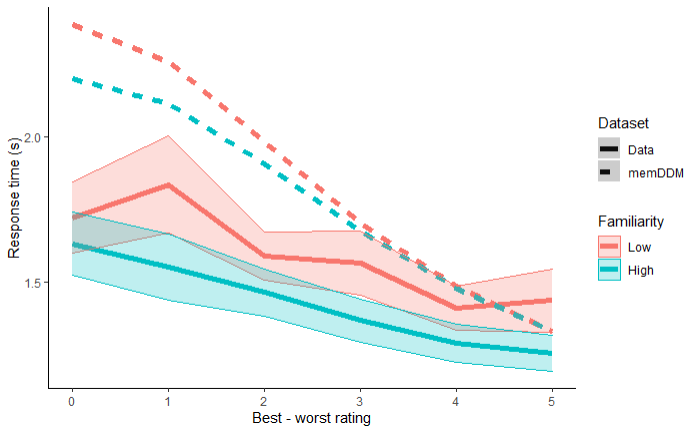

# memDDM {#memDDM}

(TL;DR) I attempt to incorporate working memory (mem-) into a exponential collapsing bounds Drift-Diffusion-Model (DDM). The exponential bounds add two new parameters to the DDM, delay before collapse and rate of collapse. I hypothesized that the delay before the collapse will inversely scale with previous encounters with either stimuli (call this "familiarity"). In other words, people will make less patient decisions when they are more familiar with the stimuli. I tested this out by setting delay equal to $t_0 + \gamma \text{Familiarity}$, where $t_0$ is a baseline collapse delay and $\gamma<0$ is how much the delay is scaled by familiarity. I found $t_0=8.4$, similar to the delay estimate from a standard collapsing bound DDM. Furthermore, I found $\gamma=-0.8$, indicating that patience is inversely scaled in familiarity with the stimuli. Unfortunately, predictions from this memDDM are not a good qualitative match with response time patterns observed in the data.

<center>

</center>

## Introduction

Like in the last chapter, I'm trying to model faster response times in response to repeated exposure to stimuli. I tried incorporating a drift rate that scales with the number of previous exposures to the chosen option. That didn't work.

Ya boi is at it again, except this time, I hypothesize that the time when decision bounds start collapsing is modulated by the number of previous encounters with either option. Specifically, using the functional form laid out by [@hawkins2015], I hypothesize that the shape parameter ($\kappa$) is inversely proportional to the number of previous exposures. 

Note that here, I am using a Generalized Drift-Diffusion-Model [@shinn2020], not an aDDM. This is for 2 reasons:

1. I want some practice with fitting the GDDM using the PyDDM package.

2. I want to see how flexible the parameters of the GDDM are.

3. It'll probably be faster to estimate than an aDDM, which appeases my currently tight schedule.

Similar to the last chapter, the goals of this report are to:

1. Incorporate the idea that internal samples are modulated by (and sometimes even sampled from) memory into a sequential sampling model.

2. Build a variation of the DDM that explains shorter response times with more familiar stimuli.

## Methods

Reading and transforming the data from [@smith2018].

### Prep work

#### Load libraries

```{r message=FALSE, messages=FALSE}
rm(list = ls())
seed = 1337
library(dplyr)
library(ggplot2)
library(hrbrthemes)
library(ggsci)
library(data.table)
library(plotrix)
library(grid)
library(gridExtra)
library(reticulate)
use_python("D:/Program Files/PsychoPy/python.exe")
```

#### Load data

I will again be using the data from [@smith2018]. The data can be downloaded here:
https://osf.io/x2jhp/?view_only=2669d8f3983d4442952a52c5de5814f7. 

I calculate a variable called "PreviousEncounterBoth", which counts the number of previous trials in which the subject has seen either item for this trial.

Familiarity is low or high. Low means previous encounters with either item is below or equal to median for that subject. High means previous exposures is above median.

```{r}
load("data/mem-aDDM-smithkrajbich2018.RData")

twofoodeyedata <- twofoodeyedata %>%
  group_by(SubjectNumber, Trial) %>%
  mutate( # fixation number
    fixNum=row_number()
  ) 

# Running counts of the number of times the subjects have seen the left and right options across previous trials
twofoodchoicedata$PreviousEncounterLeft <- NA
twofoodchoicedata$PreviousEncounterRight <- NA
data <- twofoodchoicedata[order(twofoodchoicedata$SubjectNumber, twofoodchoicedata$Trial),]
for (n in 1:length(data$SubjectNumber)) {
  tempdata <- data[data$SubjectNumber==data$SubjectNumber[n] & data$Trial<=data$Trial[n],]
  prevList <- rbind(tempdata$FoodLeft,tempdata$FoodRight)
  data$PreviousEncounterLeft[n] <- sum(prevList==data$FoodLeft[n])-1
  data$PreviousEncounterRight[n] <- sum(prevList==data$FoodRight[n])-1
}
data$PreviousEncounterBoth <- data$PreviousEncounterLeft+data$PreviousEncounterRight
data$PreviousEncounterChosen <- 
  ifelse(data$LeftRight==1, data$PreviousEncounterLeft, data$PreviousEncounterRight)

data <- data %>%
  group_by(SubjectNumber) %>%
  mutate(
    pe.median = median(PreviousEncounterBoth),
    Familiarity = ifelse(PreviousEncounterBoth > pe.median, 1, 0) %>% factor(levels=c(0,1), labels=c("Low","High")),
    vdiff = ValueLeft-ValueRight,
    difficulty = abs(ValueLeft-ValueRight),
    LeftRight = ifelse(LeftRight==1, 1,0)
  )

write.csv(data, "data/mem-DDM-cleanSmithKrajbich2018.csv")
```

## Behavioral Results

What do choices and response times look like? This is what I'm trying to model.

### Choice probabilities

Probability of choosing the left option wrt value differences.

```{r, message=FALSE}
pdata.choice <- data %>%
  group_by(SubjectNumber, vdiff) %>%
  summarize(
    choice.means = mean(LeftRight)
  ) %>%
  ungroup() %>%
  group_by(vdiff) %>%
  summarize(
    y = mean(choice.means),
    se = std.error(choice.means)
  )

plot.choice <- ggplot(data=pdata.choice, aes(x=vdiff, y=y)) +
  geom_vline(xintercept=0, color="grey", alpha=.75) +
  geom_hline(yintercept=0.5, color="grey", alpha=.75) +
  geom_line(size=2) +
  geom_ribbon(aes(ymin=y-se, ymax=y+se), alpha=.25) +
  labs(y="Pr(choose left)", x="Left - right rating") +
  theme_classic()
plot.choice
```


### RTs, grouped by familiarity.

This is the phenomenon I am trying to model with the GDDM. Response times across difficulties are shorter when the subject is more familiar with both stimuli.

```{r, message=FALSE}
pdata.rt <- data %>%
  group_by(SubjectNumber, Familiarity, difficulty) %>%
  summarize(
    RT.means = mean(RT)
  ) %>%
  ungroup() %>%
  group_by(Familiarity, difficulty) %>%
  summarize(
    y = mean(RT.means),
    se = std.error(RT.means)
  )

plot.rt <- ggplot(data=pdata.rt, aes(x=difficulty, y=y, group=Familiarity, color=Familiarity)) +
  geom_line(size=2) +
  geom_ribbon(aes(ymin=y-se, ymax=y+se, fill=Familiarity), alpha=.25) +
  labs(y="Response times (s)", x="Best - worst rating") +
  theme_classic()
plot.rt
```

## Fit with PyDDM

I will use PyDDM by [@shinn2020] to fit a GDDM to the data.

### Libraries and reading in the data

```{python, eval=FALSE}
from ddm import Model, Fittable, Sample, Bound, set_N_cpus, FitResult
from ddm.functions import fit_adjust_model, display_model, fit_adjust_model
from ddm.models import NoiseConstant, BoundConstant, BoundCollapsingExponential, OverlayChain, OverlayNonDecision, OverlayPoissonMixture, LossRobustBIC
import ddm.plot
import math
import pandas as pd
import numpy as np

set_N_cpus(4)

# read in csv data
with open("data/mem-DDM-cleanSmithKrajbich2018.csv", "r") as f:
    df_rt = pd.read_csv(f)

df_rt = df_rt[df_rt["SubjectNumber"]==1]

sk_sample = Sample.from_pandas_dataframe(df_rt, rt_column_name="RT", correct_column_name="LeftRight")
```


### Standard DDM

Fix noise = 1. Why noise? We are going to fit collapsing bounds later, so need to fix something else. Noise is a more traditional candidate than drift rate as a fixed parameter.

```{python, eval=FALSE}
# Let drift rate vary with value difference
class DriftScaled(ddm.models.Drift):
  name = "Drift depends linearly on value difference"
  required_parameters = ["driftvaluediff"]
  required_conditions = ["vdiff"]
  
  def get_drift(self, conditions, **kwargs):
    return self.driftvaluediff * conditions["vdiff"]

# fit the data
model_sk = Model(
  name = 'SmithKrajbich2018 data, drift varies with value difference',
  drift = DriftScaled(
    driftvaluediff = Fittable(minval=0, maxval=2)
  ),
  noise = NoiseConstant(noise = 1),
  bound = BoundConstant(B=Fittable(minval=.1, maxval=1.5)),
  overlay=OverlayChain(
    overlays=[
      OverlayNonDecision(nondectime = Fittable(minval=0, maxval=1)), 
      OverlayPoissonMixture(pmixturecoef=.02,rate=1)
    ]
  ),
  dx=.01, 
  dt=.01, 
  T_dur=10
)
fit_model_sk_standard = fit_adjust_model(
  sample = sk_sample, 
  model = model_sk,
  lossfunction = LossRobustBIC,
  verbose=False)
display_model(fit_model_sk_standard)

with open("temp/memDDM-standard.txt", "w") as f:
    f.write(repr(fit_model_sk_standard))
```

### mem-DDM where drift scales with previous exposure to the chosen option

Just double checking that we get similar DDM parameters to the previous chapter, even though we aren't accounting for attentional biases here.

```{python, eval=FALSE}
# Let drift rate vary with value difference and previous exposure to the chosen item
class DriftScaled(ddm.models.Drift):
  name = "Drift depends linearly on value difference"
  required_parameters = ["driftvaluediff","driftprevexp"]
  required_conditions = ["vdiff","PreviousEncounterChosen"]
  
  def get_drift(self, conditions, **kwargs):
    return (self.driftvaluediff + self.driftprevexp * conditions["PreviousEncounterChosen"]) * conditions["vdiff"]

# fit the data
model_sk = Model(
  name = 'SmithKrajbich2018 data, drift varies with value difference',
  drift = DriftScaled(
    driftvaluediff = Fittable(minval=0, maxval=2),
    driftprevexp   = Fittable(minval=0, maxval=2)
  ),
  noise = NoiseConstant(noise = 1),
  bound = BoundConstant(B=Fittable(minval=.1, maxval=1.5)),
  overlay=OverlayChain(
    overlays=[
      OverlayNonDecision(nondectime = Fittable(minval=0, maxval=1)), 
      OverlayPoissonMixture(pmixturecoef=.02,rate=1)
    ]
  ),
  dx=.01, 
  dt=.01, 
  T_dur=10
)
fit_model_sk_driftScaled = fit_adjust_model(
  sample = sk_sample, 
  model = model_sk,
  lossfunction = LossRobustBIC,
  verbose=False)
display_model(fit_model_sk_driftScaled)

with open("temp/memDDM-dirftScaled.txt", "w") as f:
    f.write(repr(fit_model_sk_driftScaled))
```

Good news everyone! Drift rate, accounting for wider boundaries, is in the same ballpark as before.

### DDM with collpasing bounds

Using exponential bounds to speed up fitting. Faster than [@hawkins2015] Weibull CDF since it has fewer parameters. After some conversations with Daeyeol Lee in Lake Arrowhead 2020, it also doesn't seem like it makes much difference what the functional form of the collapsing bounds is. In terms of predictive accuracy, they don't make much difference. Since this is just early exploration and isn't going out to any peer-reviewed journals... why not just go with the faster functional form?

```{python, eval=FALSE}
# Let drift rate vary with value difference
class DriftRate(ddm.models.Drift):
  name = "Drift depends linearly on value difference"
  required_parameters = ["driftvaluediff"]
  required_conditions = ["vdiff"]
  
  def get_drift(self, conditions, **kwargs):
    return self.driftvaluediff * conditions["vdiff"]
    
# Let bounds collapse after a certain delay
class BoundCollapsingExponentialDelay(Bound):
    """Bound collapses exponentially over time.

    Takes three parameters: 

    `B` - the bound at time t = 0.
    `tau` - the time constant for the collapse, should be greater than
    zero.
    `t1` - the time at which the collapse begins, in seconds
    """
    name = "Delayed exponential collapsing bound"
    required_parameters = ["B", "tau", "t1"]
    def get_bound(self, t, conditions, **kwargs):
        if t <= self.t1:
            return self.B
        if t > self.t1:
            return self.B * np.exp(-self.tau*(t-self.t1))

# fit the data
model_sk = Model(
  name = 'SmithKrajbich2018 data, drift varies with value difference',
  drift = DriftRate(driftvaluediff = Fittable(minval=0, maxval=2)),
  noise = NoiseConstant(noise = 1),
  bound = BoundCollapsingExponentialDelay(
    B = Fittable(minval=.1, maxval=1.5),
    tau = Fittable(minval=.1, maxval=5),
    t1 = Fittable(minval=0, maxval=10)
  ),
  overlay=OverlayChain(
    overlays=[
      OverlayNonDecision(nondectime = Fittable(minval=0, maxval=1)), 
      OverlayPoissonMixture(pmixturecoef=.02,rate=1)
    ]
  ),
  dx=.01, 
  dt=.01, 
  T_dur=10
)
fit_model_sk_collapseBound = fit_adjust_model(
  sample = sk_sample, 
  model = model_sk,
  lossfunction = LossRobustBIC,
  verbose=False)
display_model(fit_model_sk_collapseBound)

with open("temp/memDDM-collapseBound.txt", "w") as f:
    f.write(repr(fit_model_sk_collapseBound))
```

* Drift rate = 0.35
* Noise = 1
* Boundary starting point = 1.3
* Boundary delay = 8.4
* Rate of collapse = 1.9
* Non-decision time = 0.6


### mem-DDM where boundary collapse shape scales with previous exposure to both items

Using exponential bounds where delay is scaled by previous exposure to both items.

```{python, eval=FALSE}
# Let drift rate vary with value difference
class DriftRate(ddm.models.Drift):
  name = "Drift depends linearly on value difference"
  required_parameters = ["driftvaluediff"]
  required_conditions = ["vdiff"]
  
  def get_drift(self, conditions, **kwargs):
    return self.driftvaluediff * conditions["vdiff"]
    
# Let bounds collapse after a certain delay scaled by previous exposure
class BoundCollapsingExponentialDelay(Bound):
    """Bound collapses exponentially over time.

    Takes three parameters: 

    `B` - the bound at time t = 0.
    `tau` - the time constant for the collapse, should be greater than
    zero.
    `t1` - the time at which the collapse begins, in seconds
    `gam` - how does delay scale with previous exposure to both options
    """
    name = "Delayed exponential collapsing bound"
    required_parameters = ["B", "tau", "t1", "gam"]
    required_conditions = ["PreviousEncounterBoth"]
    def get_bound(self, t, conditions, **kwargs):
        scaledDelay = self.t1 + self.gam * conditions["PreviousEncounterBoth"]
        if t <= scaledDelay:
            return self.B
        if t > scaledDelay:
            return self.B * np.exp(-self.tau*(t-scaledDelay))

# fit the data
model_sk = Model(
  name = 'SmithKrajbich2018 data, drift varies with value difference',
  drift = DriftRate(driftvaluediff = Fittable(minval=.2, maxval=.5)),
  noise = NoiseConstant(noise = 1),
  bound = BoundCollapsingExponentialDelay(
    B = Fittable(minval=1, maxval=1.4),
    tau = Fittable(minval=.1, maxval=3),
    t1 = Fittable(minval=0, maxval=10),
    gam = Fittable(minval=-10, maxval=10)
  ),
  overlay=OverlayChain(
    overlays=[
      OverlayNonDecision(nondectime = Fittable(minval=0, maxval=1)), 
      OverlayPoissonMixture(pmixturecoef=.02,rate=1)
    ]
  ),
  dx=.01, 
  dt=.01, 
  T_dur=10
)
fit_model_sk_collapseBoundScaled = fit_adjust_model(
  sample = sk_sample, 
  model = model_sk,
  lossfunction = LossRobustBIC,
  verbose=False)
display_model(fit_model_sk_collapseBoundScaled)

with open("temp/memDDM-boundsScaled-additive.txt", "w") as f:
    f.write(repr(fit_model_sk_collapseBoundScaled))
```

* Drift rate = 0.37
* Noise = 1
* Boundary starting point = 1.3
* Boundary delay with no familiarity = 8.4
* Familiarity linearly scales boundary delay = -0.8
* Rate of collapse = 2.6
* Non-decision time = 0.6

## Simulations

Simulating the memDDM to see if it can predict the behavior we see in the data.

### Read the stored models

```{python, eval=FALSE}
with open("temp/memDDM-standard.txt", "r") as f:
    fit_model_sk_standard = eval(f.read())

with open("temp/memDDM-boundsScaled-additive.txt", "r") as f:
    fit_model_sk_collapseBoundScaled = eval(f.read())
```


### Define a function to get mean response time. 

This will be for a given a value difference and previous encounter since that's how the simulations are generated.

```{python, eval=FALSE}
def get_rt(solutionObj, modelObj):
  return(
    # top: mean RT for left choices * probability of left
    # bottom: mean RT for right choices * probability of right
    np.mean(
      sum(solutionObj.corr*modelObj.t_domain()) +
      sum(solutionObj.err*modelObj.t_domain())
    )
  )
```

### Simulate choices and response times

Use unique combinations of value difference and previous encounters with both stimuli from the data.

```{python, eval=FALSE}
conditions = ["PreviousEncounterBoth","vdiff"]
pe_unique = np.unique(df_rt[conditions[0]])
vdiff_unique = np.unique(df_rt[conditions[1]])
nObs = len(pe_unique)*len(vdiff_unique)
placeholder = np.repeat(0.0, nObs)
df_sim_standard = pd.DataFrame(
  data = np.matrix([placeholder, placeholder, placeholder, placeholder]).T,
  columns = ["vdiff","pe","choice","rt"]
)
df_sim_CBS = pd.DataFrame(
  data = np.matrix([placeholder, placeholder, placeholder, placeholder]).T,
  columns = ["vdiff","pe","choice","rt"]
)

ind = -1
for vd in vdiff_unique:
  for pe in pe_unique:
      
      ind = ind + 1
      
      sol_standard = fit_model_sk_standard.solve(
        conditions = {
          "vdiff":vd,
          "PreviousEncounterBoth":pe
        }
      )
      
      df_sim_standard["vdiff"][ind] = vd
      df_sim_standard["pe"][ind] = pe
      df_sim_standard["choice"][ind] = sol_standard.prob_correct()
      df_sim_standard["rt"][ind] = get_rt(sol_standard, model_sk)
      
      sol_collapseBoundScaled = fit_model_sk_collapseBoundScaled.solve(
        conditions = {
          "vdiff":vd,
          "PreviousEncounterBoth":pe
        }
      )
      
      df_sim_CBS["vdiff"][ind] = vd
      df_sim_CBS["pe"][ind] = pe
      df_sim_CBS["choice"][ind] = sol_collapseBoundScaled.prob_correct()
      df_sim_CBS["rt"][ind] = get_rt(sol_collapseBoundScaled, model_sk)
      
df_sim_standard.to_csv("temp/memDDM-sim-standard.csv")
df_sim_CBS.to_csv("temp/memDDM-sim-collapseBoundScaled.csv")
```

## Compare simulations and data

### Choices

```{r, message=FALSE, warning=FALSE}
#sim.DDM <- read.csv("temp/memDDM-sim-standard.csv")
sim.memDDM <- read.csv("temp/memDDM-sim-collapseBoundScaled.csv")

# sim.DDM <- sim.DDM %>%
#   group_by(vdiff) %>%
#   summarize(
#     y = mean(choice),
#     Dataset = "DDM",
#     se = NA
#   )

sim.memDDM <- sim.memDDM %>%
  group_by(vdiff) %>%
  summarize(
    y = mean(choice),
    Dataset = "memDDM",
    se = NA
  )

pdata.choice$Dataset <- "Data"

pdata.compare.choice <- bind_rows(sim.memDDM, pdata.choice)

plot.compare.choice <- ggplot(data=pdata.compare.choice, aes(x=vdiff, y=y, color=Dataset, linetype=Dataset)) +
  geom_vline(xintercept=0, color="grey", alpha=.75) +
  geom_hline(yintercept=0.5, color="grey", alpha=.75) +
  geom_line(size=2) +
  geom_ribbon(aes(ymin=y-se, ymax=y+se, fill=Dataset), alpha=.25) +
  labs(y="Pr(choose left)", x="Left - right rating") +
  theme_classic() +
  scale_color_futurama() +
  scale_fill_futurama()
plot.compare.choice
```

The memDDM does quite a poor job with predicting choices.

### RTs

```{r, message=FALSE, warning=FALSE}
#sim.DDM <- read.csv("temp/memDDM-sim-standard.csv")
sim.memDDM <- read.csv("temp/memDDM-sim-collapseBoundScaled.csv")

pe.med <- as.numeric(unique(data[data$SubjectNumber==1,]$pe.median))

# sim.DDM <- sim.DDM %>%
#   mutate(
#     Familiarity = factor(
#       ifelse(pe>pe.med, 1, 0), 
#       levels=c(0,1),
#       labels=c("Low","High")
#     ),
#     difficulty = abs(vdiff)
#   ) %>%
#   group_by(difficulty, Familiarity) %>%
#   summarize(
#     y = mean(rt),
#     se = NA,
#     Dataset = "DDM"
#   )

sim.memDDM <- sim.memDDM %>%
  mutate(
    pe.med = pe.med,
    Familiarity = factor(
      ifelse(pe>pe.med, 1, 0), 
      levels=c(0,1),
      labels=c("Low","High")
    ),
    difficulty = abs(vdiff)
  ) %>%
  group_by(difficulty, Familiarity) %>%
  summarize(
    y = mean(rt),
    se = NA,
    Dataset = "memDDM"
  )

pdata.rt$Dataset <- "Data"

pdata.compare.rt <- bind_rows(sim.memDDM, pdata.rt)

plot.compare.rt <- ggplot(data=pdata.compare.rt, aes(x=difficulty, y=y, color=Familiarity, linetype=Dataset)) +
  geom_line(size=2) +
  geom_ribbon(aes(ymin=y-se, ymax=y+se, fill=Familiarity), alpha=.25) +
  labs(y="Response time (s)", x="Best - worst rating") +
  theme_classic()
plot.compare.rt
```

For high difficulty trials, looks like we can get slight downward shifts in response time with high familiarity. This difference gradually falls to 0 as trials get easier. Predictions are nowhere near observed response times at higher difficulties. It seems that boundary collapse delay scaled by repeated encounters with both stimuli is unable to generate the level shifts in response time with familiarity that we see in data.
