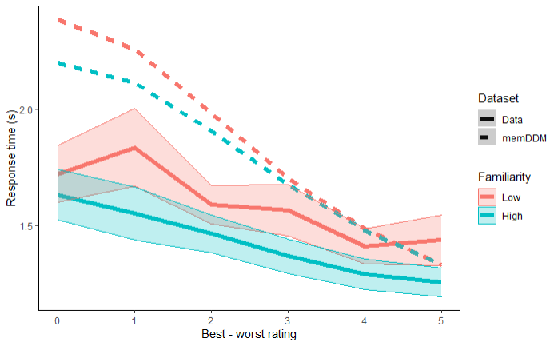

--- 
title: "Late Night Bayes ☾"
author: "Brenden Eum"
date: "`r Sys.Date()`"
site: bookdown::bookdown_site
output: bookdown::gitbook
documentclass: book
bibliography: [book.bib, packages.bib]
biblio-style: apalike
link-citations: yes
github-repo: rstudio/bookdown-demo
description: "A collection of reports about my side projects."
---

# Welcome

My name is Brenden, and I am a Social & Decision Neuroscience PhD student at Caltech. 

This is a compilation of some reports that I write out of curiosity. My goal is to share these projects with others to speed up the spread of new methods or to answer simple questions. So far, all the data used on this site is available at www.rnl.caltech.edu or various other sites (e.g. OSF). Given how much I write / comment, it should be fairly easy to find the datasets :). I'll try to include a link to the data in each chapter.

Feel free to reach out to me if you have any questions or if you just want to chat (beum@caltech.edu)!

<!--chapter:end:index.Rmd-->


# Decision Classification Boundaries {#dcb}

(TL;DR) Glickman, Moran, and Usher's (2022) Decision Classification Boundaries perform (1) outstandingly well with simulated, perceptual data; (2) decently well with impatient subjects in perceptual tasks; and (3) unsurprisingly poor with subjects in value-based tasks.

{width=60%}

This notebook is a test of the methods from [@glickman2022]. I would like to see if their algorithm that dynamically estimates collapsing bounds (Decision Classification Boundary, DCB) works with perceptual data from an upcoming belief tracking project and value-based data from [@eum2022].

#### Simulated, perceptual data {-}

First, I will simulate data for two cyborgs using a DDM. Their task will be to select from two streams of rectangles whichever stream has the taller average height (see [@tsetsos2016] or [@glickman2022]). The first cyborg will utilize fixed decision boundaries; the second cyborg will utilize collapsing boundaries (Weibull function, per tradition). I will test if the DCB algorithm can recover the decision boundaries for both cyborgs.

#### Real, perceptual data {-}

Second, I will use preliminary data collected for my upcoming slider task. The task is again for subjects to select from two streams of rectangles which stream has the taller average height. I think it would be interesting to see if DCB works with both (1) accumulated evidence and (2) location of the slider.

#### Real, value-based data {-}

Third, I will read in the data from [@eum2022]. I will only use trials from the visible condition. This will be interesting since there isn't a stream of varying evidence. It's just a single value comparison that accumulates over time. If we use an aDDM, then there will be some variation in evidence over time based on fixation data. 

#### Here's a quick summary of what DCB does: {-}

1. Discretize your time-dimension.
2. Consider a single trial. At any time during that trial, the sequence of stimuli has provided a stream of evidence in favor of one of the actions. In the case of perceptual tasks, we can take the sum of evidence over time and come up with a metric for "accumulated evidence" at any given time point. This might be a bit trickier in value-based decision tasks.
3. At any given point in time, agents have three potential actions (continue sampling, choose left, choose right). If we consider one point in time, then we can look at the distributions of actions along a single dimension, accumulated evidence. 
3. Each trial yields one point along this accumulated evidence dimension. The points are labeled by the action taken at that time during that trial. This allows for supervised separation by linear discriminant analysis (LDA).
4. The boundary separation curves approximate decision boundaries over time.

<center>
{width=30%}
</center>

```{r, message=FALSE, include=FALSE}
rm(list = ls())
seed = 1337
library(dplyr)
library(ggplot2)
library(gganimate)
library(hrbrthemes)
library(svMisc) #progress tracker
library(truncnorm)
library(MASS) #LDA
```


## Simulated, perceptual data

### Simulate data {.tabset}

The task is to select from two streams of rectangles the stream with the taller average height. We will generate two DDM cyborgs, the first with fixed decision bounds, the second with collapsing decision bounds.

#### DDM function {-}

Simulate behavior for a single trial using a DDM with symmetric bounds about 0.\
*Input*: Two equal-length streams of evidence, DDM parameters.\
*Output*: A time-series of choice (0=R, 1=L, 2=continue) and accumulated evidence (scaled by drift since we are working with the DDM).

```{r}
DDM <- function(L=c(0,0,0), R=c(0,0,0), b=0, d=.002, sig=.03, bound=c(1,1,1)) {
  if (length(L)!=length(R)) {stop("L and R differ in length.")}
  if (length(b)!=1 | length(d)!=1 | length(sig)!=1) {stop("Invalid DDM parameters.")}
  if (length(bound)!=length(L) & length(bound)!=1) {stop("Invalid bound. Must be defined at every time point or fixed.")}
  if (length(bound)==1) {ub <- rep(bound, length(L))} else {ub <- bound}
  df <- data.frame(
    sample = rep(NA, length(L)),
    choice = rep(NA, length(L)),
    ae = rep(NA, length(L))
  )
  RDV <- b
  accumEvid <- 0
  boundaryHit <- F
  for (t in 1:length(L)) {
    df$sample[t] <- t
    RDV <- RDV + d*(L[t]-R[t]) + rnorm(1, mean=0, sd=sig)
    accumEvid <- accumEvid + d*(L[t]-R[t]) # Accumulated evidence depends on the model you're using.
    df$ae[t] <- accumEvid
    df$choice[t] <- 2
    if (RDV>=ub[t] | RDV<=-ub[t]) {
      if (RDV>=ub[t]) {df$choice[t] <- 1}
      if (RDV<=-ub[t]) {df$choice[t] <- 0}
      boundaryHit <- T
      break
    }
  }
  # if (boundaryHit==F) { #Use this to figure out which trials didn't reach a decision.
  #   print("Decision was not reached within allotted number of samples.")
  # } 
  return(df)
}
```

#### Trial Data {-}

This will be exactly the same for both the fixed and collapsing cyborgs. Heights will vary around 50, bounded within (0,100). All trials will favor either L or R, but the degree of difficulty may vary.

```{r, cache = TRUE}
set.seed(seed)
nSamples = 50
nTrials = 1000
byTrial.mean = 50
byTrial.sd = 20
bySample.sd = 20
lb <- 0
ub <- 100

simulateData <- function(nSamples,nTrials,byTrial.mean,byTrial.sd,bySample.sd,lb,ub) {
  simData <- data.frame(
    trial = 1,
    L = rtruncnorm(
      nSamples,
      mean = rnorm(1, mean = byTrial.mean, sd = byTrial.sd),
      sd = bySample.sd,
      a = lb,
      b = ub
    ),
    R = rtruncnorm(
      nSamples,
      mean = rnorm(1, mean = byTrial.mean, sd = byTrial.sd),
      sd = bySample.sd,
      a = lb,
      b = ub
    )
  )
  
  for (n in 2:nTrials) {
  #progress(n, nTrials) #progress tracker
  tempData <- data.frame(
    trial = n,
    L = rtruncnorm(
      nSamples,
      mean = rnorm(1, mean = byTrial.mean, sd = byTrial.sd),
      sd = bySample.sd,
      a = lb,
      b = ub
    ),
    R = rtruncnorm(
      nSamples,
      mean = rnorm(1, mean = byTrial.mean, sd = byTrial.sd),
      sd = bySample.sd,
      a = lb,
      b = ub
    )
  )
  simData <- rbind(simData, tempData)
  }
  return(simData)
}

simData <- simulateData(
  nSamples,
  nTrials,
  byTrial.mean,
  byTrial.sd,
  bySample.sd,
  lb,
  ub)
```


#### Fixed bounds cyborg {-}

Bounds are fixed to 50 and -50 via the 'bound' attribute of the fixedCyborg.ddm object.

```{r}
set.seed(seed)

fixedCyborg.ddm <- list(
  b = 0,
  d = .9,
  sig = 4,
  bound = 50
)

trialData <- list(
    L = simData$L[simData$trial==1],
    R = simData$R[simData$trial==1]
  )  
fixedCyborg.data <- do.call(DDM, c(trialData,fixedCyborg.ddm))
fixedCyborg.data$trial <- 1

for (trial in 2:nTrials) {
  #progress(trial,nTrials) #progress tracker
  trialData <- list(
    L = simData$L[simData$trial==trial],
    R = simData$R[simData$trial==trial]
  )  
  tempData <- do.call(DDM, c(trialData,fixedCyborg.ddm))
  tempData$trial <- trial
  fixedCyborg.data <- rbind(fixedCyborg.data, tempData)
}
fixedCyborg.data <- na.omit(fixedCyborg.data)
summary(fixedCyborg.data)
```

#### Collapsing bounds cyborg {-}

Bounds are decreasing as a Weibull function. Weibull parameters are taken directly from [@glickman2022], which I'm led to believe are taken directly from [@hawkins2015]. The Weibull function is taken directly from [@hawkins2015]. The scale parameter ($\lambda$) is fixed to 4. Shape ($\kappa$) and asymptotic convergence ($a'$) can vary.

```{r}
set.seed(seed)

weibullbound <- function(t, a, k, lam, ap) {
  return( a-(1-exp(-(t/k)^k))*(.5*a+ap) )
}

collapsingCyborg.ddm <- list(
  b = 0,
  d = .9,
  sig = 4,
  bound = weibullbound(t=c(1:nSamples), a=100, k=3, lam=4, ap=10) # see Glickman et al. (2022) or Hawkins et al. (2015)
)

trialData <- list(
  L = simData$L[simData$trial==1],
  R = simData$R[simData$trial==1]
)  
collapsingCyborg.data <- do.call(DDM, c(trialData,collapsingCyborg.ddm))
collapsingCyborg.data$trial <- 1

for (trial in 2:nTrials) {
  #progress(trial,nTrials) #progress tracker
  trialData <- list(
    L = simData$L[simData$trial==trial],
    R = simData$R[simData$trial==trial]
  )  
  tempData <- do.call(DDM, c(trialData,collapsingCyborg.ddm))
  tempData$trial <- trial
  collapsingCyborg.data <- rbind(collapsingCyborg.data, tempData)
}
collapsingCyborg.data <- na.omit(collapsingCyborg.data)
summary(collapsingCyborg.data)
```

### Check behavior {.tabset}

#### Fixed bounds cyborg {-}

Behavior makes sense given the decision boundaries. There is some leakage across the boundaries proportional to the variance of the noise in the DDM.

```{r fixed_check, out.width='80%', fig.asp=.75, fig.align='center', warning=FALSE, echo=FALSE, cache = TRUE }
tempData <- fixedCyborg.data
tempData$choice <- factor(tempData$choice, levels=c(0,1,2), labels=c('Choose right','Choose left','Continue sampling'))
p <- tempData[tempData$sample<=10,] %>%
  ggplot(aes(x=ae, fill=choice, color=choice)) +
  geom_histogram(alpha=.5, bins=100, position='identity') +
  geom_vline(xintercept=50, color='darkgrey', linetype='dashed', alpha=.5, size=2) +
  geom_vline(xintercept=-50, color='darkgrey', linetype='dashed', alpha=.5, size=2) +
  coord_flip() +
  theme_classic() +
  labs(title='Sample: {closest_state}', x='Accumulated Evidence', y='Count') +
  xlim(c(-150,150)) +
  transition_states(sample) +
  theme(plot.title = element_text(size=22))
p
```

#### Collapsing bounds cyborg {-}

Behavior makes sense given the decision boundaries. There is some leakage across the boundaries proportional to the variance of the noise in the DDM.

```{r collapsing_check, out.width='80%', fig.asp=.75, fig.align='center', warning=FALSE, echo=FALSE, cache = TRUE}
tempData <- collapsingCyborg.data
tempData$upperbound <- weibullbound(tempData$sample, a=100, k=3, lam=4, ap=10)
tempData$choice <- factor(tempData$choice, levels=c(0,1,2), labels=c('Choose right','Choose left','Continue sampling'))
p <- tempData[tempData$sample<=10,] %>%
  ggplot(aes(x=ae, fill=choice, color=choice)) +
  geom_histogram(alpha=.5, bins=100, position='identity') +
  geom_vline(aes(xintercept=upperbound), color='darkgrey', linetype='dashed', alpha=.5, size=2) +
  geom_vline(aes(xintercept=-upperbound), color='darkgrey', linetype='dashed', alpha=.5, size=2) +
  coord_flip() +
  theme_classic() +
  labs(title='Sample: {closest_state}', x='Accumulated Evidence', y='Count') +
  xlim(c(-150,150)) +
  transition_states(sample) +
  theme(plot.title = element_text(size=22))
p
```

### DCB {.tabset}

#### DCB function {-}

Dynamically estimate collapsing decision boundaries up to a certain sample number.\
*Input*: (1) Time-series data for a single subject with trial, sample number, choice ({0,1,2} see above), and accumulated evidence. (2) Maximum sample number (since our figures only go up to 10, let's just set this as 10 for now).\
*Output*: Time-series of the bound, over sample number dimension (time). Note that [@glickman2022] assumed that the collapsing bounds were symmetrical, therefore they took the average of the separating planes.

```{r}
DCB <- function(data, maxSample) {
  samples <- c(1:maxSample)
  output <- data.frame(
    sample = samples,
    ub = rep(NA, length(samples)),
    lb = rep(NA, length(samples)),
    avgb = rep(NA, length(samples))
  )
  x_vals <- data.frame(ae = seq(-150,150,1)) # resolution of the collapsing boundary
  for (n in samples) { #samples
    tryCatch({ # In some cases, there may not be any decisions for left or right when sample number is small. Don't return an error.
      lda.fit <- lda(choice~ae, data[data$sample==n,])
      lda.pred <- predict(lda.fit,x_vals)
      #x_val closest to decision boundary for upper bound (.5 posterior probability of being choice=1 or 2)
      ub_x_vals <- seq(0,150,1)
      output$ub[n] = ub_x_vals[ which(abs(lda.pred$posterior[151:301,'2']-0.5)==min(abs(lda.pred$posterior[151:301,'2']-0.5))) ]
      #x_val closest to decision boundary for lower bound (.5 posterior probability of being choice=0 or 2)
      lb_x_vals <- seq(-150,-1,1)
      output$lb[n] = lb_x_vals[ which(abs(lda.pred$posterior[1:150,'2']-0.5)==min(abs(lda.pred$posterior[1:150,'2']-0.5))) ]
      output$avgb[n] = .5*(abs(output$ub[n])+abs(output$lb[n]))
    }, error=function(e){cat("ERROR :",conditionMessage(e), "\n")})
  }
  return(output)
}
```

#### Fixed bounds cyborg {-}

The DCB isn't perfect, but I honestly can't deny that I'm surprised by its accuracy. Clearly it performs worse as data becomes sparse (i.e. when there are fewer choices at later times).

```{r fixed_dcb, out.width='80%', fig.asp=.75, fig.align='center', message=FALSE, warning=FALSE, error=FALSE, echo=FALSE, cache = TRUE}
set.seed(seed)

fixedCyborg.dcb <- DCB(fixedCyborg.data, 10)

tempData <- fixedCyborg.data
tempData$choice <- factor(tempData$choice, levels=c(0,1,2), labels=c('Choose right','Choose left','Continue sampling'))
tempData <- merge(tempData,fixedCyborg.dcb[,c('sample','avgb')], by.x="sample", by.y="sample")
p <- tempData[tempData$sample<=10,] %>%
  ggplot(aes(x=ae, fill=choice, color=choice)) +
  geom_histogram(alpha=.5, bins=100, position='identity') +
  geom_vline(xintercept=50, color='darkgrey', linetype='dashed', alpha=.5, size=2) +
  geom_vline(xintercept=-50, color='darkgrey', linetype='dashed', alpha=.5, size=2) +
  geom_vline(aes(xintercept=avgb), color='red', alpha=.5, size=1) +
  geom_vline(aes(xintercept=-avgb), color='red', alpha=.5, size=1) +
  coord_flip() +
  theme_classic() +
  labs(title='Sample: {closest_state}', x='Accumulated Evidence', y='Count') +
  xlim(c(-150,150)) +
  transition_states(sample) +
  theme(plot.title = element_text(size=22))
p
```

#### Collapsing bounds cyborg {-}

This is where things get even more interesting. The DCB follows the collapsing bound generated by a Weibull function quite well. 

```{r collapsing_dcb, out.width='80%', fig.asp=.75, fig.align='center', message=FALSE, warning=FALSE, error=FALSE, echo=FALSE, cache = TRUE}
set.seed(seed)

collapsingCyborg.dcb <- DCB(collapsingCyborg.data, 10)

tempData <- collapsingCyborg.data
tempData$upperbound <- weibullbound(tempData$sample, a=100, k=3, lam=4, ap=10)
tempData$choice <- factor(tempData$choice, levels=c(0,1,2), labels=c('Choose right','Choose left','Continue sampling'))
tempData <- merge(tempData,collapsingCyborg.dcb[,c('sample','avgb')], by.x="sample", by.y="sample")
p <- tempData[tempData$sample<=10,] %>%
  ggplot(aes(x=ae, fill=choice, color=choice)) +
  geom_histogram(alpha=.5, bins=100, position='identity') +
  geom_vline(aes(xintercept=upperbound), color='darkgrey', linetype='dashed', alpha=.5, size=2) +
  geom_vline(aes(xintercept=-upperbound), color='darkgrey', linetype='dashed', alpha=.5, size=2) +
  geom_vline(aes(xintercept=avgb), color='red', alpha=.5, size=1) +
  geom_vline(aes(xintercept=-avgb), color='red', alpha=.5, size=1) +
  coord_flip() +
  theme_classic() +
  labs(title='Sample: {closest_state}', x='Accumulated Evidence', y='Count') +
  xlim(c(-150,150)) +
  transition_states(sample) +
  theme(plot.title = element_text(size=22))
p
```

### Preliminary conclusion

The DCB performs remarkably well for simulated, perceptual data where there are sequences of stimuli for each decision.

There is one obvious problem at this stage. Decision boundaries cannot be estimated at a given point in time if, across all trials, all three actions are not made at that point in time. For instance, at sample 1, no choices were made for the right option; therefore, decision boundaries cannot be estimated at time $\text{sample}=1$. This prevents the DCB from estimating the starting point of decision boundaries. This seems to be the case in [@glickman2022] too.

<center>
{width=30%}
</center>

### Comparative statics {.tabset}

Let's see how the DCB performs when we alter some of the cyborgs' parameters.

#### Fixed bounds cyborg {.tabset}

##### Drift {-}

*Prediction*: The DCB should work fine regardless of the drift rate since accumulated evidence can be modulated by drift rate. This should also extend to attentional discounting from the aDDM with fixation data.

* bias = $0$
* noise = $4$
* bound = $\pm 50$

```{r, message=FALSE, warning=FALSE, error=FALSE, echo=FALSE}
set.seed(seed)
setBound = 50
paramChanges = c(.1,.5,.9,1.3)

# Simulate behavioral data for every possible drift rate, holding other parameters constant.
cyborg.data.compare <- data.frame()
for (paramChange in paramChanges) {
  #print(driftRate) #progress tracker
  cyborg.ddm <- list(
    b = 0,
    d = paramChange,
    sig = 4,
    bound = setBound
  )
  trialData <- list(
    L = simData$L[simData$trial==1],
    R = simData$R[simData$trial==1]
  )  
  cyborg.data <- do.call(DDM, c(trialData,cyborg.ddm))
  cyborg.data$trial <- 1
  cyborg.data$paramChange <- paramChange
  for (trial in 2:nTrials) {
    trialData <- list(
      L = simData$L[simData$trial==trial],
      R = simData$R[simData$trial==trial]
    )  
    tempData <- do.call(DDM, c(trialData,cyborg.ddm))
    tempData$trial <- trial
    tempData$paramChange <- paramChange
    cyborg.data <- rbind(cyborg.data, tempData)
  }
  cyborg.data.compare <- rbind(cyborg.data.compare, cyborg.data)
}
cyborg.data.compare <- na.omit(cyborg.data.compare) #drop all rows with no action (choice already made)

# Get DCB for every driftRate
cyborg.dcb.compare <- data.frame()
for (paramChange in paramChanges) {
  cyborg.dcb <- DCB(cyborg.data.compare[cyborg.data.compare$paramChange==paramChange,], 10)
  tempData <- cyborg.data.compare[cyborg.data.compare$paramChange==paramChange,]
  tempData$upperbound <- round(setBound,0)
  tempData$paramChange <- round(tempData$paramChange,1) #for some reason, you need to round this to get precise matches with Shiny input
  tempData <- merge(tempData,cyborg.dcb[,c('sample','avgb')], by.x="sample", by.y="sample")
  cyborg.dcb.compare <- rbind(cyborg.dcb.compare, tempData)
}
cyborg.dcb.compare$choice <- factor(cyborg.dcb.compare$choice, levels=c(0,1,2), labels=c('Choose right','Choose left','Continue sampling'))

# Plot
cyborg.dcb.compare %>%
  ggplot(aes(x=ae, fill=choice, color=choice)) +
  geom_histogram(alpha=.5, bins=100, position='identity') +
  geom_vline(aes(xintercept=upperbound), color='darkgrey', linetype='dashed', alpha=.75, size=2) +
  geom_vline(aes(xintercept=-upperbound), color='darkgrey', linetype='dashed', alpha=.75, size=2) +
  geom_vline(aes(xintercept=avgb), color='red', alpha=.5, size=1) +
  geom_vline(aes(xintercept=-avgb), color='red', alpha=.5, size=1) +
  coord_flip() +
  theme_classic() +
  labs(x='Drift rate', y='Sample') +
  xlim(c(-150,150)) +
  theme(
    plot.title = element_text(size=22),
    axis.ticks.x = element_blank(),
    axis.text.x = element_blank()
  ) +
  facet_grid(paramChange~sample, scales="free")
```

Aside from the fact that all the choices are not represented at early times when drift rate is low, we see that DCB tracks the fixed boundary well for any drift rate.

##### Noise {-}

This is important to consider since accumulated evidence can bleed over LDA boundaries. The more noise there is, the more that measurements of accumulated evidence will bleed over into other classifications. For instance, with a larger noise, there should be more "continue sampling" observations that fall above the separating plane for "choose left" and below the separating plane for "choose right". And vice versa.

*Prediction*: I think more noise variance will negatively affect the performance of the DCB.

* bias = $0$
* drift = $0.9$
* bound = $\pm 50$

```{r, message=FALSE, warning=FALSE, error=FALSE, echo=FALSE}
set.seed(seed)
setBound = 50
paramChanges = c(1,4,8,20)

# Simulate behavioral data for every possible drift rate, holding other parameters constant.
cyborg.data.compare <- data.frame()
for (paramChange in paramChanges) {
  #print(driftRate) #progress tracker
  cyborg.ddm <- list(
    b = 0,
    d = 0.9,
    sig = paramChange,
    bound = setBound
  )
  trialData <- list(
    L = simData$L[simData$trial==1],
    R = simData$R[simData$trial==1]
  )  
  cyborg.data <- do.call(DDM, c(trialData,cyborg.ddm))
  cyborg.data$trial <- 1
  cyborg.data$paramChange <- paramChange
  for (trial in 2:nTrials) {
    trialData <- list(
      L = simData$L[simData$trial==trial],
      R = simData$R[simData$trial==trial]
    )  
    tempData <- do.call(DDM, c(trialData,cyborg.ddm))
    tempData$trial <- trial
    tempData$paramChange <- paramChange
    cyborg.data <- rbind(cyborg.data, tempData)
  }
  cyborg.data.compare <- rbind(cyborg.data.compare, cyborg.data)
}
cyborg.data.compare <- na.omit(cyborg.data.compare) #drop all rows with no action (choice already made)

# Get DCB for every driftRate
cyborg.dcb.compare <- data.frame()
for (paramChange in paramChanges) {
  cyborg.dcb <- DCB(cyborg.data.compare[cyborg.data.compare$paramChange==paramChange,], 10)
  tempData <- cyborg.data.compare[cyborg.data.compare$paramChange==paramChange,]
  tempData$upperbound <- round(setBound,0)
  tempData$paramChange <- round(tempData$paramChange,1) #for some reason, you need to round this to get precise matches with Shiny input
  tempData <- merge(tempData,cyborg.dcb[,c('sample','avgb')], by.x="sample", by.y="sample")
  cyborg.dcb.compare <- rbind(cyborg.dcb.compare, tempData)
}
cyborg.dcb.compare$choice <- factor(cyborg.dcb.compare$choice, levels=c(0,1,2), labels=c('Choose right','Choose left','Continue sampling'))

# Plot
cyborg.dcb.compare %>%
  ggplot(aes(x=ae, fill=choice, color=choice)) +
  geom_histogram(alpha=.5, bins=100, position='identity') +
  geom_vline(aes(xintercept=upperbound), color='darkgrey', linetype='dashed', alpha=.75, size=2) +
  geom_vline(aes(xintercept=-upperbound), color='darkgrey', linetype='dashed', alpha=.75, size=2) +
  geom_vline(aes(xintercept=avgb), color='red', alpha=.5, size=1) +
  geom_vline(aes(xintercept=-avgb), color='red', alpha=.5, size=1) +
  coord_flip() +
  theme_classic() +
  labs(x='Noise', y='Sample') +
  xlim(c(-150,150)) +
  theme(
    plot.title = element_text(size=22),
    axis.ticks.x = element_blank(),
    axis.text.x = element_blank()
  ) +
  facet_grid(paramChange~sample, scales="free")
```

As the variance of noise grows, we see the performance of DCB progressively deteriorate over time. I would imagine that this could become a huge problem in real data and might affect the robustness of this algorithm.

##### Bounds {-}

*Prediction*: I think this may end up mechanically similar to changing the drift rate, so I don't think changing the bounds will affect DCB performance.

* bias = $0$
* drift = $0.9$
* noise = $4$

```{r, message=FALSE, warning=FALSE, error=FALSE, echo=FALSE}
set.seed(seed)
paramChanges = c(25,50,75,100)

# Simulate behavioral data for every possible drift rate, holding other parameters constant.
cyborg.data.compare <- data.frame()
for (paramChange in paramChanges) {
  #print(driftRate) #progress tracker
  cyborg.ddm <- list(
    b = 0,
    d = 0.9,
    sig = 4,
    bound = paramChange
  )
  trialData <- list(
    L = simData$L[simData$trial==1],
    R = simData$R[simData$trial==1]
  )  
  cyborg.data <- do.call(DDM, c(trialData,cyborg.ddm))
  cyborg.data$trial <- 1
  cyborg.data$paramChange <- paramChange
  for (trial in 2:nTrials) {
    trialData <- list(
      L = simData$L[simData$trial==trial],
      R = simData$R[simData$trial==trial]
    )  
    tempData <- do.call(DDM, c(trialData,cyborg.ddm))
    tempData$trial <- trial
    tempData$paramChange <- paramChange
    cyborg.data <- rbind(cyborg.data, tempData)
  }
  cyborg.data.compare <- rbind(cyborg.data.compare, cyborg.data)
}
cyborg.data.compare <- na.omit(cyborg.data.compare) #drop all rows with no action (choice already made)

# Get DCB for every driftRate
cyborg.dcb.compare <- data.frame()
for (paramChange in paramChanges) {
  cyborg.dcb <- DCB(cyborg.data.compare[cyborg.data.compare$paramChange==paramChange,], 10)
  tempData <- cyborg.data.compare[cyborg.data.compare$paramChange==paramChange,]
  tempData$upperbound <- round(paramChange,0)
  tempData$paramChange <- round(tempData$paramChange,1) #for some reason, you need to round this to get precise matches with Shiny input
  tempData <- merge(tempData,cyborg.dcb[,c('sample','avgb')], by.x="sample", by.y="sample")
  cyborg.dcb.compare <- rbind(cyborg.dcb.compare, tempData)
}
cyborg.dcb.compare$choice <- factor(cyborg.dcb.compare$choice, levels=c(0,1,2), labels=c('Choose right','Choose left','Continue sampling'))

# Plot
cyborg.dcb.compare %>%
  ggplot(aes(x=ae, fill=choice, color=choice)) +
  geom_histogram(alpha=.5, bins=100, position='identity') +
  geom_vline(aes(xintercept=upperbound), color='darkgrey', linetype='dashed', alpha=.75, size=2) +
  geom_vline(aes(xintercept=-upperbound), color='darkgrey', linetype='dashed', alpha=.75, size=2) +
  geom_vline(aes(xintercept=avgb), color='red', alpha=.5, size=1) +
  geom_vline(aes(xintercept=-avgb), color='red', alpha=.5, size=1) +
  coord_flip() +
  theme_classic() +
  labs(x='Bounds', y='Sample') +
  xlim(c(-150,150)) +
  theme(
    plot.title = element_text(size=22),
    axis.ticks.x = element_blank(),
    axis.text.x = element_blank()
  ) +
  facet_grid(paramChange~sample, scales="free")
```

Bounds don't seem to affect the performance of the DCB. The relatively poor performance of the DCB when bounds are large is caused by the uneven distribution of choices at early times. Early times are dominated by "continue sampling", making it difficult for LDA to determine accurate classification bounds.

##### Number of trials {-}

Keeping all else constant, how does the DCB perform with varying numbers of trials.

*Prediction*: DCB performance will asymptotically converge to some maximum performance. Hopefully it works well for approximately 300 trials, since I would like to apply this algorithm to more than simulated data.

* bias = $0$
* drift = $0.9$
* noise = $4$
* bound = $\pm 50$

```{r, message=FALSE, warning=FALSE, error=FALSE, echo=FALSE}
set.seed(seed)
setBound = 50
paramChanges = c(50, 150, 360, 500)

# Simulate behavioral data for every possible drift rate, holding other parameters constant.
cyborg.data.compare <- data.frame()
for (paramChange in paramChanges) {
  #print(driftRate) #progress tracker
  nTrials <- paramChange
  simData <- simulateData(
    nSamples,
    nTrials,
    byTrial.mean,
    byTrial.sd,
    bySample.sd,
    lb,
    ub
  )
  trialData <- list(
    L = simData$L[simData$trial==1],
    R = simData$R[simData$trial==1]
  )  
  cyborg.ddm <- list(
    b = 0,
    d = 0.9,
    sig = 4,
    bound = setBound
  )
  cyborg.data <- do.call(DDM, c(trialData,cyborg.ddm))
  cyborg.data$trial <- 1
  cyborg.data$paramChange <- paramChange
  for (trial in 2:nTrials) {
    trialData <- list(
      L = simData$L[simData$trial==trial],
      R = simData$R[simData$trial==trial]
    )  
    tempData <- do.call(DDM, c(trialData,cyborg.ddm))
    tempData$trial <- trial
    tempData$paramChange <- paramChange
    cyborg.data <- rbind(cyborg.data, tempData)
  }
  cyborg.data.compare <- rbind(cyborg.data.compare, cyborg.data)
}
cyborg.data.compare <- na.omit(cyborg.data.compare) #drop all rows with no action (choice already made)

# Get DCB for every driftRate
cyborg.dcb.compare <- data.frame()
for (paramChange in paramChanges) {
  cyborg.dcb <- DCB(cyborg.data.compare[cyborg.data.compare$paramChange==paramChange,], 10)
  tempData <- cyborg.data.compare[cyborg.data.compare$paramChange==paramChange,]
  tempData$upperbound <- round(setBound,0)
  tempData$paramChange <- round(tempData$paramChange,1) #for some reason, you need to round this to get precise matches with Shiny input
  tempData <- merge(tempData,cyborg.dcb[,c('sample','avgb')], by.x="sample", by.y="sample")
  cyborg.dcb.compare <- rbind(cyborg.dcb.compare, tempData)
}
cyborg.dcb.compare$choice <- factor(cyborg.dcb.compare$choice, levels=c(0,1,2), labels=c('Choose right','Choose left','Continue sampling'))

# Plot
cyborg.dcb.compare %>%
  ggplot(aes(x=ae, fill=choice, color=choice)) +
  geom_histogram(alpha=.5, bins=100, position='identity') +
  geom_vline(aes(xintercept=upperbound), color='darkgrey', linetype='dashed', alpha=.75, size=2) +
  geom_vline(aes(xintercept=-upperbound), color='darkgrey', linetype='dashed', alpha=.75, size=2) +
  geom_vline(aes(xintercept=avgb), color='red', alpha=.5, size=1) +
  geom_vline(aes(xintercept=-avgb), color='red', alpha=.5, size=1) +
  coord_flip() +
  theme_classic() +
  labs(x='Trials', y='Sample') +
  xlim(c(-150,150)) +
  theme(
    plot.title = element_text(size=22),
    axis.ticks.x = element_blank(),
    axis.text.x = element_blank()
  ) +
  facet_grid(paramChange~sample, scales="free")
```

The DCB performs ok at 150 trials. By 360 trials, it looks like it is fitting fixed bounds decently. Not too much performance improvement from 360 to 500 trials. I think this ultimately depends on how many choices are made at every time point, which may or may not be dependent on the total number of trials.


#### Collapsing bounds cyborg {.tabset}

##### Drift {-}

So far, our cyborgs are just linear accumulators since drift rate has been set to 1 for the cyborgs. This is a special case of the DDM, but does the DCB still work for other drift rates?\
*Prediction*: The DCB should work fine regardless of the drift rate. We just need to account for the drift rate in our accumulated evidence. This should also extend to attentional discounting from the aDDM, so long as we use fixation data.

* bias = $0$
* noise = $4$
* Weibull scale = $4$
* Weibull shape = $3$
* Weibull asymptote = $10$

```{r, message=FALSE, warning=FALSE, error=FALSE, echo=FALSE}
set.seed(seed)
setBound = weibullbound(t=c(1:nSamples), a=100, k=3, lam=4, ap=10)
paramChanges = c(.1,.5,.9,1.3)

# Simulate behavioral data for every possible drift rate, holding other parameters constant.
cyborg.data.compare <- data.frame()
for (paramChange in paramChanges) {
  #print(driftRate) #progress tracker
  cyborg.ddm <- list(
    b = 0,
    d = paramChange,
    sig = 4,
    bound = setBound
  )
  trialData <- list(
    L = simData$L[simData$trial==1],
    R = simData$R[simData$trial==1]
  )  
  cyborg.data <- do.call(DDM, c(trialData,cyborg.ddm))
  cyborg.data$trial <- 1
  cyborg.data$paramChange <- paramChange
  for (trial in 2:nTrials) {
    trialData <- list(
      L = simData$L[simData$trial==trial],
      R = simData$R[simData$trial==trial]
    )  
    tempData <- do.call(DDM, c(trialData,cyborg.ddm))
    tempData$trial <- trial
    tempData$paramChange <- paramChange
    cyborg.data <- rbind(cyborg.data, tempData)
  }
  cyborg.data.compare <- rbind(cyborg.data.compare, cyborg.data)
}
cyborg.data.compare <- na.omit(cyborg.data.compare) #drop all rows with no action (choice already made)

# Get DCB for every driftRate
cyborg.dcb.compare <- data.frame()
for (paramChange in paramChanges) {
  cyborg.dcb <- DCB(cyborg.data.compare[cyborg.data.compare$paramChange==paramChange,], 10)
  tempData <- cyborg.data.compare[cyborg.data.compare$paramChange==paramChange,]
  tempData$upperbound <- weibullbound(tempData$sample, a=100, k=3, lam=4, ap=10)
  tempData$paramChange <- round(tempData$paramChange,1) #for some reason, you need to round this to get precise matches with Shiny input
  tempData <- merge(tempData,cyborg.dcb[,c('sample','avgb')], by.x="sample", by.y="sample")
  cyborg.dcb.compare <- rbind(cyborg.dcb.compare, tempData)
}
cyborg.dcb.compare$choice <- factor(cyborg.dcb.compare$choice, levels=c(0,1,2), labels=c('Choose right','Choose left','Continue sampling'))

# Plot
cyborg.dcb.compare %>%
  ggplot(aes(x=ae, fill=choice, color=choice)) +
  geom_histogram(alpha=.5, bins=100, position='identity') +
  geom_vline(aes(xintercept=upperbound), color='darkgrey', linetype='dashed', alpha=.75, size=2) +
  geom_vline(aes(xintercept=-upperbound), color='darkgrey', linetype='dashed', alpha=.75, size=2) +
  geom_vline(aes(xintercept=avgb), color='red', alpha=.5, size=1) +
  geom_vline(aes(xintercept=-avgb), color='red', alpha=.5, size=1) +
  coord_flip() +
  theme_classic() +
  labs(x='Drift rate', y='Sample') +
  xlim(c(-150,150)) +
  theme(
    plot.title = element_text(size=22),
    axis.ticks.x = element_blank(),
    axis.text.x = element_blank()
  ) +
  facet_grid(paramChange~sample, scales="free")
```

At low drift rates, the DCB fails to capture the asymptote of the collapsed bounds. Otherwise, it performs fine. 

##### Noise {-}

This is important to consider since accumulated evidence can bleed over LDA boundaries. The more noise there is, the more that measurements of accumulated evidence will bleed over into other classifications. For instance, with a larger noise, there should be more "continue sampling" observations that fall above the separating plane for "choose left" and below the separating plane for "choose right". And vice versa.

* bias = $0$
* drift = $0.9$
* Weibull scale = $4$
* Weibull shape = $3$
* Weibull asymptote = $10$

```{r, message=FALSE, warning=FALSE, error=FALSE, echo=FALSE}
set.seed(seed)
setBound = weibullbound(t=c(1:nSamples), a=100, k=3, lam=4, ap=10)
paramChanges = c(1,4,8,20)

# Simulate behavioral data for every possible drift rate, holding other parameters constant.
cyborg.data.compare <- data.frame()
for (paramChange in paramChanges) {
  #print(driftRate) #progress tracker
  cyborg.ddm <- list(
    b = 0,
    d = 0.9,
    sig = paramChange,
    bound = setBound
  )
  trialData <- list(
    L = simData$L[simData$trial==1],
    R = simData$R[simData$trial==1]
  )  
  cyborg.data <- do.call(DDM, c(trialData,cyborg.ddm))
  cyborg.data$trial <- 1
  cyborg.data$paramChange <- paramChange
  for (trial in 2:nTrials) {
    trialData <- list(
      L = simData$L[simData$trial==trial],
      R = simData$R[simData$trial==trial]
    )  
    tempData <- do.call(DDM, c(trialData,cyborg.ddm))
    tempData$trial <- trial
    tempData$paramChange <- paramChange
    cyborg.data <- rbind(cyborg.data, tempData)
  }
  cyborg.data.compare <- rbind(cyborg.data.compare, cyborg.data)
}
cyborg.data.compare <- na.omit(cyborg.data.compare) #drop all rows with no action (choice already made)

# Get DCB for every driftRate
cyborg.dcb.compare <- data.frame()
for (paramChange in paramChanges) {
  cyborg.dcb <- DCB(cyborg.data.compare[cyborg.data.compare$paramChange==paramChange,], 10)
  tempData <- cyborg.data.compare[cyborg.data.compare$paramChange==paramChange,]
  tempData$upperbound <- weibullbound(tempData$sample, a=100, k=3, lam=4, ap=10)
  tempData$paramChange <- round(tempData$paramChange,1) #for some reason, you need to round this to get precise matches with Shiny input
  tempData <- merge(tempData,cyborg.dcb[,c('sample','avgb')], by.x="sample", by.y="sample")
  cyborg.dcb.compare <- rbind(cyborg.dcb.compare, tempData)
}
cyborg.dcb.compare$choice <- factor(cyborg.dcb.compare$choice, levels=c(0,1,2), labels=c('Choose right','Choose left','Continue sampling'))

# Plot
cyborg.dcb.compare %>%
  ggplot(aes(x=ae, fill=choice, color=choice)) +
  geom_histogram(alpha=.5, bins=100, position='identity') +
  geom_vline(aes(xintercept=upperbound), color='darkgrey', linetype='dashed', alpha=.75, size=2) +
  geom_vline(aes(xintercept=-upperbound), color='darkgrey', linetype='dashed', alpha=.75, size=2) +
  geom_vline(aes(xintercept=avgb), color='red', alpha=.5, size=1) +
  geom_vline(aes(xintercept=-avgb), color='red', alpha=.5, size=1) +
  coord_flip() +
  theme_classic() +
  labs(x='Noise', y='Sample') +
  xlim(c(-150,150)) +
  theme(
    plot.title = element_text(size=22),
    axis.ticks.x = element_blank(),
    axis.text.x = element_blank()
  ) +
  facet_grid(paramChange~sample, scales="free")
```

Again, performance degrades over time when noise is large. It almost looks like the boundaries collapse, then widen again. At absurdly large amounts of noise, we even see it widen, tighten, widen, and tighten (all within 10 samples!). I bet we'll see patterns like this in real data.

##### Weibull Shape {-}

Change the shape of the Weibull collapsing function. The larger the shape, the later the collapse.

* bias = $0$
* drift = $0.9$
* noise = $4$
* Weibull scale = $4$
* Weibull asymptote = $10$

```{r, message=FALSE, warning=FALSE, error=FALSE, echo=FALSE}
set.seed(seed)
paramChanges = c(3,5,7,9)

# Simulate behavioral data for every possible drift rate, holding other parameters constant.
cyborg.data.compare <- data.frame()
for (paramChange in paramChanges) {
  #print(driftRate) #progress tracker
  setBound = weibullbound(t=c(1:nSamples), a=100, k=paramChange, lam=4, ap=10)
  cyborg.ddm <- list(
    b = 0,
    d = 0.9,
    sig = 4,
    bound = setBound
  )
  trialData <- list(
    L = simData$L[simData$trial==1],
    R = simData$R[simData$trial==1]
  )  
  cyborg.data <- do.call(DDM, c(trialData,cyborg.ddm))
  cyborg.data$trial <- 1
  cyborg.data$paramChange <- paramChange
  for (trial in 2:nTrials) {
    trialData <- list(
      L = simData$L[simData$trial==trial],
      R = simData$R[simData$trial==trial]
    )  
    tempData <- do.call(DDM, c(trialData,cyborg.ddm))
    tempData$trial <- trial
    tempData$paramChange <- paramChange
    cyborg.data <- rbind(cyborg.data, tempData)
  }
  cyborg.data.compare <- rbind(cyborg.data.compare, cyborg.data)
}
cyborg.data.compare <- na.omit(cyborg.data.compare) #drop all rows with no action (choice already made)

# Get DCB for every driftRate
cyborg.dcb.compare <- data.frame()
for (paramChange in paramChanges) {
  cyborg.dcb <- DCB(cyborg.data.compare[cyborg.data.compare$paramChange==paramChange,], 10)
  tempData <- cyborg.data.compare[cyborg.data.compare$paramChange==paramChange,]
  tempData$upperbound <- weibullbound(tempData$sample, a=100, k=paramChange, lam=4, ap=10)
  tempData$paramChange <- round(tempData$paramChange,1) #for some reason, you need to round this to get precise matches with Shiny input
  tempData <- merge(tempData,cyborg.dcb[,c('sample','avgb')], by.x="sample", by.y="sample")
  cyborg.dcb.compare <- rbind(cyborg.dcb.compare, tempData)
}
cyborg.dcb.compare$choice <- factor(cyborg.dcb.compare$choice, levels=c(0,1,2), labels=c('Choose right','Choose left','Continue sampling'))

# Plot
cyborg.dcb.compare %>%
  ggplot(aes(x=ae, fill=choice, color=choice)) +
  geom_histogram(alpha=.5, bins=100, position='identity') +
  geom_vline(aes(xintercept=upperbound), color='darkgrey', linetype='dashed', alpha=.75, size=2) +
  geom_vline(aes(xintercept=-upperbound), color='darkgrey', linetype='dashed', alpha=.75, size=2) +
  geom_vline(aes(xintercept=avgb), color='red', alpha=.5, size=1) +
  geom_vline(aes(xintercept=-avgb), color='red', alpha=.5, size=1) +
  coord_flip() +
  theme_classic() +
  labs(x='Weibull shape', y='Sample') +
  xlim(c(-150,150)) +
  theme(
    plot.title = element_text(size=22),
    axis.ticks.x = element_blank(),
    axis.text.x = element_blank()
  ) +
  facet_grid(paramChange~sample, scales="free")
```

The DCB tracks the time of collapse well.

##### Weibull Asymptote {-}

The Weibull collapsing function starts at $a=100$. It will converge to $0.5a+a'$. We are adjusting $a'$.
Dropping from $a'>0$ to $a'=0$ asymptotically brings us down to a bound of 50. $a'<0$ drags the asymptote below 50.

* bias = $0$
* drift = $0.9$
* noise = $4$
* Weibull scale = $4$
* Weibull shape = $3$

```{r, message=FALSE, warning=FALSE, error=FALSE, echo=FALSE}
set.seed(seed)
paramChanges = c(-25,-12,12,25)

# Simulate behavioral data for every possible drift rate, holding other parameters constant.
cyborg.data.compare <- data.frame()
for (paramChange in paramChanges) {
  #print(driftRate) #progress tracker
  setBound = weibullbound(t=c(1:nSamples), a=100, k=3, lam=4, ap=paramChange)
  cyborg.ddm <- list(
    b = 0,
    d = 0.9,
    sig = 4,
    bound = setBound
  )
  trialData <- list(
    L = simData$L[simData$trial==1],
    R = simData$R[simData$trial==1]
  )  
  cyborg.data <- do.call(DDM, c(trialData,cyborg.ddm))
  cyborg.data$trial <- 1
  cyborg.data$paramChange <- paramChange
  for (trial in 2:nTrials) {
    trialData <- list(
      L = simData$L[simData$trial==trial],
      R = simData$R[simData$trial==trial]
    )  
    tempData <- do.call(DDM, c(trialData,cyborg.ddm))
    tempData$trial <- trial
    tempData$paramChange <- paramChange
    cyborg.data <- rbind(cyborg.data, tempData)
  }
  cyborg.data.compare <- rbind(cyborg.data.compare, cyborg.data)
}
cyborg.data.compare <- na.omit(cyborg.data.compare) #drop all rows with no action (choice already made)

# Get DCB for every driftRate
cyborg.dcb.compare <- data.frame()
for (paramChange in paramChanges) {
  cyborg.dcb <- DCB(cyborg.data.compare[cyborg.data.compare$paramChange==paramChange,], 10)
  tempData <- cyborg.data.compare[cyborg.data.compare$paramChange==paramChange,]
  tempData$upperbound <- weibullbound(tempData$sample, a=100, k=3, lam=4, ap=paramChange)
  tempData$paramChange <- round(tempData$paramChange,1) #for some reason, you need to round this to get precise matches with Shiny input
  tempData <- merge(tempData,cyborg.dcb[,c('sample','avgb')], by.x="sample", by.y="sample")
  cyborg.dcb.compare <- rbind(cyborg.dcb.compare, tempData)
}
cyborg.dcb.compare$choice <- factor(cyborg.dcb.compare$choice, levels=c(0,1,2), labels=c('Choose right','Choose left','Continue sampling'))

# Plot
cyborg.dcb.compare %>%
  ggplot(aes(x=ae, fill=choice, color=choice)) +
  geom_histogram(alpha=.5, bins=100, position='identity') +
  geom_vline(aes(xintercept=upperbound), color='darkgrey', linetype='dashed', alpha=.75, size=2) +
  geom_vline(aes(xintercept=-upperbound), color='darkgrey', linetype='dashed', alpha=.75, size=2) +
  geom_vline(aes(xintercept=avgb), color='red', alpha=.5, size=1) +
  geom_vline(aes(xintercept=-avgb), color='red', alpha=.5, size=1) +
  coord_flip() +
  theme_classic() +
  labs(x='Weibull asymptote', y='Sample') +
  xlim(c(-150,150)) +
  theme(
    plot.title = element_text(size=22),
    axis.ticks.x = element_blank(),
    axis.text.x = element_blank()
  ) +
  facet_grid(paramChange~sample, scales="free")
```

The DCB tracks the asymptote of collapse well.

##### Number of trials {-}

Keeping all else constant, how does the DCB perform with varying numbers of trials.

* bias = $0$
* drift = $0.9$
* noise = $4$
* bound = $\pm 50$

```{r, message=FALSE, warning=FALSE, error=FALSE, echo=FALSE}
set.seed(seed)
setBound = weibullbound(t=c(1:nSamples), a=100, k=3, lam=4, ap=10)
paramChanges = c(50, 150, 360, 500)

# Simulate behavioral data for every possible drift rate, holding other parameters constant.
cyborg.data.compare <- data.frame()
for (paramChange in paramChanges) {
  #print(driftRate) #progress tracker
  nTrials <- paramChange
  simData <- simulateData(
    nSamples,
    nTrials,
    byTrial.mean,
    byTrial.sd,
    bySample.sd,
    lb,
    ub
  )
  trialData <- list(
    L = simData$L[simData$trial==1],
    R = simData$R[simData$trial==1]
  )  
  cyborg.ddm <- list(
    b = 0,
    d = 0.9,
    sig = 4,
    bound = setBound
  )
  cyborg.data <- do.call(DDM, c(trialData,cyborg.ddm))
  cyborg.data$trial <- 1
  cyborg.data$paramChange <- paramChange
  for (trial in 2:nTrials) {
    trialData <- list(
      L = simData$L[simData$trial==trial],
      R = simData$R[simData$trial==trial]
    )  
    tempData <- do.call(DDM, c(trialData,cyborg.ddm))
    tempData$trial <- trial
    tempData$paramChange <- paramChange
    cyborg.data <- rbind(cyborg.data, tempData)
  }
  cyborg.data.compare <- rbind(cyborg.data.compare, cyborg.data)
}
cyborg.data.compare <- na.omit(cyborg.data.compare) #drop all rows with no action (choice already made)

# Get DCB for every driftRate
cyborg.dcb.compare <- data.frame()
for (paramChange in paramChanges) {
  cyborg.dcb <- DCB(cyborg.data.compare[cyborg.data.compare$paramChange==paramChange,], 10)
  tempData <- cyborg.data.compare[cyborg.data.compare$paramChange==paramChange,]
  tempData$upperbound <- weibullbound(tempData$sample, a=100, k=3, lam=4, ap=10)
  tempData$paramChange <- round(tempData$paramChange,1) #for some reason, you need to round this to get precise matches with Shiny input
  tempData <- merge(tempData,cyborg.dcb[,c('sample','avgb')], by.x="sample", by.y="sample")
  cyborg.dcb.compare <- rbind(cyborg.dcb.compare, tempData)
}
cyborg.dcb.compare$choice <- factor(cyborg.dcb.compare$choice, levels=c(0,1,2), labels=c('Choose right','Choose left','Continue sampling'))

# Plot
cyborg.dcb.compare %>%
  ggplot(aes(x=ae, fill=choice, color=choice)) +
  geom_histogram(alpha=.5, bins=100, position='identity') +
  geom_vline(aes(xintercept=upperbound), color='darkgrey', linetype='dashed', alpha=.75, size=2) +
  geom_vline(aes(xintercept=-upperbound), color='darkgrey', linetype='dashed', alpha=.75, size=2) +
  geom_vline(aes(xintercept=avgb), color='red', alpha=.5, size=1) +
  geom_vline(aes(xintercept=-avgb), color='red', alpha=.5, size=1) +
  coord_flip() +
  theme_classic() +
  labs(x='Trials', y='Sample') +
  xlim(c(-150,150)) +
  theme(
    plot.title = element_text(size=22),
    axis.ticks.x = element_blank(),
    axis.text.x = element_blank()
  ) +
  facet_grid(paramChange~sample, scales="free")
```

Performance seems sufficient at 150 trials, and improves (with diminishing returns) at larger trial counts. 

### Conclusion

Looks like DCB might work for tasks with sequential presentation and comparison of multiple stimuli, particularly in the perception and numerosity domains. 

Need to make sure that the variance of noise is not too large amongst subjects, otherwise DCB will likely fail to track decision boundaries. This may be partially controlled by the noisiness of stimuli. For instance, displaying streams of numbers might result in less noise than displaying streams of collections of balls (where the collections represent a number).

DCB might work in as little as 150 trials per subject, though more trials only aids with accuracy. It's performance is more dependent on drift (since we need a decent distribution across all choices at a given time) and noise (since accumulated evidence can bleed over decision boundaries).


## Perceptual data, DDM

We use data from a study currently in progress. I can't share this data yet since the project is still at an early phase. Subjects simultaneously view two streams of rectangles and are asked to choose which stream has the larger average as quickly as possible (see [@tsetsos2016]).

### Prep work {.tabset}

#### Read-in and clean data {-}

Reads in data and outputs a time-series of accumulated evidence and choices (along with slider location, etc.). Choices are 0=left, 1=right, 2=continue sampling.

```{r}
slider.data <- 
  read.csv("data/dcb-all_dataSlider.csv")
slider.data <- data.frame(
  subject=factor(slider.data$participant),
  trial=slider.data$block.thisN*120 + slider.data$trial.thisN,
  sample=slider.data$samplePhase.thisN,
  choice=slider.data$choice,
  evidence=round((slider.data$heightR-slider.data$heightL)*100,2),
  sliderLoc=(slider.data$sliderLoc*2-1)*100,
  time=round(slider.data$sliderTime,3)*1000
)

slider.data <- slider.data %>%
  group_by(subject,trial,sample) %>%
  summarize(
    choice=last(choice),
    evidence=last(evidence),
    sliderLoc=last(sliderLoc),
    time=last(time)
  ) %>%
  ungroup() %>%
  group_by(subject,trial) %>%
  mutate(
    ae=cumsum(evidence),
    samples=max(sample)
  )

slider.data$choice[slider.data$sample!=slider.data$samples] <- 2
```

#### Take subj data, output figure {-}

Time dimension is along number of samples. Note that time-steps are not consistent since each pair of stimuli are displayed for a variable amount of time.

```{r}
plotDCB <- function(data, maxSamples=10) {
  # Get subject's data and convert it to useable input to our DCB() function.
  # Requires sample, choice, ae, and trial variables in time-series panel format.
  subj.data <- data
  subj.data <- subj.data[,c('sample','choice','ae','trial')]
  
  # DCB
  subj.dcb <- DCB(subj.data, maxSamples)
  subj.dcb
  
  tempData <- subj.data
  tempData$choice <- factor(tempData$choice, levels=c(0,1,2), labels=c('Choose left','Choose right','Continue sampling'))
  tempData <- merge(tempData,subj.dcb[,c('sample','avgb')], by.x="sample", by.y="sample")
  p <- tempData[tempData$sample<=maxSamples,] %>%
    ggplot(aes(x=ae, fill=choice, color=choice)) +
    geom_histogram(alpha=.25, bins=100, position='identity') +
    geom_vline(aes(xintercept=avgb), color='red', alpha=.65, size=2) +
    geom_vline(aes(xintercept=-avgb), color='red', alpha=.65, size=2) +
    coord_flip() +
    theme_classic() +
    labs(x='Accumulated Evidence', y='Sample') +
    xlim(c(-150,150)) +
    theme(
      plot.title = element_text(size=22),
      axis.ticks.x = element_blank(),
      axis.text.x = element_blank()
    ) +
    facet_grid(~sample, scales="free")
  return(p)
}
```

### DCB {.tabset}

#### Subject 1 {-}

```{r, message=FALSE, warning=FALSE, error=FALSE, echo=FALSE, cache = TRUE}
data <- slider.data[slider.data$subject=='BE',]
plotDCB(data, maxSamples=10)
```

Not great... maybe this was just a fluke. If we consider the timepoints with the bulk of observations, then maybe we could argue evidence in favor of fixed bounds.

#### Subject 2 {-}

```{r, message=FALSE, warning=FALSE, error=FALSE, echo=FALSE, cache = TRUE}
data <- slider.data[slider.data$subject=='TH',]
plotDCB(data, maxSamples=10)
```

If we only consider points in time with a sufficient amount of data, then definitely looks like collapsing bounds.

#### Subject 3 {-}

```{r, message=FALSE, warning=FALSE, error=FALSE, echo=FALSE, cache = TRUE}
data <- slider.data[slider.data$subject=='SA',]
plotDCB(data, maxSamples=10)
```

Not sure what to make of this.

#### Subject 4 {-}

```{r, message=FALSE, warning=FALSE, error=FALSE, echo=FALSE, cache = TRUE}
data <- slider.data[slider.data$subject=='YW',]
plotDCB(data, maxSamples=10)
```

If we only consider points in time with a sufficient amount of data, then looks like collapsing bounds.

### Conclusion {-}

For 2 out of 4 subjects, the DCB clearly provides evidence in favor of a collapsing boundary. For the remaining subjects, the DCB looks scattered. I'm beginning to question the robustness of the DCB algorithm, though it clearly does well when modeling impatient subjects!

## Perceptual data, slider

Instead of calculating accumulated evidence using a linear accumulator, I substitute it with slider bar location. Just curious if this works.

### Prep work

```{r}
slider.data$ae <- slider.data$sliderLoc
```

### DCB {.tabset}

#### Subject 1 {-}

```{r, message=FALSE, warning=FALSE, error=FALSE, echo=FALSE, cache = TRUE}
data <- slider.data[slider.data$subject=='BE',]
plotDCB(data, maxSamples=10)
```

More linear boundaries, but that's because the maximum / minimum slider bar location is 0 / 100, so this approach is naturally biased towards a linear boundary. 

#### Subject 2 {-}

```{r, message=FALSE, warning=FALSE, error=FALSE, echo=FALSE, cache = TRUE}
data <- slider.data[slider.data$subject=='TH',]
plotDCB(data, maxSamples=10)
```

Subtle hints of collapsing barrier, again biased towards a linear boundary.

#### Subject 3 {-}

```{r, message=FALSE, warning=FALSE, error=FALSE, echo=FALSE, cache = TRUE}
data <- slider.data[slider.data$subject=='SA',]
plotDCB(data, maxSamples=10)
```

Kinda looks like when noise is very large and bounds are collapsing... that trend where the boundary collapses, widens, then collapses again.

#### Subject 4 {-}

```{r, message=FALSE, warning=FALSE, error=FALSE, echo=FALSE, cache = TRUE}
data <- slider.data[slider.data$subject=='YW',]
plotDCB(data, maxSamples=10)
```

Subtle hints of collapsing barrier.

### Conclusion {-}

The fact that the "accumulated evidence" for choices cannot differ from $\pm 100$ biases the collapsing boundary towards linear bounds. There is still some hint of collapse for the subjects who previously displayed collapsing boundaries, but I'm not sure we can call this a success. That's ok, I took a shot in the dark asking if the algorithm could work with just slider bar locations, and it turns out that it probably doesn't.


## Value-based data, DDM

I use data from [@eum2022] visible trials. The data can be downloaded here: https://www.rnl.caltech.edu/publications/index.html. I am not assuming a drift diffusion model for accumulated evidence. I am simply assuming a linear accumulator (drift=1). If the DCB exhibit a bias that is linear in samples, then perhaps performance can be improved by using subject-specific drift rate parameters. However, if the DCB exhibit non-linear bias, then I find it hard to believe that drift rate will make much difference.

### Prep work {.tabset}

#### Read data {-}

```{r, message=FALSE, warning=FALSE, error=FALSE}
load("data/dcb-choices.R")
ddm.data <- data.frame(
  subject=choices$parcode,
  hidden=choices$hidden,
  condition=choices$lr_diff,
  response=choices$choice,
  RT=choices$rt/1000
)
ddm.data <- ddm.data[ddm.data$hidden==0,] #keep visible trials
```

#### Take subj data, output figure {-}

Let's assume one sample occurs every 250 ms. This splits the time dimension into roughly the same resolution as the simulations above.

```{r}
plotDCB <- function(data, maxSamples=10) {
  # Get subject's data and convert it to useable input to our DCB() function.
  # Requires sample, choice, ae, and trial variables in time-series panel format.
  subj.data <- data
  subj.data$samples <- (round(subj.data$RT/.25)*.25) /.25 #250m
  subj.data$trial <- c(1:length(subj.data$RT))
  subj.data <- subj.data[rep(seq(nrow(subj.data)), subj.data$samples),] #repeat each row by number of samples
  subj.data <- subj.data %>%
    group_by(trial) %>%
    mutate(ae=cumsum(condition),
           sample=row_number())
  subj.data$choice <- subj.data$response
  subj.data[subj.data$sample!=subj.data$samples,'choice'] <- 2
  subj.data <- subj.data[,c('sample','choice','ae','trial')]
  
  # DCB
  subj.dcb <- DCB(subj.data, maxSamples)
  subj.dcb
  
  tempData <- subj.data
  tempData$choice <- factor(tempData$choice, levels=c(0,1,2), labels=c('Choose right','Choose left','Continue sampling'))
  tempData <- merge(tempData,subj.dcb[,c('sample','avgb')], by.x="sample", by.y="sample")
  p <- tempData[tempData$sample<=maxSamples,] %>%
    ggplot(aes(x=ae, fill=choice, color=choice)) +
    geom_histogram(alpha=.5, bins=50, position='identity') +
    geom_vline(aes(xintercept=avgb), color='red', alpha=.5, size=2) +
    geom_vline(aes(xintercept=-avgb), color='red', alpha=.5, size=2) +
    coord_flip() +
    theme_classic() +
    labs(x='Accumulated Evidence', y='Sample (250 ms)') +
    xlim(c(-50,50)) +
    theme(
      plot.title = element_text(size=22),
      axis.ticks.x = element_blank(),
      axis.text.x = element_blank()
    ) +
    facet_grid(~sample, scales="free")
  return(p)
}
```

### DCB {.tabset}

#### Subj 225 {-}

```{r, message=FALSE, warning=FALSE, error=FALSE, echo=FALSE, cache = TRUE}
data <- ddm.data[ddm.data$subject==225,]
plotDCB(data, maxSamples=15)
```

Perhaps collapsing boundary with large noise? This conclusion is based on the simulations of the collapsing cyborg with a large noise parameter.

#### Subj 304 {-}

```{r, message=FALSE, warning=FALSE, error=FALSE, echo=FALSE, cache = TRUE}
data <- ddm.data[ddm.data$subject==304,]
plotDCB(data, maxSamples=15)
```

Not sure what to make of this.

#### Subj 316 {-}

```{r, message=FALSE, warning=FALSE, error=FALSE, echo=FALSE, cache = TRUE}
data <- ddm.data[ddm.data$subject==316,]
plotDCB(data, maxSamples=15)
```

Looks a lot like the collapsing barrier cyborg with large noise.

#### Subj 319 {-}

```{r, message=FALSE, warning=FALSE, error=FALSE, echo=FALSE, cache = TRUE}
data <- ddm.data[ddm.data$subject==319,]
plotDCB(data, maxSamples=15)
```

Potentially an increasingly patient subject? More likely that the algorithm is struggling to fit properly.

### Conclusion

DCB is not looking promising in the value-based choice domain. Of course, I don't know what subjects' actual collapsing bounds are, but my attempt at fitting the DCB either suggests there is too much noise in the process for DCB to be effective. Perhaps value signals are too noisy compared to perceptual or numerosity stimuli. Also, the rate of evidence accumulation in these cases is constant since they are staring at the same stimuli for the entirety of the decision making process. I don't think the DCB was intended to be used on stimuli like this, so it's like trying to use a fork to drink soup.


## Value-based data, aDDM

Now, let's see what happens if we calculate accumulated evidence with the aDDM (without noise). I have a hunch that this might work better!

### Prep work {.tabset}

#### Read data {-}

We want to take the choice-fixations data and transform it into an object that we can feed into plotDCB() below.

Ideally, the output should have:
* subject
* trial
* a time dimension
* accumulated evidence (at that point in time)
* choice

We also need subject-speccific aDDM estimates.

```{r, message=FALSE, warning=FALSE, error=FALSE}
# Choice-fixation data
load("data/dcb-cf.R")
ddm.data <- data.frame(
  subject=cf$parcode,
  trial=cf$trial,
  hidden=cf$hidden,
  vl=cf$avgWTP_left,
  vr=cf$avgWTP_right,
  loc=cf$location,
  dur=cf$duration,
  choice=cf$choice,
  rt=cf$rt/1000
)
ddm.data <- ddm.data[ddm.data$hidden==0,] #keep visible trials

# Subject-level aDDM estimates
subs <- unique(ddm.data$subject)
selected.subs <- c(225,304,316,319) #Pick 4 subjects
selected.subs.ind <- c(25,28,38,41) #indexes
ddm.estim <- read.csv("data/dcb-MAP_estimates.csv")

# Transform data
ddm.data <- ddm.data[which(ddm.data$subject %in% selected.subs),]
ddm.data$evidence <- NA
for (i in c(1:length(selected.subs))) {
  # looking nowhere
  ind <- (ddm.data$subject==selected.subs[i] & (ddm.data$loc==0 | ddm.data$loc==4) )
  ddm.data[ind,'evidence'] <- 0
  # looking right
  ind <- (ddm.data$subject==selected.subs[i] & ddm.data$loc==2)
  ddm.data[ind,'evidence'] <- ddm.estim$d_v[selected.subs.ind[i]] * 
    (ddm.estim$t_v[selected.subs.ind[i]]*ddm.data[ind,'vl'] - ddm.data[ind,'vr'])
  # looking left
  ind <- (ddm.data$subject==selected.subs[i] & ddm.data$loc==1)
  ddm.data[ind,'evidence'] <- ddm.estim$d_v[selected.subs.ind[i]] * 
    (ddm.data[ind,'vl'] - ddm.estim$t_v[selected.subs.ind[i]]*ddm.data[ind,'vr'])
}
ddm.data <- ddm.data[rep(seq(nrow(ddm.data)), ddm.data$dur),] #repeat each row by number of samples
ddm.data <- ddm.data %>%
    group_by(subject,trial) %>%
    mutate(ae=cumsum(evidence),
           time=row_number())
```

#### Take subj data, output figure {-}

Let's assume one sample occurs every 250 ms. This splits the time dimension into roughly the same resolution as the simulations above.

This overwrites the previous function so that we can calculate accumulated evidence (ae) using the aDDM instead of a linear accumulator.

```{r}
plotDCB <- function(data, maxSamples=10) {
  # Get subject's data and convert it to useable input to our DCB() function.
  # Requires sample, choice, ae, and trial variables in time-series panel format.
  data$time <- ceiling(data$time / 250) * 250 #round up times to the nearest 250 above.
  subj.data <- data %>%
    group_by(subject,trial,time) %>%
    summarize(
      sample=last(time)/250,
      choice=last(choice),
      ae=last(ae)
    ) %>%
    ungroup() %>%
    group_by(subject,trial) %>%
    mutate(
      samples=max(sample)
    )
  subj.data[subj.data$sample!=subj.data$samples,'choice'] <- 2
  
  # DCB
  subj.dcb <- DCB(subj.data, maxSamples)
  subj.dcb
  
  tempData <- subj.data
  tempData$choice <- factor(tempData$choice, levels=c(0,1,2), labels=c('Choose right','Choose left','Continue sampling'))
  tempData <- merge(tempData,subj.dcb[,c('sample','avgb')], by.x="sample", by.y="sample")
  p <- tempData[tempData$sample<=maxSamples,] %>%
    ggplot(aes(x=ae, fill=choice, color=choice)) +
    geom_histogram(alpha=.5, bins=25, position='identity') +
    geom_vline(aes(xintercept=avgb), color='red', alpha=.5, size=2) +
    geom_vline(aes(xintercept=-avgb), color='red', alpha=.5, size=2) +
    coord_flip() +
    theme_classic() +
    labs(x='Accumulated Evidence', y='Sample (250 ms)') +
    xlim(c(-25,25)) +
    theme(
      plot.title = element_text(size=22),
      axis.ticks.x = element_blank(),
      axis.text.x = element_blank()
    ) +
    facet_grid(~sample, scales="free")
  return(p)
}
```

### DCB {.tabset}

#### Subj 225 {-}

```{r, message=FALSE, warning=FALSE, error=FALSE, echo=FALSE, cache = TRUE}
data <- ddm.data[ddm.data$subject==subs[25],]
plotDCB(data, maxSamples=15)
```

Confusion...

#### Subj 304 {-}

```{r, message=FALSE, warning=FALSE, error=FALSE, echo=FALSE, cache = TRUE}
data <- ddm.data[ddm.data$subject==subs[28],]
plotDCB(data, maxSamples=15)
```

Looks like collapsing bounds with large noise?

#### Subj 316 {-}

```{r, message=FALSE, warning=FALSE, error=FALSE, echo=FALSE, cache = TRUE}
data <- ddm.data[ddm.data$subject==subs[38],]
plotDCB(data, maxSamples=15)
```

Again, looks like collapsing bounds with large noise???

#### Subj 319 {-}

```{r, message=FALSE, warning=FALSE, error=FALSE, echo=FALSE, cache = TRUE}
data <- ddm.data[ddm.data$subject==subs[41],]
plotDCB(data, maxSamples=15)
```

More confusion...

### Conclusion

I'm not sure the DCB's make any sense here, but if we were to interpret them, then subjects mostly seem like they have collapsing bounds with large noise. This might make sense if we believe that value signals are noisier than perceptual or numerosity stimuli, but that also makes DCB a poor candidate algorithm for fitting decision bounds to value-based behavioral data.

## Discussion

Overall, the DCB seems to show some promise with perceptual data, but not with value-based data. This is by no fault of the DCB, I was just curious if it would work in the value-based domain (like a baby trying to drink soup with a fork). 

For perceptual data, I think it works particularly well on subjects who are very impatient (both of the collapsing bound subjects in the perceptual data mentioned that they were getting very impatient with the task). Aside from those subjects, it seems to estimate boundaries that appear very volatile over time. I'm not really sure what to make of those results, and the extreme volatility does not leave much room for interpretation. 

Personally, I think that although the DCB could be estimating decision boundaries more accurately, we lose the interpretability that comes with using a functional form for collapsing bounds. At the end of the day, isn't that the purpose of a simplified model of decision making? 

Furthermore, if subjects aren't arriving at all possible choices early on in the trial, the DCB fails to estimate boundaries. This prevents us from estimating the starting point of the decision boundaries.

<!--chapter:end:01-dcb.Rmd-->

# mem-aDDM {#mem-aDDM}

(TL;DR) I tried to incorporate the effects of working memory (mem-) into the Attentional Drift-Diffusion-Model (aDDM) by allowing the drift rate parameter to scale with the number of previous exposures to the chosen stimulus in the session. This was an attempt to (1) improve the accuracy of response time predictions from the aDDM and (2) model shorter response times with repeated exposures. It didn't work, but at least now I know what not to try next ¯\\_(ツ)_/¯.

<center>
{width=60%}
</center>

## Introduction

In value-based decisions, there are different ways that familiarity with a stimulus might affect decisions over time. Adopting intuition from Signal Detection Theory, repeated exposure to a stimulus might reduce the variance of the value signal. When it comes to sequential sampling models, we can model this in two ways. The obvious approach would be to reduce the noise parameter as a function of stimulus exposure time. However, previous studies have shown that response times decrease with repeated exposure to a stimulus in an experiment (a wonderful report written by Trinity Pruitt when she was rotating through the Rangel Lab in 2021, or [@agranov2017]). A reduced noise parameter can only serve to increase response times, therefore this adjustment to the model would likely fail to account for behavior. Similarly, I believe the extension of the DDM used in [@agranov2017] fails to account for the effects of repeated exposure on parameters of the DDM.

<center>
{width=30%}
Source: Trinity Pruitt. Faster RTs for stimuli seen more than the median number of times a stimulus is seen in [@smith2018] and in [@eum2022].\
</center>

Instead, I hypothesize that familiarity with a stimulus will affect the drift rate parameter. For one, a drift rate parameter that scales with previous encounters is capable of explaining faster response times with repeated exposure. [@kelly2013] find that faster response times correlate with faster buildup rate of centroparietal positive potential independent of stimulus coherence, suggesting that faster response times might be explained by a larger drift rate parameter. But the main inspiration behind an encounter-scaling drift rate parameter comes from the memory and decision-making literature. [@shadlen2016] argue that value signals are modulated by memory (episodic, working, etc.), specifically that value signals in sequential sampling models integrated in the LIP are modulated by activity in the hippocampus. Studies using EEG also find a neural signal that reflects sampling from memory [@vanede2022]. If we buy the argument that sampling from memory is more difficult than sampling from a visual representation ([@weilbacher2021] and [@eum2022]), then we might suspect that recent exposure to a stimulus will reduce the difficulty of sampling information from working memory. Again, this could potentially result in a smaller noise parameter, but seeing that this fails to explain behavior, I believe it is instead explained by drift rate parameter that scales with previous encounters.

I also think this will make different RT predictions depending on the value difference. Since value differences integrate over time, the lack of evidence in a difficult decision compounds over time. This means that a larger drift rate parameter will reduce response times by more in difficult choices than in easy choices. This may remedy problems that the aDDM has with fitting RT distributions across value differences (see below).

<center>
{width=30%}
</center>


The goals of this report:

1. Incorporate the idea that internal samples are modulated by (and sometimes even sampled from) memory into a sequential sampling model.
2. Build a variation of the aDDM that explains shorter response times with more familiar stimuli.
3. Improve the performance of the aDDM, which has previously overestimated response times when choices are difficult.

## Warning

Not a great display of coding. But with one weekend for a side-project, this is what I wound up with. If the project turns into something bigger, then I'll consider re-writing the code into something more elegant.

## Methods

### Prep work

#### Load libraries

```{r message=FALSE, messages=FALSE}
rm(list = ls())
seed = 1337
library(dplyr)
library(ggplot2)
library(hrbrthemes)
library(runjags)
library(brms)
#library(cmdstanr)
library(data.table)
library(plotrix)
library(grid)
library(gridExtra)
#set_cmdstan_path("D:/Program Files/R-4.0.2/library/cmdstan-2.24.1") #gotta do this everytime :\
```

#### Read-in data and calculations

I will use data from the "two food" choice task in [@smith2018]. The data can be downloaded here: https://osf.io/x2jhp/?view_only=2669d8f3983d4442952a52c5de5814f7. I calculate a variable called "PreviousEncountersChosen", which counts the number of previous trials in which the subject has seen the chosen item for this trial.

I was thinking about extending the model so that we calculate "PreviousExposure" up until the current fixation, but this would require that we use a different (and MUCH slower) toolbox to estimate the aDDM. If we fit the data by fixations, then we need should use the Tavares toolbox [@tavares2017]. But, that will take a long time and will not result in posterior distributions for parameter estimates. So instead, I will use the Lombardi and Hare toolbox [@lombardi2021] and let drift rate vary trial-by-trial systematically as a function of previous encounters. This differs from the trial-by-trial variability in drift rate that draws drift from a distribution, as in [@lombardi2021] or [@eum2022].

```{r}
load("data/mem-aDDM-smithkrajbich2018.RData")

twofoodeyedata <- twofoodeyedata %>%
  group_by(SubjectNumber, Trial) %>%
  mutate( # fixation number
    fixNum=row_number()
  ) 

# Running counts of the number of times the subjects have seen the left and right options across previous trials
twofoodchoicedata$PreviousEncounterLeft <- NA
twofoodchoicedata$PreviousEncounterRight <- NA
data <- twofoodchoicedata[order(twofoodchoicedata$SubjectNumber, twofoodchoicedata$Trial),]
for (n in 1:length(data$SubjectNumber)) {
  tempdata <- data[data$SubjectNumber==data$SubjectNumber[n] & data$Trial<=data$Trial[n],]
  prevList <- rbind(tempdata$FoodLeft,tempdata$FoodRight)
  data$PreviousEncounterLeft[n] <- sum(prevList==data$FoodLeft[n])-1
  data$PreviousEncounterRight[n] <- sum(prevList==data$FoodRight[n])-1
}
twofoodchoicedata <- data
twofoodchoicedata$PreviousEncounterBoth <- twofoodchoicedata$PreviousEncounterLeft+twofoodchoicedata$PreviousEncounterRight
twofoodchoicedata$PreviousEncounterChosen <- 
  ifelse(twofoodchoicedata$LeftRight==1, twofoodchoicedata$PreviousEncounterLeft, twofoodchoicedata$PreviousEncounterRight)

food <- merge(twofoodchoicedata, twofoodeyedata, by=c("SubjectNumber", "Trial"))
food <- food[order(food$SubjectNumber, food$Trial, food$fixNum),]
food$valDiff <- food$ValueLeft-food$ValueRight
food$difficulty <- abs(food$ValueLeft-food$ValueRight)
food$fixID <- ifelse(food$ROI==1, food$FoodLeft, food$FoodRight) # ID for currently fixated food
food$choiceID <- ifelse(food$LeftRight==1, food$FoodLeft, food$FoodRight) # ID for chosen food

food <- food %>%
  group_by(SubjectNumber, fixID) %>%
  mutate( # Get total dwell time up until this fixation
    Exposure = cumsum(DwellLength)-DwellLength 
  ) %>%
  ungroup() %>%
  group_by(SubjectNumber, Trial, fixID) %>%
  mutate( # Get total dwell time up until this trial for each unique stimulus
    TrialPreviousExposure = min(Exposure) 
  ) %>%
  ungroup() %>%
  group_by(SubjectNumber, Trial) %>%
  mutate( # Get total dwell time for both stimuli up until this trial
    PreviousExposureBoth = sum(unique(TrialPreviousExposure),na.rm=TRUE)
  ) %>%
  ungroup() %>%
  mutate(
    fixToChoice = (fixID==choiceID),
    placeholder = 0
  )

food$placeholder <- ifelse(food$fixToChoice==1, food$TrialPreviousExposure, 0)
food <- food %>%
  group_by(SubjectNumber, Trial) %>%
  mutate( 
    PreviousExposureChosen = max(placeholder), # Get total dwell time for chosen stimulus up until this trial
    maxFixNum = max(fixNum) # use this to get middle fixation indicators later
  )

# middle fixations
food$middleFix <- (food$fixNum>1 & food$fixNum!=food$maxFixNum)
```

## How should drift change?

Let's regress response time on value difference (L-R) and various metrics of previous exposure. If previous exposure leads to larger drift rate parameters, then we necessarily need a negative correlation between response time and previous exposure.

Really quickly, let's define the data set we will use for regressions. This should be trial-by-trial data. Also, let's change RT to ms for better parameterization. Also, let's set the settings for the hierarchical regressions.

```{r}
data <- food[food$fixNum==1,]
data$RT <- data$RT*1000 # convert to ms

chainscores = 3
iterations = 6000
burnin = floor(iterations/2)
```

### Previous exposure to both options

Here, I take previous exposure as the sum of total fixation time to either option in previous trials.

```{r cache=TRUE}
#reg.exp.both <- brm(
#  RT ~ difficulty+PreviousExposureBoth + (1+difficulty+PreviousExposureBoth|SubjectNumber),
#  data=data,
#  family=gaussian,
#  chains=chainscores,
#  cores=chainscores,
#  iter=iterations,
#  warmup=burnin,
#  seed=seed,
#  refresh=0
#)
reg.exp.both = lm(RT ~ difficulty+PreviousExposureBoth + (1+difficulty+PreviousExposureBoth|SubjectNumber), data=data)
reg.exp.both
```

The results don't look very promising. It doesn't seem like previous exposure to both options is affecting the response times.

### Previous exposure to chosen option

Here, I take previous exposure as the total fixation time to the chosen option in previous trials.

```{r cache=TRUE}
#reg.exp.chosen <- brm(
#  RT ~ difficulty+PreviousExposureChosen + (1+difficulty+PreviousExposureChosen|SubjectNumber),
#  data=data,
#  family=gaussian,
#  chains=chainscores,
#  cores=chainscores,
#  iter=iterations,
#  warmup=burnin,
#  seed=seed,
#  refresh=0
#)
reg.exp.chosen = lm(RT ~ difficulty+PreviousExposureChosen + (1+difficulty+PreviousExposureChosen|SubjectNumber), data=data)
reg.exp.chosen
```

The results don't look very promising. It doesn't seem like previous exposure to the chosen option is affecting the response times.

### Previous encounters with both options 

Here, I take previous encounters as the number of times the subject has encountered both options before.

```{r cache=TRUE}
#reg.enc.both <- brm(
#  RT ~ difficulty+PreviousEncounterBoth + (1+difficulty+PreviousEncounterBoth|SubjectNumber),
#  data=data,
#  family=gaussian,
#  chains=chainscores,
#  cores=chainscores,
#  iter=iterations,
#  warmup=burnin,
#  seed=seed,
#  save_pars = save_pars(all = TRUE), #for LOO CV later
#  refresh=0
#)
reg.enc.both = lm(RT ~ difficulty+PreviousEncounterBoth + (1+difficulty+PreviousEncounterBoth|SubjectNumber), data=data)
reg.enc.both
```

Interestingly, previous encounters with both options is negatively correlated with response times.

### Previous encounters with chosen option

Here, I take previous encounters as the number of times the subject has encountered the chosen option before.

```{r cache=TRUE}
#reg.enc.chosen <- brm(
#  RT ~ difficulty+PreviousEncounterChosen + (1+difficulty+PreviousEncounterChosen|SubjectNumber),
#  data=data,
#  family=gaussian,
#  chains=chainscores,
#  cores=chainscores,
#  iter=iterations,
#  warmup=burnin,
#  seed=seed,
#  save_pars = save_pars(all = TRUE), #for LOO CV later
#  refresh=0
#)
reg.enc.chosen = lm(RT ~ difficulty+PreviousEncounterChosen + (1+difficulty+PreviousEncounterChosen|SubjectNumber), data=data)
reg.enc.chosen
```

It seems that previous encounters with the chosen option is also negatively correlated with response times. 

### Model comparison

So now we have two potential ways in which working memory might affect response times. (1) Previous encounters with both options, and (2) Previous encounters with the chosen item. Let's run a quick model comparison using Leave-One-Out Cross Validation to see which explains the data better. 

We are comparing the expected log pointwise predictive density (ELPD) of the "chosen" model compared to the "both" model. For this, we should look at the elpd_loo. The better model has the higher elpd_loo.

```{r model-comparison, cache=TRUE, warnings=FALSE}
#loo1 <- loo(reg.enc.both)
#loo2 <- loo(reg.enc.chosen)

#comparison <- loo_compare(loo1,loo2)
#print(comparison, simplify=FALSE, digits=3)
```

[I ran these at some point in the past, but I didn't want to have to rerun the MCMC algorithms when I reknit the book again. I've commented out all the analyses using Bayesian heirarchical modeling and used OLS instead. This means there's no need to use ELPD, but I've left the written analyses in from a long time ago so you can see what the results were.]

It looks like previous encounters with the chosen option slightly outperforms previous encounters with both options. 

The results here suggest that previous encounters with the chosen option are correlated with faster responses. My hunch is that working memory is somehow affecting behavior. My hypothesis is that repeated exposure to the chosen item is increasing the ease with which subjects can sample value signals from working memory [@weilbacher2021].

These results make sense with the previous literature. [@weilbacher2021] showed that the amount of attention to an item did not affect whether or not subjects remembered that item. However, [@agranov2017] found that repeated encounters with the same item sped up response times. Perhaps value become easier to sample from memory with more encounters, but is not modulated by the amount of exposure per encounter.

In the next section, I will design a variation of the aDDM where the drift rate scales with previous encounters with the chosen item.

## mem-aDDM

### Fitting Methods

The general piecewise constant DDM (pcDDM) does not have fully time-dependent drift rates. Instead, it has drift rates that are constant over discrete intervals. The continuous pcDDM is written as follows:

$dx(t) = \mu(t) dt + \sigma dW(t)$

where:

- $x(t)$ is evidence at time $t$
- $\mu(t)$ is the drift rate at time $t$
- $\sigma$ is the standard deviation of the Brownian motion
- $W(t)$ is standard Brownian motion

Bias is $x(0)=x_0$. Drift is $\mu(t)=\mu_i$ for $t_i \leq t < t_{i+1}$. Response time is $\tau = \inf\{t>0|x(t)\not\in(-B,B)\}$.

Following [@lombardi2021], we can rewrite drift rate when two conditions hold: (1) when it is constant in discrete time intervals, and (2) when stopping time is explicitly known. We rewrite it:

\begin{equation}
\begin{aligned}

\mu(t) &= \sum_{i=0}^{n-1} \mu_i 1_{[t_i,t_{i+1})} \\

\int_0^\tau \mu(t) dt &= \int_0^\tau \sum_{i=0}^{n-1} \mu_i 1_{[t_i,t_{i+1})} dt \\

\int_0^\tau \sum_{i=0}^{n-1} |\mu_i 1_{[t_i,t_{i+1})}| dt &< \infty, \; \therefore \text{by Fubini's theorem,} \\

\int_0^\tau \mu(t) dt &= \sum_{i=0}^{n-1} \int_0^\tau \mu_i 1_{[t_i,t_{i+1})} dt \\

&= \sum_{i=0}^{n-1} \int_{t_i}^{t_{i+1}} \mu_i dt \\

&= \tau \left( \sum_{i=0}^{n-1} \int_{t_i}^{t_{i+1}} \mu_i dt \right) \frac{1}{\tau} \\

\text{By Fundamental theorem of} &\text{ calculus and some continuity conditions...} \\

&= \int_0^\tau \frac{d}{d\tau} \left[ \tau \left( \sum_{i=0}^{n-1} \int_{t_i}^{t_{i+1}} \mu_i dt \right) \frac{1}{\tau} \right] dt \\

&= \int_0^\tau \left( \frac{1}{\tau} \sum_{i=0}^{n-1} \int_{t_i}^{t_{i+1}} \mu_i dt \right) dt - \int_0^\tau \left( \frac{1}{\tau} \sum_{i=0}^{n-1} \int_{t_i}^{t_{i+1}} \mu_i dt \right) dt \\

&= ??? \\

&= \int_0^\tau \left( \frac{1}{\tau} \sum_{i=0}^{n-1} \int_{t_i}^{t_{i+1}} \mu_i dt \right) dt \\

\text{Let } t_0=0 \text{ and } t_n=\tau. &\text{ If } n \text{ is the number of intervals, then} \\

\mu(t) &= \frac{1}{\tau} \sum_{i=0}^{n-1} \int_{t_i}^{t_{i+1}} \mu_i dt \\

&= \frac{1}{\tau} \sum_{i=0}^{n-1} \mu_i (t_{i+1}-t_i)

\end{aligned}
\end{equation}


Here, $\mu_i$ is constant across each time interval $(t_{i+1}-t_i)$. The drift rate in the aDDM can be written as:

$\bar{\mu} = \frac{\tau_A}{\tau} d (V_A-\theta V_B) + \frac{\tau_B}{\tau} d (\theta V_A- V_B)$

I modify drift rate to account for previous encounters with the chosen option. Note that this remains constant across an entire trial, thus we can transform the drift rate parameter and still use the toolbox by [@lombardi2021]:

$\bar{\mu} =  (d+\gamma \text{PreviousEncounters}) \left[ \frac{\tau_A}{\tau} (V_A-\theta V_B) + \frac{\tau_B}{\tau} (\theta V_A- V_B) \right]$

where $\text{PreviousEncounters}$ is the number of times the chosen item was seen in previous trials.

### Lombardi & Hare Toolbox

This is the part of the toolbox that prepares the data. I've modified it to include PreviousEncounters.

```{r}
# # # Input a dataframe with: # # # # # # # # # # # # # # # # # # # # # # # # # # # # # # # # # # # # # #
#
# choice   -> =1 if left food item chosen, =0 if right food item chosen
# leftval  -> value option on the left
# rightval -> value option on the right
# rt       -> reaction time in ms
# fixnum   -> fixation number
# fixdur   -> fixation duration in ms
# pe       -> total number of times the chosen option was seen in previous trials
# roi      -> region of interest of the fixation (1 if fixation to the left option, 2 to the right option)
# trial    -> trial number
# subject  -> subject number
#
# # # # # # # # # # # # # # # # # # # # # # # # # # # # # # # # # # # # # # # # # # # # # # # # # # # # # 

LHToolbox <- function(data) {
  
  # subject numbers
  subjs<- unique(data$subject)
  
  # calculate total fixation duration
  # total fixation time to the left option 
  # and total fixation time to the right option
  for( s in subjs){
    for (t in unique(data$trial[data$subject==s])){
      #index for all fixations in one trial
      ind=which(data$subject==s & data$trial==t)
      #index for left fixations in the trial
      indl=which(data$subject==s & data$trial==t & data$roi==1)
      #index for right fixations in the trial
      indr=which(data$subject==s & data$trial==t & data$roi==0)
      #total fixation duration
      data$totfix[data$subject==s & data$trial==t] = sum(data$fixdur[ind])
      #fixation time to the left option
      data$fixleft[data$subject==s & data$trial==t] = sum(data$fixdur[indl])
      #fixation time to the right option
      data$fixright[data$subject==s & data$trial==t] = sum(data$fixdur[indr])
    }
  }
  
  # discard all the fixations, keep the first one
  data<-data[data$fixnum==1,]
  
  #non decision time = rt - total fixation time
  data$ndt <- (data$rt - data$totfix) # in seconds
  data$ndt[data$ndt<0] <- 0.0001 # you can decide whether to fit the ndt or give it as input to the model
  
  # NB BEFORE FITTING THE MODEL MAKE SURE YOU HAVE NO NAN or NA IN YOUR DATA
  
  #--------------------------------#--------------------------------
  
  # RT is positive if left food item choosen, negative if right food item chosen
  data$rtPN[data$choice==1]<- data$rt[data$choice==1] # in seconds
  data$rtPN[data$choice==0]<- -data$rt[data$choice==0] # in seconds
  
  # Index of subjects
  idxP = as.numeric(ordered(data$subject)) #makes a sequentially numbered subj index
  
  # rescale the value of the options
  v_left = data$leftval/10 # Smith & Krajbich 2018 scale was from 1-10
  v_right = data$rightval/10
  
  # value diff
  vDiff = round(v_left-v_right,1)
  
  # proportion of fixations to the left option (nb. fixright = 1-gazeL)
  gazeL = data$fixleft/data$totfix

  # rt to fit
  y = data$rtPN
  
  # number of trials
  N = length(y)
  
  # number of subjects
  ns = length(unique(idxP))
  
  # non-decision time
  ndt = data$ndt
  
  # previous encounters, scaled from 0 to 1 by the maximum number of previous encounters.
  pe = data$pe/max(data$pe)
  
  #--------------------------------------------
  # fit the model
  
  # data
  dat <- list(
    subject=data$subject,
    trial=data$trial,
    choice=data$choice,
    rt=data$rt,
    N=N, 
    y=y, 
    idxP=idxP, 
    v_L=v_left,
    v_R=v_right, 
    vDiff=vDiff,
    gazeL=gazeL, 
    ns=ns, 
    ndt=ndt, 
    pe=pe
  )
  
  return(dat)
}
```

### JAGS code

$RDV_t = RDV_{t-1} + (d+\gamma*\text{PreviousEncounters})\mu+\epsilon$

where $\mu=(V_L-\theta V_R)$ if looking left, and $\mu=(\theta V_L-V_R)$ if looking right. $\epsilon \sim N(0,\sigma)$ is white, Gaussian noise. $\gamma$ is sensitivity to previous time spent looking at either stimuli.

Don't forget that JAGS rnorm works with precision... so confusing keeping track of what Stan or JAGS use...

```{r}
cat( "model {

    # drift rate
        d_mu ~ dunif(0.00001,50)
        d_pr ~ dgamma(1, 0.1)
        
    # previous exposure sensitivity
        g_mu ~ dunif(0.00001,50)
        g_pr ~ dgamma(1, 0.1)

    # noise
        sig_mu ~ dunif(0.000001, 2)
        sig_pr ~ dgamma(1, 0.1)


    # Bias of the DDM
        bias_alpha <- bias_mu * bias_kappa
        bias_beta <- (1 - bias_mu) * bias_kappa
        bias_mu ~ dbeta(2, 2)T(0.01,0.99)
        bias_kappa ~ dgamma(1, 0.5)

    # attentional bias
        theta_mu ~ dnorm(.5,.3)T(0,1)
        theta_pr ~ dgamma(1, 0.1)


    for (p in 1:ns) { # subject level

        d[p] ~ dnorm(d_mu, d_pr)T(0.000001,50)
        
        g[p] ~ dnorm(g_mu, g_pr)T(0.000001,50)
        
        sig[p] ~ dnorm(sig_mu, sig_pr)T(0.00001,2)
        
        bias[p] ~ dbeta(bias_alpha, bias_beta)T(0.01,0.99)

        theta[p] ~ dnorm(theta_mu, theta_pr)T(0,1)
    }

    for (i in 1:N) { # trial level

    ## WIENER model, fixing the threshold to 2 and estimating the noise
        y[i] ~ dwieners(2, tau[i], bet[i], w[i], sig[idxP[i]] ) # actual DDM distribution

        # generate trial-by-trial nDT
        tau[i] <- ndt[i]

        # generate trial-by-trial Bias
        bet[i] <- bias[idxP[i]]

        # Drift rate
        w[i] <- (d[idxP[i]]+g[idxP[i]]*pe[i]) * ( (gazeL[i]*v_L[i] - (1-gazeL[i])*v_R[i]) + theta[idxP[i]]*((1-gazeL[i])*v_L[i] - gazeL[i]*v_R[i]))

    }
}", file="temp/mem-aDDM_memaDDM.txt")
```

### Fit mem-aDDM

Use odd trials as training data. At the end, check whether all distributions have converged with Gelman-Rubin statistics. 

**One key thing I've learned about the Lombardi-Hare Toolbox from this project: If non-decision time takes up more than 99% of the response time, the JAGS wiener module will completely break ("Node inconsistent with parent"). To use the toolbox, you need to drop the trials where (NDT/RT) > 0.99!**

```{r fit_mem-aDDM, cache=TRUE}
# rename and transform
toolboxdata <- data.frame(
  choice = ifelse(food$LeftRight==1,1,0),
  leftval = food$ValueLeft,
  rightval = food$ValueRight,
  rt = food$RT,
  fixnum = food$fixNum,
  fixdur = food$DwellLength,
  pe = food$PreviousEncounterChosen,
  roi = ifelse(food$ROI==1,1,0),
  trial = food$Trial,
  subject = food$SubjectNumber,
  totfix = NA, #placeholder
  fixleft = NA, #placeholder
  fixright = NA #placeholder
)
train <- toolboxdata[toolboxdata$trial%%2!=0,] # Training data
test <- toolboxdata[toolboxdata$trial%%2==0,] # Testing data

# Lombardi Hare toolbox transformation
train <- data.frame(LHToolbox(train))
test <- data.frame(LHToolbox(test))

# Drop any trials where NDT is more than 99% of the trial. Why?
# (1) This breaks JAGS wiener module.
# (2) Who the heck is spending more than 99% of a trial not fixating on anything?
train$who <- train$ndt/train$rt
train <- train[train$who<.99,]
test$who <- test$ndt/test$rt
test <- test[test$who<.99,]

# Any recent adjustments to the data require that I remake the data dump that goes into JAGS
dat <- dump.format(list(
  N=length(train$y), 
  y=train$y, 
  idxP=as.numeric(ordered(train$subject)), 
  v_L=train$v_L,
  v_R=train$v_R, 
  gazeL=train$gazeL, 
  ns=length(unique(train$subject)), 
  ndt=train$ndt, 
  pe=train$pe
))

# initial guesses
inits1 <- dump.format(list( 
  d_mu=0.2, d_pr=0.05,
  g_mu=0.2, g_pr=0.05,
  sig_mu=1,sig_pr=1,
  bias_mu=0.5, bias_kappa=1,
  theta_mu=0.6,theta_pr=0.5,
  .RNG.name="base::Super-Duper", .RNG.seed=1
))

inits2 <- dump.format(list( 
  d_mu=0.1, d_pr=0.05,
  g_mu=0.1, g_pr=0.05,
  sig_mu=1,sig_pr=1,
  bias_mu=0.6, bias_kappa=1,
  theta_mu=0.5,theta_pr=0.5,
  .RNG.name="base::Wichmann-Hill", .RNG.seed=2
))

inits3 <- dump.format(list( 
  d_mu=0.05, d_pr=0.05,
  g_mu=0.05, g_pr=0.05,
  sig_mu=1,sig_pr=1,
  bias_mu=0.4, bias_kappa=1,
  theta_mu=0.2,theta_pr=0.5,
  .RNG.name="base::Mersenne-Twister", .RNG.seed=3
))

# parameters to monitor
monitor = c(
  "d_mu", "d_pr", "d", # drift rate
  "g_mu", "g_pr", "g", # exposure modulates drift rate
  "sig_mu", "sig_pr", "sig", # noise 
  "bias_mu", "bias_kappa", "bias", # bias
  "theta_mu", "theta_pr", "theta" # attentional discounting
) 

# # run the fitting
# set.seed(seed)
# results <- run.jags(
#   model="temp/mem-aDDM_memaDDM.txt", 
#   monitor=monitor, 
#   data=dat, 
#   n.chains=3, 
#   inits=list(inits1,inits2,inits3),
#   plots = TRUE, 
#   method="parallel", 
#   module="wiener", 
#   burnin=15000, sample=5000 #burnin=25000 sample=10000
# ) 
# 
# memFit <- add.summary(results)
# 
# save(memFit, file="temp/mem-aDDM_memaDDMfit.RData")
# 
# # Convergence reached?
# memFit$psrf$mpsrf
```

Looks like we're in the clear.

### MAP estimates

Let's get the mode and 95% HDI for each subject's parameter estimates.

```{r cache=TRUE}
# estimate and return the mode of a distribution (in this case, the posterior)
estimate_mode <- function(x) {
  d <- density(x)
  return( d$x[which.max(d$y)] )
}

# estimate 95 HDI
estimate_hdi <- function(x, conf=.95) {
  lb <- 0 + (1-conf)/2
  ub <- 1 - (1-conf)/2
  d <- quantile(x, probs = c(lb,ub), na.rm = F,
           names = TRUE)
  return(d)
}

load(file="temp/mem-aDDM_memaDDMfit.RData")

# Get the traces
memtraces <- data.frame(combine.mcmc(mcmc.objects=memFit$mcmc))

# placeholders
memMAP <- data.frame(
  d = unique(food$SubjectNumber),
  d_lb = unique(food$SubjectNumber),
  d_ub = unique(food$SubjectNumber),
  g = unique(food$SubjectNumber),
  g_lb = unique(food$SubjectNumber),
  g_ub = unique(food$SubjectNumber),
  sig = unique(food$SubjectNumber),
  sig_lb = unique(food$SubjectNumber),
  sig_ub = unique(food$SubjectNumber),
  bias = unique(food$SubjectNumber),
  bias_lb = unique(food$SubjectNumber),
  bias_ub = unique(food$SubjectNumber),
  theta = unique(food$SubjectNumber),
  theta_lb = unique(food$SubjectNumber),
  theta_ub = unique(food$SubjectNumber)
)

for (j in unique(food$SubjectNumber)) {
  
  # column names
  d.ind <- paste0('d.',toString(j),'.')
  g.ind <- paste0('g.',toString(j),'.')
  sig.ind <- paste0('sig.',toString(j),'.')
  bias.ind <- paste0('bias.',toString(j),'.')
  theta.ind <- paste0('theta.',toString(j),'.')
  
  # Get modes
  memMAP$d[j]     <- estimate_mode(memtraces[,d.ind])
  memMAP$g[j]     <- estimate_mode(memtraces[,g.ind])
  memMAP$sig[j]   <- estimate_mode(memtraces[,sig.ind])
  memMAP$bias[j]  <- estimate_mode(memtraces[,bias.ind])
  memMAP$theta[j] <- estimate_mode(memtraces[,theta.ind])
  
  # Get HDIs
  d_hdi     <- estimate_hdi(memtraces[,d.ind])
  g_hdi     <- estimate_hdi(memtraces[,g.ind])
  sig_hdi   <- estimate_hdi(memtraces[,sig.ind])
  bias_hdi  <- estimate_hdi(memtraces[,bias.ind])
  theta_hdi <- estimate_hdi(memtraces[,theta.ind])
  memMAP$d_lb[j]     <- d_hdi[1]
  memMAP$g_lb[j]     <- g_hdi[1]
  memMAP$sig_lb[j]   <- sig_hdi[1]
  memMAP$bias_lb[j]  <- bias_hdi[1]
  memMAP$theta_lb[j] <- theta_hdi[1]
  memMAP$d_ub[j]     <- d_hdi[2]
  memMAP$g_ub[j]     <- g_hdi[2]
  memMAP$sig_ub[j]   <- sig_hdi[2]
  memMAP$bias_ub[j]  <- bias_hdi[2]
  memMAP$theta_ub[j] <- theta_hdi[2]
  
}
```

## aDDM

We need something to compare the mem-aDDM to. The obvious benchmark is the aDDM since the mem-aDDM is an attempt to improve the RT fits of the aDDM.

### JAGS code

$RDV_t = RDV_{t-1} + d\mu+\epsilon$

where $\mu=(V_L-\theta V_R)$ if looking left, and $\mu=(\theta V_L-V_R)$ if looking right. $\epsilon \sim N(0,\sigma)$ is white, Gaussian noise. $\gamma$ is sensitivity to previous time spent looking at either stimuli.

Don't forget that JAGS rnorm works with precision... so confusing keeping track of what Stan or JAGS use...

```{r}
cat( "model {

    # drift rate
        d_mu ~ dunif(0.00001,50)
        d_pr ~ dgamma(1, 0.1)

    # noise
        sig_mu ~ dunif(0.000001, 2)
        sig_pr ~ dgamma(1, 0.1)

    # Bias of the DDM
        bias_alpha <- bias_mu * bias_kappa
        bias_beta <- (1 - bias_mu) * bias_kappa
        bias_mu ~ dbeta(2, 2)T(0.01,0.99)
        bias_kappa ~ dgamma(1, 0.5)

    # attentional bias
        theta_mu ~ dnorm(.5,.3)T(0,1)
        theta_pr ~ dgamma(1, 0.1)


    for (p in 1:ns) { # subject level

        d[p] ~ dnorm(d_mu, d_pr)T(0.000001,50)
        
        sig[p] ~ dnorm(sig_mu, sig_pr)T(0.00001,2)
        
        bias[p] ~ dbeta(bias_alpha, bias_beta)T(0.01,0.99)

        theta[p] ~ dnorm(theta_mu, theta_pr)T(0,1)
    }

    for (i in 1:N) { # trial level

    ## WIENER model, fixing the threshold to 2 and estimating the noise
        y[i] ~ dwieners(2, tau[i], bet[i], w[i], sig[idxP[i]] ) # actual DDM distribution

        # generate trial-by-trial nDT
        tau[i] <- ndt[i]

        # generate trial-by-trial Bias
        bet[i] <- bias[idxP[i]]

        # Drift rate
        w[i] <- d[idxP[i]] * ( (gazeL[i]*v_L[i] - (1-gazeL[i])*v_R[i]) + theta[idxP[i]]*((1-gazeL[i])*v_L[i] - gazeL[i]*v_R[i]))

    }
}", file="temp/mem-aDDM_aDDM.txt")
```

### Fit aDDM

Use odd trials as training data. At the end, check whether all distributions have converged with Gelman-Rubin statistics. 

```{r fit_aDDM, eval=FALSE}
# initial guesses
inits1 <- dump.format(list( 
  d_mu=0.2, d_pr=0.05,
  sig_mu=1,sig_pr=1,
  bias_mu=0.5, bias_kappa=1,
  theta_mu=0.6,theta_pr=0.5,
  .RNG.name="base::Super-Duper", .RNG.seed=1
))

inits2 <- dump.format(list( 
  d_mu=0.1, d_pr=0.05,
  sig_mu=1,sig_pr=1,
  bias_mu=0.6, bias_kappa=1,
  theta_mu=0.5,theta_pr=0.5,
  .RNG.name="base::Wichmann-Hill", .RNG.seed=2
))

inits3 <- dump.format(list( 
  d_mu=0.05, d_pr=0.05,
  sig_mu=1,sig_pr=1,
  bias_mu=0.4, bias_kappa=1,
  theta_mu=0.2,theta_pr=0.5,
  .RNG.name="base::Mersenne-Twister", .RNG.seed=3
))

# parameters to monitor
monitor = c(
  "d_mu", "d_pr", "d", # drift rate
  "sig_mu", "sig_pr", "sig", # noise 
  "bias_mu", "bias_kappa", "bias", # bias
  "theta_mu", "theta_pr", "theta" # attentional discounting
)

# run the fitting
set.seed(seed)
results <- run.jags(
  model="temp/mem-aDDM_aDDM.txt",
  monitor=monitor,
  data=dat,
  n.chains=3,
  inits=list(inits1,inits2,inits3),
  plots = TRUE,
  method="parallel",
  module="wiener",
  burnin=15000, sample=5000
)

aFit <- add.summary(results)

save(aFit, file="temp/mem-aDDM_aDDMfit.RData")

# Convergence reached?
aFit$psrf$mpsrf
```

Looks like we're in the clear.

### MAP estimates

Let's get the mode and 95% HDI for each subject's parameter estimates.

```{r cache=TRUE}
load(file="temp/mem-aDDM_aDDMfit.RData")

# Get the traces
atraces <- data.frame(combine.mcmc(mcmc.objects=aFit$mcmc))

# placeholders
aMAP <- data.frame(
  d = unique(food$SubjectNumber),
  d_lb = unique(food$SubjectNumber),
  d_ub = unique(food$SubjectNumber),
  sig = unique(food$SubjectNumber),
  sig_lb = unique(food$SubjectNumber),
  sig_ub = unique(food$SubjectNumber),
  bias = unique(food$SubjectNumber),
  bias_lb = unique(food$SubjectNumber),
  bias_ub = unique(food$SubjectNumber),
  theta = unique(food$SubjectNumber),
  theta_lb = unique(food$SubjectNumber),
  theta_ub = unique(food$SubjectNumber)
)

for (j in unique(food$SubjectNumber)) {
  
  # column names
  d.ind <- paste0('d.',toString(j),'.')
  sig.ind <- paste0('sig.',toString(j),'.')
  bias.ind <- paste0('bias.',toString(j),'.')
  theta.ind <- paste0('theta.',toString(j),'.')
  
  # Get modes
  aMAP$d[j]     <- estimate_mode(atraces[,d.ind])
  aMAP$sig[j]   <- estimate_mode(atraces[,sig.ind])
  aMAP$bias[j]  <- estimate_mode(atraces[,bias.ind])
  aMAP$theta[j] <- estimate_mode(atraces[,theta.ind])
  
  # Get HDIs
  d_hdi     <- estimate_hdi(atraces[,d.ind])
  sig_hdi   <- estimate_hdi(atraces[,sig.ind])
  bias_hdi  <- estimate_hdi(atraces[,bias.ind])
  theta_hdi <- estimate_hdi(atraces[,theta.ind])
  aMAP$d_lb[j]     <- d_hdi[1]
  aMAP$sig_lb[j]   <- sig_hdi[1]
  aMAP$bias_lb[j]  <- bias_hdi[1]
  aMAP$theta_lb[j] <- theta_hdi[1]
  aMAP$d_ub[j]     <- d_hdi[2]
  aMAP$sig_ub[j]   <- sig_hdi[2]
  aMAP$bias_ub[j]  <- bias_hdi[2]
  aMAP$theta_ub[j] <- theta_hdi[2]
  
}
```


## Compare predictions

### mem-aDDM trial simulation

Write a function that simulates behavior (choice, rt) for a single trial using the mem-aDDM. It will take as inputs parameters to the mem-aDDM and fixation properties (e.g. probability of first fixating left which is a scalar, or middle fixations which is the distribution of all middle fixations for that subject from the testing set).

This is code taken from [@eum2022], which is code based on [@lombardi2021].

Note that the mem-aDDM nests the original aDDM. If you want to run an aDDM trial, all you need to do is feed in g=c(0). This eliminates any effect of previous encounter in the algorithm!

```{r}
mem.sim.trial <- function(b, d, g, t, s, vL, vR, pe, prFirstLeft, firstFix, middleFix, latency, transition) {
  
  ###################################################################
  # create a variable to track when to stop (for efficiency purposes)
  stopper <- 0
  
  ##############################
  # initialize rdv at bias point
  RDV <- b
  rt  <- 0
  
  ##############################
  # latency to first fixation
  latencyDur <- sample(latency,1)
  latency_err <- rnorm(n=latencyDur, mean=0, sd=s)
  
  if (abs(RDV+sum(latency_err))>=1) {
    for (t in 1:latencyDur) {
      RDV <- RDV + latency_err[t]
      rt <- rt + 1
      lastLoc <- 4
      if (abs(RDV)>=1) {stopper<-1; break}
    }
  } else {
    RDV <- RDV + sum(latency_err)
    rt <- rt + latencyDur
  }
  
  ##############################
  # first fixation
  if (stopper==0) {
    firstDur <- sample(firstFix,1)
    loc <- rbinom(1,1,prFirstLeft)
    if (loc==1) {drift_mean <- (d+g*pe)*(vL-t*vR)}
    if (loc==0) {drift_mean <- (d+g*pe)*(t*vL-vR)}
    drift <- drift_mean + rnorm(n=firstDur, mean=0, sd=s)
  
    if (abs(RDV+sum(drift))>=1) {
      for (t in 1:firstDur) {
        RDV <- RDV + drift[t]
        rt <- rt + 1
        lastLoc <- loc
        if (abs(RDV)>=1) {stopper<-1; break}
      }
    } else {
      RDV <- RDV + sum(drift)
      rt <- rt + firstDur
      prevLoc <- loc
    }
  }
  
  #######################################################
  # transitions and middle fixations until choice is made
  while (abs(RDV)<1) {
    transDur <- sample(transition,1)
    trans_err <- rnorm(n=transDur, mean=0, sd=s)
    
    if (abs(RDV+sum(trans_err))>=1) {
      for (t in 1:transDur) {
        RDV <- RDV + trans_err[t]
        rt <- rt + 1
        lastLoc <- prevLoc
        if (abs(RDV)>=1) {stopper<-1; break}
      }
    } else {
      RDV <- RDV + sum(trans_err)
      rt <- rt + transDur
    }
    
    if (stopper==0) {
      middleDur <- sample(middleFix,1)
      if (prevLoc==1) {loc<-0}
      if (prevLoc==0) {loc<-1}
      if (loc==1) {drift_mean <- (d+g*pe)*(vL-t*vR)}
      if (loc==0) {drift_mean <- (d+g*pe)*(t*vL-vR)}
      drift <- drift_mean + rnorm(n=middleDur, mean=0, sd=s)
    
      if (abs(RDV+sum(drift))>=1) {
        for (t in 1:middleDur) {
          RDV <- RDV + drift[t]
          rt <- rt + 1
          lastLoc <- loc
          if (abs(RDV)>=1) {break}
        }
      } else {
        RDV <- RDV + sum(drift)
        rt <- rt + middleDur
        prevLoc <- loc
      }
    }
  }

  ##############################
  # return your results
  if (RDV>0) {choice <- 1}
  if (RDV<0) {choice <- 0}
  vDiff <- vL*10-vR*10
  results <- data.frame(choice=choice, rt=rt/1000, vL=vL*10, vR=vR*10, vDiff=vDiff, lastFix=lastLoc)
  return(results)
  
}
```

### Out-of-sample predictions

Simulate

```{r, eval=FALSE}
simCount = 20
set.seed(seed)

# fixation data from out-of-sample
fixeven <- food[food$Trial%%2==0,]

# Placeholders
vL <- list()
vR <- list()
pe <- list()
d <- list()
g <- list()
sig <- list()
theta <- list()
bias <- list()
prFirstLeft <- list()
latency <- list()
firstFix <- list()
transition <- list()
middleFix <- list()

mem.sim <- data.frame(
  subj = NA,
  trial = NA,
  choice = NA,
  choice.a = NA,
  rt = NA,
  rt.a=NA,
  vL = NA,
  vR = NA,
  vDiff = NA,
  simulation = NA,
  lastFix = NA,
  lastFix.a = NA,
  pe=NA
)

# Loop through subjects to get everyone's choices and RT
for (sub in sort(unique(test$subject))) {
  
  # Progress tracker
  print(sub)
  
  # gather relevant data
  subjdata <- test[test$subject==sub,]
  vL[[sub]] <- subjdata$v_L
  vR[[sub]] <- subjdata$v_R
  pe[[sub]] <- subjdata$pe
  
  d.ind <- paste0('d.',toString(sub),'.')
  g.ind <- paste0('g.',toString(sub),'.')
  sig.ind <- paste0('sig.',toString(sub),'.')
  bias.ind <- paste0('bias.',toString(sub),'.')
  theta.ind <- paste0('theta.',toString(sub),'.')
  
  # convert all parameters to 1 ms timestep (originally in 1 s timestep)
  d[[sub]]     <- sample(memtraces[,d.ind], simCount)/1000
  g[[sub]]     <- sample(memtraces[,g.ind], simCount)/1000
  sig[[sub]]   <- sample(memtraces[,sig.ind], simCount)/sqrt(1000)
  bias[[sub]]  <- (sample(memtraces[,bias.ind], simCount)-0.5)*2
  theta[[sub]] <- sample(memtraces[,theta.ind], simCount) 
  
  subjfix <- fixeven[fixeven$SubjectNumber==sub,]
  prFirstLeft[[sub]] <- mean( (subjfix$ROI[subjfix$fixNum==1]==1) ,na.rm=T)
  latency[[sub]] <- test$ndt #capturing both latency and transitions
  firstFix[[sub]] <- round(subjfix$DwellLength[subjfix$fixNum==1]*1000,0)
  transition[[sub]] <- c(0)
  middleFix[[sub]] <- round(subjfix$DwellLength[subjfix$middleFix==1]*1000,0)
  
  # Simulate dataset
  for (j in 1:simCount) {
    for (i in 1:length(vL[[sub]])) {
      
      simTrial <- mem.sim.trial(
          b = bias[[sub]][j],
          d = d[[sub]][j],
          g = g[[sub]][j],
          t = theta[[sub]][j],
          s = sig[[sub]][j],
          vL = vL[[sub]][i],
          vR = vR[[sub]][i],
          pe = pe[[sub]][[i]],
          prFirstLeft = prFirstLeft[[sub]],
          latency = latency[[sub]],
          transition = transition[[sub]],
          firstFix = firstFix[[sub]],
          middleFix = middleFix[[sub]]
      )
      
      asimTrial <- mem.sim.trial(
          b = bias[[sub]][j],
          d = d[[sub]][j],
          g = c(0), # again, aDDM is nested in mem-aDDM (i.e. g=0).
          t = theta[[sub]][j],
          s = sig[[sub]][j],
          vL = vL[[sub]][i],
          vR = vR[[sub]][i],
          pe = c(0),
          prFirstLeft = prFirstLeft[[sub]],
          latency = latency[[sub]],
          transition = transition[[sub]],
          firstFix = firstFix[[sub]],
          middleFix = middleFix[[sub]]
      )
      simTrial$choice.a <- asimTrial$choice
      simTrial$rt.a <- asimTrial$rt
      simTrial$lastFix.a <- asimTrial$lastFix
      
      simTrial$subj <- sub
      simTrial$trial <- i
      simTrial$simulation <- j
      simTrial$pe <- pe[[sub]][[i]]
      mem.sim <- rbind(mem.sim, simTrial)
    }
  }
}
mem.sim <- na.omit(mem.sim)

save(mem.sim, file="temp/mem-aDDM_sim.RData")

```

I want two plots, each with 3 lines. One plot for choices. One plot for RTs. One line will show true out-of-sample data. One line will show mem-aDDM predictions for those exact same trials. One line will show aDDM predictions for those exact same trials. Run 20 simulations.

```{r}

load(file="temp/mem-aDDM_sim.RData")

pdata.real <- test %>%
  group_by(subject, vDiff) %>%
  summarize(
    choices = mean(choice, na.rm=T),
    rts = mean(rt, na.rm=T)
  ) %>%
  ungroup() %>%
  group_by(vDiff) %>%
  summarize(
    choice.mean = mean(choices, na.rm=T),
    choice.se = std.error(choices, na.rm=T),
    rt.mean = mean(rts, na.rm=T),
    rt.se = std.error(rts, na.rm=T),
    Dataset = 0
  )
pdata.real$vDiff <- pdata.real$vDiff*10
pdata.mem <- mem.sim %>%
  group_by(subj, vDiff) %>%
  summarize(
    choices = mean(choice, na.rm=T),
    rts = mean(rt, na.rm=T)
  ) %>%
  ungroup() %>%
  group_by(vDiff) %>%
  summarize(
    choice.mean = mean(choices, na.rm=T),
    choice.se = std.error(choices, na.rm=T),
    rt.mean = mean(rts, na.rm=T),
    rt.se = std.error(rts, na.rm=T),
    Dataset = 1
  )
pdata.a <- mem.sim %>%
  group_by(subj, vDiff) %>%
  summarize(
    choices = mean(choice.a, na.rm=T),
    rts = mean(rt.a, na.rm=T)
  ) %>%
  ungroup() %>%
  group_by(vDiff) %>%
  summarize(
    choice.mean = mean(choices, na.rm=T),
    choice.se = std.error(choices, na.rm=T),
    rt.mean = mean(rts, na.rm=T),
    rt.se = std.error(rts, na.rm=T),
    Dataset = 2
  )

pdata <- rbind(pdata.real, pdata.mem)
pdata <- rbind(pdata, pdata.a)
pdata$Dataset <- factor(pdata$Dataset, levels=c(0,1,2), labels=c("Data","mem-aDDM Sim.","aDDM Sim."))

mem.choice.plot <- ggplot(data=pdata, aes(x=vDiff)) +
  geom_hline(yintercept=0.5, color='grey', alpha=0.75) +
  geom_vline(xintercept=0, color='grey', alpha=0.75) +
  geom_line(aes(y=choice.mean, group=Dataset, color=Dataset), size=2) +
  geom_ribbon(aes(ymin=choice.mean-choice.se, ymax=choice.mean+choice.se, group=Dataset, fill=Dataset), alpha=.2) +
  ylab("P(choose left)") +
  xlab("Value difference (L-R)") +
  ylim(c(0,1)) +
  theme_classic() +
  theme(
    legend.position=c(0.25,.8)
  )

mem.rt.plot <- ggplot(data=pdata, aes(x=vDiff)) +
  geom_vline(xintercept=0, color='grey', alpha=0.75) +
  geom_line(aes(y=rt.mean, group=Dataset, color=Dataset), size=2) +
  geom_ribbon(aes(ymin=rt.mean-rt.se, ymax=rt.mean+rt.se, group=Dataset, fill=Dataset), alpha=.2) +
  ylab("Response time (s)") +
  xlab("Value difference (L-R)") +
  theme_classic() +
  theme(
    legend.position="None"
  )

grid.arrange(
  mem.choice.plot, mem.rt.plot,
  nrow=1
)

```

### RT with low and high exposure.

```{r}

# Get median pe for each subject and indicators for which obs are for low and high pe.

test <- test %>%
  group_by(subject) %>%
  mutate(
    pe.med = median(pe),
    pe.low = pe <= pe.med,
    pe.high = pe > pe.med,
    difficulty = abs(vDiff)*10 #also a difficulty metric
  )

mem.sim <- mem.sim %>%
  group_by(subj) %>%
  mutate(
    pe.med = median(pe),
    pe.low = pe <= pe.med,
    pe.high = pe > pe.med,
    difficulty = abs(vDiff) #also a difficulty metric
  )

# real data

pdata.real.low <- test[test$pe.low==T,] %>%
  group_by(subject, difficulty) %>%
  summarize(
    rt.mean = mean(rt)
  ) %>%
  ungroup() %>%
  group_by(difficulty) %>%
  summarize(
    y = mean(rt.mean),
    se = std.error(rt.mean),
    Dataset = "Real",
    Exposure = "Low",
    group = 1
  )

pdata.real.high <- test[test$pe.high==T,] %>%
  group_by(subject, difficulty) %>%
  summarize(
    rt.mean = mean(rt)
  ) %>%
  ungroup() %>%
  group_by(difficulty) %>%
  summarize(
    y = mean(rt.mean),
    se = std.error(rt.mean),
    Dataset = "Real",
    Exposure = "High",
    group = 2
  )

# simulated data

pdata.sim.low <- mem.sim[mem.sim$pe.low==T,] %>%
  group_by(subj, difficulty) %>%
  summarize(
    rt.mean = mean(rt)
  ) %>%
  ungroup() %>%
  group_by(difficulty) %>%
  summarize(
    y = mean(rt.mean),
    se = std.error(rt.mean),
    Dataset = "Simulated",
    Exposure = "Low",
    group = 3
  )

pdata.sim.high <- mem.sim[mem.sim$pe.high==T,] %>%
  group_by(subj, difficulty) %>%
  summarize(
    rt.mean = mean(rt)
  ) %>%
  ungroup() %>%
  group_by(difficulty) %>%
  summarize(
    y = mean(rt.mean),
    se = std.error(rt.mean),
    Dataset = "Simulated",
    Exposure = "High",
    group = 4
  )

pdata <- bind_rows(pdata.real.low, pdata.real.high, pdata.sim.low, pdata.sim.high)

exposure.rt.plot <- ggplot(data=pdata, aes(x=difficulty)) +
  geom_line(aes(y=y, group=group, color=Dataset, linetype=Exposure), size=2) +
  geom_ribbon(aes(ymin=y-se, ymax=y+se, group=group, fill=Dataset), alpha=.2) +
  ylab("Response time (s)") +
  xlab("Best - worst value") +
  theme_classic() 

exposure.rt.plot

```


<!--chapter:end:02-mem-aDDM.Rmd-->

# memDDM {#memDDM}

(TL;DR) I attempt to incorporate working memory (mem-) into a exponential collapsing bounds Drift-Diffusion-Model (DDM). The exponential bounds add two new parameters to the DDM, delay before collapse and rate of collapse. I hypothesized that the delay before the collapse will inversely scale with previous encounters with either stimuli (call this "familiarity"). In other words, people will make less patient decisions when they are more familiar with the stimuli. I tested this out by setting delay equal to $t_0 + \gamma \text{Familiarity}$, where $t_0$ is a baseline collapse delay and $\gamma<0$ is how much the delay is scaled by familiarity. I found $t_0=8.4$, similar to the delay estimate from a standard collapsing bound DDM. Furthermore, I found $\gamma=-0.8$, indicating that patience is inversely scaled in familiarity with the stimuli. Unfortunately, predictions from this memDDM are not a good qualitative match with response time patterns observed in the data.

<center>
{width=30%}
</center>

## Introduction

Like in the last chapter, I'm trying to model faster response times in response to repeated exposure to stimuli. I tried incorporating a drift rate that scales with the number of previous exposures to the chosen option. That didn't work.

Ya boi is at it again, except this time, I hypothesize that the time when decision bounds start collapsing is modulated by the number of previous encounters with either option. Specifically, using the functional form laid out by [@hawkins2015], I hypothesize that the shape parameter ($\kappa$) is inversely proportional to the number of previous exposures. 

Note that here, I am using a Generalized Drift-Diffusion-Model [@shinn2020], not an aDDM. This is for 2 reasons:

1. I want some practice with fitting the GDDM using the PyDDM package.

2. I want to see how flexible the parameters of the GDDM are.

3. It'll probably be faster to estimate than an aDDM, which appeases my currently tight schedule.

Similar to the last chapter, the goals of this report are to:

1. Incorporate the idea that internal samples are modulated by (and sometimes even sampled from) memory into a sequential sampling model.

2. Build a variation of the DDM that explains shorter response times with more familiar stimuli.

## Methods

Reading and transforming the data from [@smith2018].

### Prep work

#### Load libraries

```{r message=FALSE, messages=FALSE}
rm(list = ls())
seed = 1337
library(dplyr)
library(ggplot2)
library(hrbrthemes)
library(ggsci)
library(data.table)
library(plotrix)
library(grid)
library(gridExtra)
library(reticulate)
#use_python("D:/Program Files/PsychoPy/python.exe")
```

#### Load data

I will again be using the data from [@smith2018]. The data can be downloaded here:
https://osf.io/x2jhp/?view_only=2669d8f3983d4442952a52c5de5814f7. 

I calculate a variable called "PreviousEncounterBoth", which counts the number of previous trials in which the subject has seen either item for this trial.

Familiarity is low or high. Low means previous encounters with either item is below or equal to median for that subject. High means previous exposures is above median.

```{r}
load("data/mem-aDDM-smithkrajbich2018.RData")

twofoodeyedata <- twofoodeyedata %>%
  group_by(SubjectNumber, Trial) %>%
  mutate( # fixation number
    fixNum=row_number()
  ) 

# Running counts of the number of times the subjects have seen the left and right options across previous trials
twofoodchoicedata$PreviousEncounterLeft <- NA
twofoodchoicedata$PreviousEncounterRight <- NA
data <- twofoodchoicedata[order(twofoodchoicedata$SubjectNumber, twofoodchoicedata$Trial),]
for (n in 1:length(data$SubjectNumber)) {
  tempdata <- data[data$SubjectNumber==data$SubjectNumber[n] & data$Trial<=data$Trial[n],]
  prevList <- rbind(tempdata$FoodLeft,tempdata$FoodRight)
  data$PreviousEncounterLeft[n] <- sum(prevList==data$FoodLeft[n])-1
  data$PreviousEncounterRight[n] <- sum(prevList==data$FoodRight[n])-1
}
data$PreviousEncounterBoth <- data$PreviousEncounterLeft+data$PreviousEncounterRight
data$PreviousEncounterChosen <- 
  ifelse(data$LeftRight==1, data$PreviousEncounterLeft, data$PreviousEncounterRight)

data <- data %>%
  group_by(SubjectNumber) %>%
  mutate(
    pe.median = median(PreviousEncounterBoth),
    Familiarity = ifelse(PreviousEncounterBoth > pe.median, 1, 0) %>% factor(levels=c(0,1), labels=c("Low","High")),
    vdiff = ValueLeft-ValueRight,
    difficulty = abs(ValueLeft-ValueRight),
    LeftRight = ifelse(LeftRight==1, 1,0)
  )

write.csv(data, "data/mem-DDM-cleanSmithKrajbich2018.csv")
```

## Behavioral Results

What do choices and response times look like? This is what I'm trying to model.

### Choice probabilities

Probability of choosing the left option wrt value differences.

```{r, message=FALSE}
pdata.choice <- data %>%
  group_by(SubjectNumber, vdiff) %>%
  summarize(
    choice.means = mean(LeftRight)
  ) %>%
  ungroup() %>%
  group_by(vdiff) %>%
  summarize(
    y = mean(choice.means),
    se = std.error(choice.means)
  )

plot.choice <- ggplot(data=pdata.choice, aes(x=vdiff, y=y)) +
  geom_vline(xintercept=0, color="grey", alpha=.75) +
  geom_hline(yintercept=0.5, color="grey", alpha=.75) +
  geom_line(size=2) +
  geom_ribbon(aes(ymin=y-se, ymax=y+se), alpha=.25) +
  labs(y="Pr(choose left)", x="Left - right rating") +
  theme_classic()
plot.choice
```


### RTs, grouped by familiarity.

This is the phenomenon I am trying to model with the GDDM. Response times across difficulties are shorter when the subject is more familiar with both stimuli.

```{r, message=FALSE}
pdata.rt <- data %>%
  group_by(SubjectNumber, Familiarity, difficulty) %>%
  summarize(
    RT.means = mean(RT)
  ) %>%
  ungroup() %>%
  group_by(Familiarity, difficulty) %>%
  summarize(
    y = mean(RT.means),
    se = std.error(RT.means)
  )

plot.rt <- ggplot(data=pdata.rt, aes(x=difficulty, y=y, group=Familiarity, color=Familiarity)) +
  geom_line(size=2) +
  geom_ribbon(aes(ymin=y-se, ymax=y+se, fill=Familiarity), alpha=.25) +
  labs(y="Response times (s)", x="Best - worst rating") +
  theme_classic()
plot.rt
```

## Fit with PyDDM

I will use PyDDM by [@shinn2020] to fit a GDDM to the data.

### Libraries and reading in the data

```{python, eval=FALSE}
from ddm import Model, Fittable, Sample, Bound, set_N_cpus, FitResult
from ddm.functions import fit_adjust_model, display_model, fit_adjust_model
from ddm.models import NoiseConstant, BoundConstant, BoundCollapsingExponential, OverlayChain, OverlayNonDecision, OverlayPoissonMixture, LossRobustBIC
import ddm.plot
import math
import pandas as pd
import numpy as np

set_N_cpus(4)

# read in csv data
with open("data/mem-DDM-cleanSmithKrajbich2018.csv", "r") as f:
    df_rt = pd.read_csv(f)

df_rt = df_rt[df_rt["SubjectNumber"]==1]

sk_sample = Sample.from_pandas_dataframe(df_rt, rt_column_name="RT", correct_column_name="LeftRight")
```


### Standard DDM

Fix noise = 1. Why noise? We are going to fit collapsing bounds later, so need to fix something else. Noise is a more traditional candidate than drift rate as a fixed parameter.

```{python, eval=FALSE}
# Let drift rate vary with value difference
class DriftScaled(ddm.models.Drift):
  name = "Drift depends linearly on value difference"
  required_parameters = ["driftvaluediff"]
  required_conditions = ["vdiff"]
  
  def get_drift(self, conditions, **kwargs):
    return self.driftvaluediff * conditions["vdiff"]

# fit the data
model_sk = Model(
  name = 'SmithKrajbich2018 data, drift varies with value difference',
  drift = DriftScaled(
    driftvaluediff = Fittable(minval=0, maxval=2)
  ),
  noise = NoiseConstant(noise = 1),
  bound = BoundConstant(B=Fittable(minval=.1, maxval=1.5)),
  overlay=OverlayChain(
    overlays=[
      OverlayNonDecision(nondectime = Fittable(minval=0, maxval=1)), 
      OverlayPoissonMixture(pmixturecoef=.02,rate=1)
    ]
  ),
  dx=.01, 
  dt=.01, 
  T_dur=10
)
fit_model_sk_standard = fit_adjust_model(
  sample = sk_sample, 
  model = model_sk,
  lossfunction = LossRobustBIC,
  verbose=False)
display_model(fit_model_sk_standard)

with open("temp/memDDM-standard.txt", "w") as f:
    f.write(repr(fit_model_sk_standard))
```

### mem-DDM where drift scales with previous exposure to the chosen option

Just double checking that we get similar DDM parameters to the previous chapter, even though we aren't accounting for attentional biases here.

```{python, eval=FALSE}
# Let drift rate vary with value difference and previous exposure to the chosen item
class DriftScaled(ddm.models.Drift):
  name = "Drift depends linearly on value difference"
  required_parameters = ["driftvaluediff","driftprevexp"]
  required_conditions = ["vdiff","PreviousEncounterChosen"]
  
  def get_drift(self, conditions, **kwargs):
    return (self.driftvaluediff + self.driftprevexp * conditions["PreviousEncounterChosen"]) * conditions["vdiff"]

# fit the data
model_sk = Model(
  name = 'SmithKrajbich2018 data, drift varies with value difference',
  drift = DriftScaled(
    driftvaluediff = Fittable(minval=0, maxval=2),
    driftprevexp   = Fittable(minval=0, maxval=2)
  ),
  noise = NoiseConstant(noise = 1),
  bound = BoundConstant(B=Fittable(minval=.1, maxval=1.5)),
  overlay=OverlayChain(
    overlays=[
      OverlayNonDecision(nondectime = Fittable(minval=0, maxval=1)), 
      OverlayPoissonMixture(pmixturecoef=.02,rate=1)
    ]
  ),
  dx=.01, 
  dt=.01, 
  T_dur=10
)
fit_model_sk_driftScaled = fit_adjust_model(
  sample = sk_sample, 
  model = model_sk,
  lossfunction = LossRobustBIC,
  verbose=False)
display_model(fit_model_sk_driftScaled)

with open("temp/memDDM-dirftScaled.txt", "w") as f:
    f.write(repr(fit_model_sk_driftScaled))
```

Good news everyone! Drift rate, accounting for wider boundaries, is in the same ballpark as before.

### DDM with collpasing bounds

Using exponential bounds to speed up fitting. Faster than [@hawkins2015] Weibull CDF since it has fewer parameters. After some conversations with Daeyeol Lee in Lake Arrowhead 2020, it also doesn't seem like it makes much difference what the functional form of the collapsing bounds is. In terms of predictive accuracy, they don't make much difference. Since this is just early exploration and isn't going out to any peer-reviewed journals... why not just go with the faster functional form?

```{python, eval=FALSE}
# Let drift rate vary with value difference
class DriftRate(ddm.models.Drift):
  name = "Drift depends linearly on value difference"
  required_parameters = ["driftvaluediff"]
  required_conditions = ["vdiff"]
  
  def get_drift(self, conditions, **kwargs):
    return self.driftvaluediff * conditions["vdiff"]
    
# Let bounds collapse after a certain delay
class BoundCollapsingExponentialDelay(Bound):
    """Bound collapses exponentially over time.

    Takes three parameters: 

    `B` - the bound at time t = 0.
    `tau` - the time constant for the collapse, should be greater than
    zero.
    `t1` - the time at which the collapse begins, in seconds
    """
    name = "Delayed exponential collapsing bound"
    required_parameters = ["B", "tau", "t1"]
    def get_bound(self, t, conditions, **kwargs):
        if t <= self.t1:
            return self.B
        if t > self.t1:
            return self.B * np.exp(-self.tau*(t-self.t1))

# fit the data
model_sk = Model(
  name = 'SmithKrajbich2018 data, drift varies with value difference',
  drift = DriftRate(driftvaluediff = Fittable(minval=0, maxval=2)),
  noise = NoiseConstant(noise = 1),
  bound = BoundCollapsingExponentialDelay(
    B = Fittable(minval=.1, maxval=1.5),
    tau = Fittable(minval=.1, maxval=5),
    t1 = Fittable(minval=0, maxval=10)
  ),
  overlay=OverlayChain(
    overlays=[
      OverlayNonDecision(nondectime = Fittable(minval=0, maxval=1)), 
      OverlayPoissonMixture(pmixturecoef=.02,rate=1)
    ]
  ),
  dx=.01, 
  dt=.01, 
  T_dur=10
)
fit_model_sk_collapseBound = fit_adjust_model(
  sample = sk_sample, 
  model = model_sk,
  lossfunction = LossRobustBIC,
  verbose=False)
display_model(fit_model_sk_collapseBound)

with open("temp/memDDM-collapseBound.txt", "w") as f:
    f.write(repr(fit_model_sk_collapseBound))
```

* Drift rate = 0.35
* Noise = 1
* Boundary starting point = 1.3
* Boundary delay = 8.4
* Rate of collapse = 1.9
* Non-decision time = 0.6


### mem-DDM where boundary collapse shape scales with previous exposure to both items

Using exponential bounds where delay is scaled by previous exposure to both items.

```{python, eval=FALSE}
# Let drift rate vary with value difference
class DriftRate(ddm.models.Drift):
  name = "Drift depends linearly on value difference"
  required_parameters = ["driftvaluediff"]
  required_conditions = ["vdiff"]
  
  def get_drift(self, conditions, **kwargs):
    return self.driftvaluediff * conditions["vdiff"]
    
# Let bounds collapse after a certain delay scaled by previous exposure
class BoundCollapsingExponentialDelay(Bound):
    """Bound collapses exponentially over time.

    Takes three parameters: 

    `B` - the bound at time t = 0.
    `tau` - the time constant for the collapse, should be greater than
    zero.
    `t1` - the time at which the collapse begins, in seconds
    `gam` - how does delay scale with previous exposure to both options
    """
    name = "Delayed exponential collapsing bound"
    required_parameters = ["B", "tau", "t1", "gam"]
    required_conditions = ["PreviousEncounterBoth"]
    def get_bound(self, t, conditions, **kwargs):
        scaledDelay = self.t1 + self.gam * conditions["PreviousEncounterBoth"]
        if t <= scaledDelay:
            return self.B
        if t > scaledDelay:
            return self.B * np.exp(-self.tau*(t-scaledDelay))

# fit the data
model_sk = Model(
  name = 'SmithKrajbich2018 data, drift varies with value difference',
  drift = DriftRate(driftvaluediff = Fittable(minval=.2, maxval=.5)),
  noise = NoiseConstant(noise = 1),
  bound = BoundCollapsingExponentialDelay(
    B = Fittable(minval=1, maxval=1.4),
    tau = Fittable(minval=.1, maxval=3),
    t1 = Fittable(minval=0, maxval=10),
    gam = Fittable(minval=-10, maxval=10)
  ),
  overlay=OverlayChain(
    overlays=[
      OverlayNonDecision(nondectime = Fittable(minval=0, maxval=1)), 
      OverlayPoissonMixture(pmixturecoef=.02,rate=1)
    ]
  ),
  dx=.01, 
  dt=.01, 
  T_dur=10
)
fit_model_sk_collapseBoundScaled = fit_adjust_model(
  sample = sk_sample, 
  model = model_sk,
  lossfunction = LossRobustBIC,
  verbose=False)
display_model(fit_model_sk_collapseBoundScaled)

with open("temp/memDDM-boundsScaled-additive.txt", "w") as f:
    f.write(repr(fit_model_sk_collapseBoundScaled))
```

* Drift rate = 0.37
* Noise = 1
* Boundary starting point = 1.3
* Boundary delay with no familiarity = 8.4
* Familiarity linearly scales boundary delay = -0.8
* Rate of collapse = 2.6
* Non-decision time = 0.6

## Simulations

Simulating the memDDM to see if it can predict the behavior we see in the data.

### Read the stored models

```{python, eval=FALSE}
with open("temp/memDDM-standard.txt", "r") as f:
    fit_model_sk_standard = eval(f.read())

with open("temp/memDDM-boundsScaled-additive.txt", "r") as f:
    fit_model_sk_collapseBoundScaled = eval(f.read())
```


### Define a function to get mean response time. 

This will be for a given a value difference and previous encounter since that's how the simulations are generated.

```{python, eval=FALSE}
def get_rt(solutionObj, modelObj):
  return(
    # top: mean RT for left choices * probability of left
    # bottom: mean RT for right choices * probability of right
    np.mean(
      sum(solutionObj.corr*modelObj.t_domain()) +
      sum(solutionObj.err*modelObj.t_domain())
    )
  )
```

### Simulate choices and response times

Use unique combinations of value difference and previous encounters with both stimuli from the data.

```{python, eval=FALSE}
conditions = ["PreviousEncounterBoth","vdiff"]
pe_unique = np.unique(df_rt[conditions[0]])
vdiff_unique = np.unique(df_rt[conditions[1]])
nObs = len(pe_unique)*len(vdiff_unique)
placeholder = np.repeat(0.0, nObs)
df_sim_standard = pd.DataFrame(
  data = np.matrix([placeholder, placeholder, placeholder, placeholder]).T,
  columns = ["vdiff","pe","choice","rt"]
)
df_sim_CBS = pd.DataFrame(
  data = np.matrix([placeholder, placeholder, placeholder, placeholder]).T,
  columns = ["vdiff","pe","choice","rt"]
)

ind = -1
for vd in vdiff_unique:
  for pe in pe_unique:
      
      ind = ind + 1
      
      sol_standard = fit_model_sk_standard.solve(
        conditions = {
          "vdiff":vd,
          "PreviousEncounterBoth":pe
        }
      )
      
      df_sim_standard["vdiff"][ind] = vd
      df_sim_standard["pe"][ind] = pe
      df_sim_standard["choice"][ind] = sol_standard.prob_correct()
      df_sim_standard["rt"][ind] = get_rt(sol_standard, model_sk)
      
      sol_collapseBoundScaled = fit_model_sk_collapseBoundScaled.solve(
        conditions = {
          "vdiff":vd,
          "PreviousEncounterBoth":pe
        }
      )
      
      df_sim_CBS["vdiff"][ind] = vd
      df_sim_CBS["pe"][ind] = pe
      df_sim_CBS["choice"][ind] = sol_collapseBoundScaled.prob_correct()
      df_sim_CBS["rt"][ind] = get_rt(sol_collapseBoundScaled, model_sk)
      
df_sim_standard.to_csv("temp/memDDM-sim-standard.csv")
df_sim_CBS.to_csv("temp/memDDM-sim-collapseBoundScaled.csv")
```

## Compare simulations and data

### Choices

```{r, message=FALSE, warning=FALSE}
#sim.DDM <- read.csv("temp/memDDM-sim-standard.csv")
sim.memDDM <- read.csv("temp/memDDM-sim-collapseBoundScaled.csv")

# sim.DDM <- sim.DDM %>%
#   group_by(vdiff) %>%
#   summarize(
#     y = mean(choice),
#     Dataset = "DDM",
#     se = NA
#   )

sim.memDDM <- sim.memDDM %>%
  group_by(vdiff) %>%
  summarize(
    y = mean(choice),
    Dataset = "memDDM",
    se = NA
  )

pdata.choice$Dataset <- "Data"

pdata.compare.choice <- bind_rows(sim.memDDM, pdata.choice)

plot.compare.choice <- ggplot(data=pdata.compare.choice, aes(x=vdiff, y=y, color=Dataset, linetype=Dataset)) +
  geom_vline(xintercept=0, color="grey", alpha=.75) +
  geom_hline(yintercept=0.5, color="grey", alpha=.75) +
  geom_line(size=2) +
  geom_ribbon(aes(ymin=y-se, ymax=y+se, fill=Dataset), alpha=.25) +
  labs(y="Pr(choose left)", x="Left - right rating") +
  theme_classic() +
  scale_color_futurama() +
  scale_fill_futurama()
plot.compare.choice
```

The memDDM does quite a poor job with predicting choices.

### RTs

```{r, message=FALSE, warning=FALSE}
#sim.DDM <- read.csv("temp/memDDM-sim-standard.csv")
sim.memDDM <- read.csv("temp/memDDM-sim-collapseBoundScaled.csv")

pe.med <- as.numeric(unique(data[data$SubjectNumber==1,]$pe.median))

# sim.DDM <- sim.DDM %>%
#   mutate(
#     Familiarity = factor(
#       ifelse(pe>pe.med, 1, 0), 
#       levels=c(0,1),
#       labels=c("Low","High")
#     ),
#     difficulty = abs(vdiff)
#   ) %>%
#   group_by(difficulty, Familiarity) %>%
#   summarize(
#     y = mean(rt),
#     se = NA,
#     Dataset = "DDM"
#   )

sim.memDDM <- sim.memDDM %>%
  mutate(
    pe.med = pe.med,
    Familiarity = factor(
      ifelse(pe>pe.med, 1, 0), 
      levels=c(0,1),
      labels=c("Low","High")
    ),
    difficulty = abs(vdiff)
  ) %>%
  group_by(difficulty, Familiarity) %>%
  summarize(
    y = mean(rt),
    se = NA,
    Dataset = "memDDM"
  )

pdata.rt$Dataset <- "Data"

pdata.compare.rt <- bind_rows(sim.memDDM, pdata.rt)

plot.compare.rt <- ggplot(data=pdata.compare.rt, aes(x=difficulty, y=y, color=Familiarity, linetype=Dataset)) +
  geom_line(size=2) +
  geom_ribbon(aes(ymin=y-se, ymax=y+se, fill=Familiarity), alpha=.25) +
  labs(y="Response time (s)", x="Best - worst rating") +
  theme_classic()
plot.compare.rt
```

For high difficulty trials, looks like we can get slight downward shifts in response time with high familiarity. This difference gradually falls to 0 as trials get easier. Predictions are nowhere near observed response times at higher difficulties. It seems that boundary collapse delay scaled by repeated encounters with both stimuli is unable to generate the level shifts in response time with familiarity that we see in data.

<!--chapter:end:03-mem-DDM.Rmd-->

# aDDM Variants in Aversive Choice {#addmvariants}

Coming soon.

<!--chapter:end:04-ddm-collapse.Rmd-->

`r if (knitr:::is_html_output()) '
# References {-}
'`

<!--chapter:end:06-references.Rmd-->

